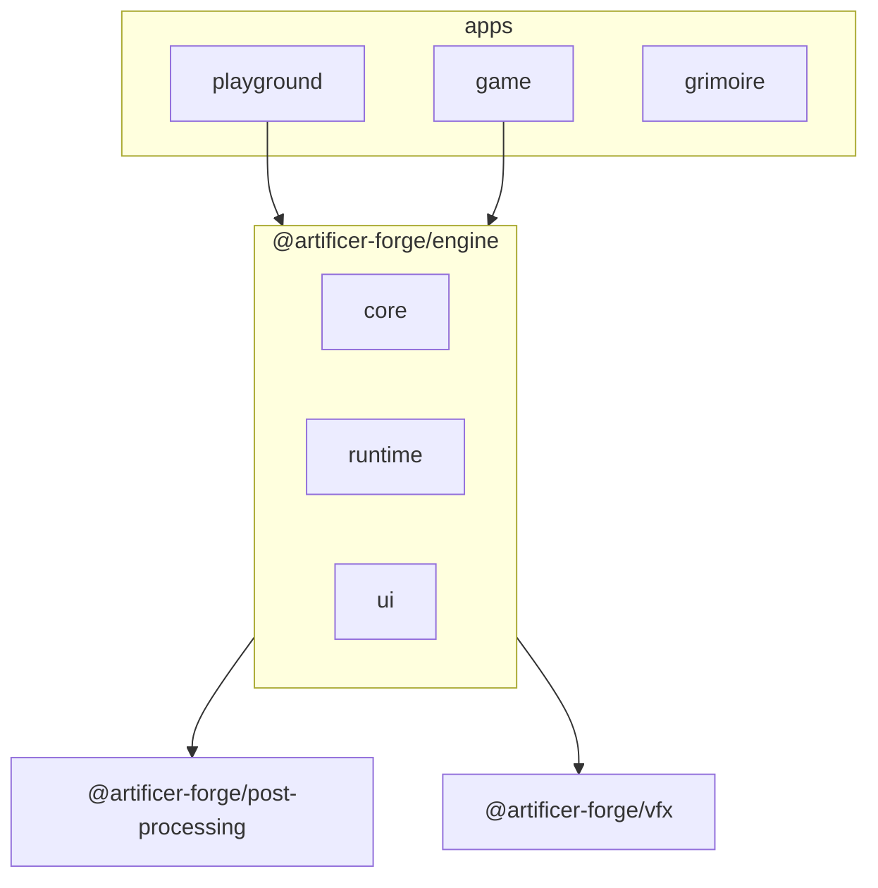

Artificer Forge is a game development toolkit built on **Nuxt 4** and **TresJS**, designed for creating 3D adventure games with Vue. Its reusable runtime now lives in a single installable package — `@artificer-forge/engine` — that you drop into any Nuxt app.

## Why TresJS?

TresJS brings Three.js to Vue with a declarative API:

```vue
<template>
  <TresCanvas>
    <TresPerspectiveCamera :position="[0, 2, 5]" />
    <TresMesh>
      <TresBoxGeometry />
      <TresMeshStandardMaterial color="hotpink" />
    </TresMesh>
  </TresCanvas>
</template>
```

Instead of imperative Three.js code, you compose 3D scenes like Vue components.

## Development Philosophy

**Iterate in playground → stabilize → extract to packages → document**

1. Prototype new features in the playground app
2. Test and refine until the API feels right
3. Extract stable code to shared packages (`@artificer-forge/engine` and friends)
4. Document the approach in this grimoire

The engine package is the result of that loop: gameplay code that proved itself in the playground, lifted into a versioned, reusable layer.

## The Engine Layers

`@artificer-forge/engine` is split into three layers, each with its own entrypoint:

- **`/core`** — pure TS RPG rules (damage, status effects, inventory, surfaces). No Vue, no Three.js.
- **`/runtime`** — stores, systems, controllers and in-scene Tres components.
- **`/ui`** — the 2D HUD overlay (action bar, inventory, panels) built on Nuxt UI.

The root export is the `<Game>` composition component, which wires all three layers into a ready-to-use host. See [Engine Architecture](/engine-architecture/overview) for the full breakdown.

## Monorepo Layout

This is a pnpm workspace. Apps consume packages; the engine is the hub.



| Workspace | Scope | Purpose |
|-----------|-------|---------|
| `apps/playground` | `@artificer-forge/playground` | Experiments sandbox |
| `apps/game` | `@artificer-forge/game` | Tabletop RPG adventure game |
| `apps/grimoire` | `@artificer-forge/grimoire` | Documentation (you're here) |
| `packages/engine` | `@artificer-forge/engine` | Game runtime: core / runtime / ui |
| `packages/post-processing` | `@artificer-forge/post-processing` | EffectComposer, bloom, outline passes |
| `packages/vfx` | `@artificer-forge/vfx` | Particle / shader visual effects |
| `packages/dialog-editor` | `@artificer-forge/dialog-editor` | Nuxt module: visual dialog authoring |
| `packages/utils` | `@artificer-forge/utils` | Shared helpers (dice rolling, etc.) |

## Source

The full source lives on GitHub: [alvarosabu/artificer-forge](https://github.com/alvarosabu/artificer-forge).
