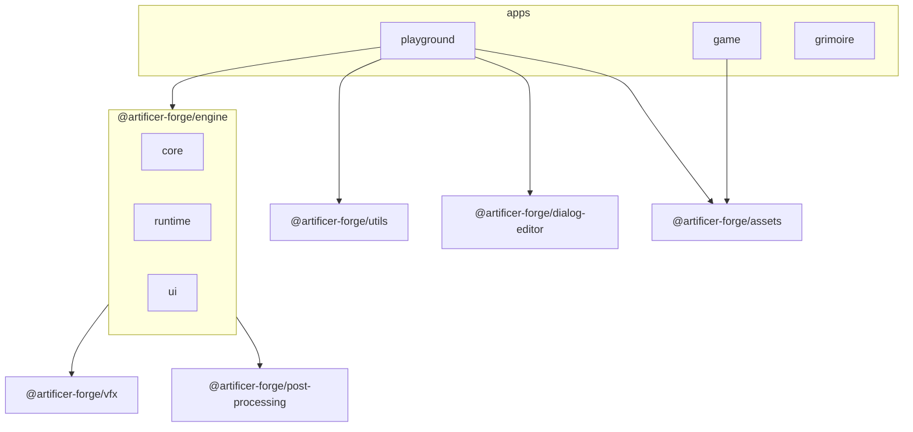

Artificer Forge is a game development toolkit built on **Nuxt 4** and **TresJS** for 3D adventure games written in Vue. The reusable runtime lives in one workspace package, `@artificer-forge/engine`. It is not published to npm; apps in this repo consume it with `workspace:*`.

## Why TresJS?

TresJS brings Three.js to Vue with a declarative API:

```vue
<template>
  <TresCanvas>
    <TresPerspectiveCamera :position="[0, 2, 5]" />
    <TresMesh>
      <TresBoxGeometry />
      <TresMeshStandardMaterial color="hotpink" />
    </TresMesh>
  </TresCanvas>
</template>
```

Instead of imperative Three.js code, you compose 3D scenes like Vue components.

## Development Philosophy

**Iterate in playground → stabilize → extract to packages → document**

1. Prototype new features in the playground app
2. Test and refine until the API feels right
3. Extract stable code to shared packages (`@artificer-forge/engine` and friends)
4. Document the approach in this grimoire

The engine package is the result of that loop: gameplay code that proved itself in the playground, lifted into a reusable layer.

## The Engine Layers

`@artificer-forge/engine` is split into three layers, each with its own entrypoint:

- **`/core`**: pure TS RPG rules (`aoe`, `appearance`, `statusEffects`, `damage`, `inventory`, `armor`, `surface`). No Vue, no Three.js.
- **`/runtime`**: Pinia stores, systems, controllers, terrain, vegetation, grading, portraits and in-scene Tres components.
- **`/ui`**: the 2D HUD overlay (action bar, inventory, panels) built on Nuxt UI.

The root export is the `<Game>` composition component, which wires all three layers into a ready-to-use host. See [Engine Architecture](/engine-architecture/overview) for the full breakdown.

## Monorepo Layout

This is a pnpm workspace. The playground is the only app that consumes the engine today. `apps/game` is still an empty TresJS shell: it depends on `@artificer-forge/assets` only, not on the engine.


```mermaid
flowchart TD
  subgraph apps
    pg[playground]
    game[game]
    gr[grimoire]
  end
  subgraph engine["@artificer-forge/engine"]
    core[core]
    runtime[runtime]
    ui[ui]
  end
  pg --> engine
  pg --> assets["@artificer-forge/assets"]
  pg --> de["@artificer-forge/dialog-editor"]
  pg --> utils["@artificer-forge/utils"]
  game --> assets
  engine --> pp["@artificer-forge/post-processing"]
  engine --> vfx["@artificer-forge/vfx"]
```

| Workspace | Scope | Purpose |
|-----------|-------|---------|
| `apps/playground` | `@artificer-forge/playground` | Experiments sandbox, the reference consumer of the engine |
| `apps/game` | `@artificer-forge/game` | Tabletop RPG adventure game (empty shell, assets module only) |
| `apps/grimoire` | `@artificer-forge/grimoire` | Documentation (you are here) |
| `packages/engine` | `@artificer-forge/engine` | Game runtime: core / runtime / ui |
| `packages/assets` | `@artificer-forge/assets` | Shared GLB models and textures. Its `/nuxt` module serves `files/models` and `files/textures` as public assets and generates `#build/character-parts.mjs`, the modular character part manifest |
| `packages/post-processing` | `@artificer-forge/post-processing` | `EffectComposer`, scaled bloom, depth of field, outline and DoF focus providers |
| `packages/vfx` | `@artificer-forge/vfx` | Particle and shader visual effects (built to `dist`) |
| `packages/dialog-editor` | `@artificer-forge/dialog-editor` | Nuxt module: visual dialog authoring, dev only |
| `packages/utils` | `@artificer-forge/utils` | `rollDice()` and the `DiceResult` type. Nothing else yet |

## Source

The full source lives on GitHub: [alvarosabu/artificer-forge](https://github.com/alvarosabu/artificer-forge).
