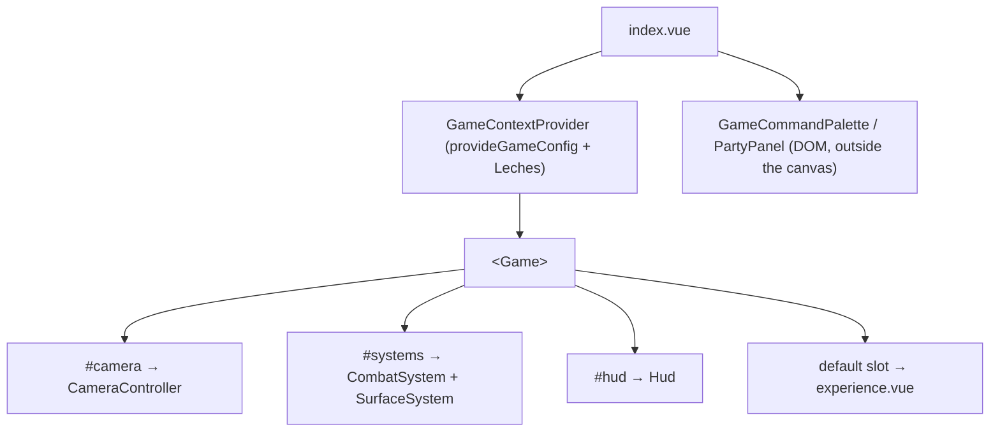

With the engine [installed](/getting-started/installation), a scene is two files: a page (`index.vue`) that mounts the app-level wrapper, and an experience component (`experience.vue`) that holds the scene graph and spawns entities. This is how every playground page is built (`apps/playground/pages/character/basic/`).

## How it fits together



## 1. The app-level wrapper

`<Game>` reads its render config with `useGameConfig()`. Without a provider it falls back to a fresh default object, so the wrapper exists to give the app one shared, reactive config it can mutate from a debug GUI. The playground's `GameContextProvider` also seeds Leches sliders from `CAMERA_DEFAULTS` and the page's `camera` prop. Trimmed to its structure:

```vue [components/GameContextProvider.vue]
<script setup lang="ts">
import { Game } from '@artificer-forge/engine'
import { CAMERA_DEFAULTS, provideGameConfig } from '@artificer-forge/engine/runtime'
import type { CameraProps } from '@artificer-forge/engine/runtime'

const props = defineProps<{ camera?: CameraProps }>()

const { uuid } = useSharedLechesControls()
const config = provideGameConfig()

// Seeded from the page's camera so the panel opens on the scene's own values.
const seed = { ...CAMERA_DEFAULTS, ...props.camera }
// ... useControls('camera', ...), useControls('postprocessing', ...), useControls('dof', ...)
// ... watchEffect(() => { config.bloom.strength = ...; config.dof.enabled = ... })

const cameraProps = computed<CameraProps>(() => ({ ...props.camera /* + GUI values */ }))
</script>

<template>
  <slot name="controls" :uuid="uuid">
    <TresLeches :uuid="uuid" collapsed />
  </slot>
  <Game :camera="cameraProps">
    <!-- Forward only when the page provides them: an empty #systems slot
         would suppress Game's CombatSystem + SurfaceSystem defaults. -->
    <template v-if="$slots.camera" #camera>
      <slot name="camera" />
    </template>
    <template v-if="$slots.systems" #systems>
      <slot name="systems" />
    </template>
    <template v-if="$slots.hud" #hud>
      <slot name="hud" />
    </template>
    <slot />
  </Game>
</template>
```

`CameraProps` is the engine type (17 fields, see [the Game component](/engine-architecture/game-component#the-camera-prop)). Do not redeclare it.

The `#controls` slot lets a page replace the default `<TresLeches>` panel. The `uuid` is the route's last path segment, so every page gets its own Leches instance.

## 2. The page

`index.vue` mounts the wrapper and the DOM widgets that live outside the canvas: the playground command palette and the party panel.

```vue [pages/character/basic/index.vue]
<script setup lang="ts">
import { PartyPanel } from '@artificer-forge/engine/ui'
import CharacterExperience from './experience.vue'
useHead({ title: 'Basic Character - TresJS Playground' })
</script>

<template>
  <div>
    <GameContextProvider>
      <CharacterExperience />
    </GameContextProvider>
    <GameCommandPalette />
    <PartyPanel />
  </div>
</template>
```

## 3. The experience

`experience.vue` renders inside `<Game>`'s default slot, so it has no `<TresCanvas>` and no camera of its own. It spawns the party leader, loads a scene, and renders one `<Character>` per character entity.

```vue [pages/character/basic/experience.vue]
<script setup lang="ts">
import { Character, Floor, useGameStore, useSceneRefs } from '@artificer-forge/engine/runtime'
import { WorldItem as InventoryWorldItem } from '@artificer-forge/engine/ui'

const gameStore = useGameStore()
const { setCharacterRef } = useSceneRefs()

// Playground command palette groups (Cmd/Ctrl+K).
useCommands({ entities: true, animations: true, statusEffects: true, recruit: true })

onMounted(async () => {
  const playerId = await gameStore.spawnFromTemplate('cedric', { x: 0, y: 0, z: 0 })
  gameStore.addToParty(playerId)
  gameStore.selectEntity(playerId)

  const { spawnPoint } = await gameStore.loadScene('character_scene')
  gameStore.updateEntity(playerId, { position: spawnPoint })
})

const characterEntities = computed(() =>
  [...gameStore.entities.values()].filter(e => e.type === 'character'),
)
const { worldItems } = storeToRefs(gameStore)
</script>

<template>
  <TresAmbientLight :intensity="0.8" />
  <TresDirectionalLight :position="[5, 5, 5]" :intensity="1.5" cast-shadow />
  <Character
    v-for="entity in characterEntities"
    :ref="(el: any) => setCharacterRef(entity.id, el)"
    :key="entity.id"
    :entity-id="entity.id"
  />
  <Suspense v-for="worldItem in worldItems" :key="worldItem.id">
    <InventoryWorldItem :item="worldItem" />
  </Suspense>
  <TresAxesHelper />
  <Floor />
</template>
```

`cedric` is a modular companion template in `content/entities/characters/companions/cedric.yaml`. `character_scene` is `content/scenes/character-scene.yaml` (empty entity list, one `default` spawn point). Other ids in the playground: `player`, `tav`, `zynrae`, `orc_scout`, `interactable_scene`, `npc_scene`.

::warning
`spawnFromTemplate` throws unless `configureContent()` ran first. The playground does this in `plugins/gameData.ts`, which runs before any page. If you skip the plugin, the first spawn fails with `[game] content source not configured`.
::

::note
`<Character>` takes `entityId`, not a model path. It reads everything else (model or modular `appearance`, rig, equipment, status effects) from the store. Register it with `setCharacterRef` so systems can call `moveTo`, `play`, `showDamage` on it. See [Scene Refs](/core-concepts/scene-refs).
::

## The default slots

`<Game>` provides defaults for three named slots.

| Slot | Default | Override when | Empty slot behaviour |
|------|---------|---------------|----------------------|
| `#camera` | `CameraController` (driven by the `camera` prop) | You want a raw `<TresPerspectiveCamera>` | Vue fallback content: an empty slot still renders the default |
| `#systems` | `CombatSystem` + `SurfaceSystem` | Non-gameplay scenes (menus, character select) | **Presence-keyed**: any `#systems` template, even empty, removes the defaults |
| `#hud` | `Hud` | You want a custom 2D overlay | Vue fallback content: an empty slot still renders the default |

The unnamed default slot is your scene graph.

See [the Game component reference](/engine-architecture/game-component) for the full slot semantics, the canvas config and the `camera` prop.
