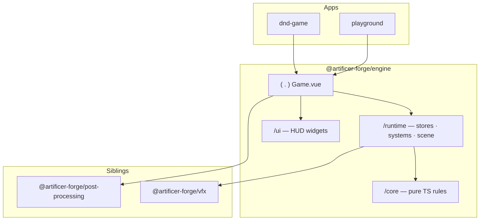

The game runtime lives in its own package, `@artificer-forge/engine`. Apps (`playground`, `dnd-game`) stay thin: they own content, routes and app-level config, while the engine owns the rules, the runtime state, the scene host and the HUD. This is the codebase's stated philosophy in practice — **prototype in the playground, stabilize, extract to the engine package**.

## Why a package

Extracting the engine forces a clean boundary between *what every RPG scene needs* (combat math, status effects, stores, the canvas host) and *what a specific app provides* (its content, pages, theming). That boundary is enforced by the `exports` map — apps can only reach the entrypoints the engine deliberately exposes.

## The exports map

`packages/engine/package.json` declares four entrypoints plus a stylesheet:

| Entrypoint | Exposes |
|------------|---------|
| `@artificer-forge/engine` | The root `<Game>` composition component |
| `@artificer-forge/engine/core` | Pure-TS RPG rules (damage, armor, aoe, surface, inventory, status effects) |
| `@artificer-forge/engine/runtime` | Vue/Tres stores, systems, controllers and in-scene components |
| `@artificer-forge/engine/ui` | Nuxt UI HUD widgets |
| `@artificer-forge/engine/styles.css` | Engine stylesheet |

The heavy dependencies (`vue`, `three`, `@tresjs/core`, `@tresjs/cientos`, `pinia`, `@vueuse/core`) are **peer** dependencies — the consuming app provides them, so there is one copy in the tree. `@nuxt/ui` is an *optional* peer, only needed if you use the `/ui` HUD layer.

## Monorepo relationship

Apps depend on the engine. The engine in turn depends on two sibling packages it pulls in as regular dependencies:

- `@artificer-forge/post-processing` — `EffectComposer`, bloom and the outline-pass provider used by `<Game>`.
- `@artificer-forge/vfx` — visual effects used by runtime systems.

## Where to go next

- [The Three Layers](/engine-architecture/three-layers) — what `/core`, `/runtime` and `/ui` each own and the import convention.
- [The Game Component](/engine-architecture/game-component) — the `<Game>` host, its slots and the `camera` prop.
- [Game Config](/engine-architecture/game-config) — `provideGameConfig()` / `useGameConfig()` and the bloom + outline render policy.
