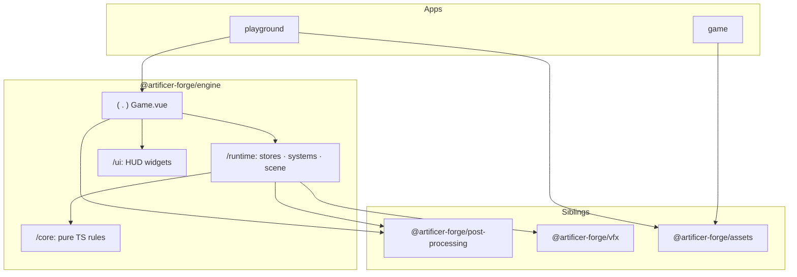

The game runtime lives in its own package, `@artificer-forge/engine`. Apps stay thin: they own content, routes and app-level config, while the engine owns the rules, the runtime state, the scene host and the HUD. This is the codebase's stated philosophy in practice: **prototype in the playground, stabilize, extract to the engine package**.

## Why a package

Extracting the engine forces a clean boundary between *what every RPG scene needs* (combat math, status effects, stores, the canvas host) and *what a specific app provides* (its content, pages, theming). That boundary is enforced by the `exports` map: apps can only reach the entrypoints the engine deliberately exposes.

## The exports map

`packages/engine/package.json` declares four entrypoints plus a stylesheet:

| Entrypoint | Exposes |
|------------|---------|
| `@artificer-forge/engine` | Only the root `<Game>` composition component (`src/index.ts` has one export) |
| `@artificer-forge/engine/core` | Pure-TS RPG rules: `aoe`, `appearance`, `statusEffects`, `damage`, `inventory`, `armor`, `surface` |
| `@artificer-forge/engine/runtime` | Vue/Tres stores, systems, controllers, terrain, vegetation, grading, portraits and in-scene components |
| `@artificer-forge/engine/ui` | Nuxt UI HUD widgets |
| `@artificer-forge/engine/styles.css` | Tailwind `@source` directive so the host app scans engine source |

All entrypoints resolve to `src/`. The package is not built or published; apps consume it with `workspace:*` and `build.transpile`. See [Installation](/getting-started/installation).

The heavy dependencies (`vue`, `three`, `@tresjs/core`, `@tresjs/cientos`, `pinia`, `@vueuse/core`) are **peer** dependencies. The consuming app provides them, so there is one copy in the tree. `@nuxt/ui` is an *optional* peer, only needed for the `/ui` HUD layer.

## Monorepo relationship

The engine depends on two sibling packages as regular dependencies:

- `@artificer-forge/post-processing`: `EffectComposer` plus `ScaledBloomNode`, `ScaledDepthOfFieldNode`, `useOutlinePass`/`useOutlinePassProvider` and `useDofFocus`/`useDofFocusProvider`. `<Game>` mounts the composer and installs both providers. See [Post-processing](/post-processing/overview).
- `@artificer-forge/vfx`: damage numbers, ghost/horn materials, particles and the target reticle used by runtime components. See [VFX](/vfx/overview).

Today only the playground consumes the engine. `apps/game` depends on `@artificer-forge/assets` alone.

```mermaid
graph TD
  subgraph Apps
    PG[playground]
    GAME[game]
  end

  subgraph "@artificer-forge/engine"
    ROOT["( . ) Game.vue"]
    CORE["/core: pure TS rules"]
    RUNTIME["/runtime: stores · systems · scene"]
    UI["/ui: HUD widgets"]
  end

  subgraph Siblings
    PP["@artificer-forge/post-processing"]
    VFX["@artificer-forge/vfx"]
    ASSETS["@artificer-forge/assets"]
  end

  PG --> ROOT
  PG --> ASSETS
  GAME --> ASSETS
  ROOT --> RUNTIME
  ROOT --> UI
  RUNTIME --> CORE
  ROOT --> PP
  RUNTIME --> PP
  RUNTIME --> VFX
```

`/runtime` also imports from post-processing directly: `Character.vue` uses `useDofFocus` and `useOutlinePass` to claim the DoF focus for the party leader and to outline hovered entities.

## Where to go next

- [The Three Layers](/engine-architecture/three-layers): what `/core`, `/runtime` and `/ui` each export and the import convention.
- [The Game Component](/engine-architecture/game-component): the `<Game>` host, its slots, the canvas config and the `camera` prop.
- [Game Config](/engine-architecture/game-config): `provideGameConfig()` / `useGameConfig()` and the antialias, bloom, DoF and outline render policy.
