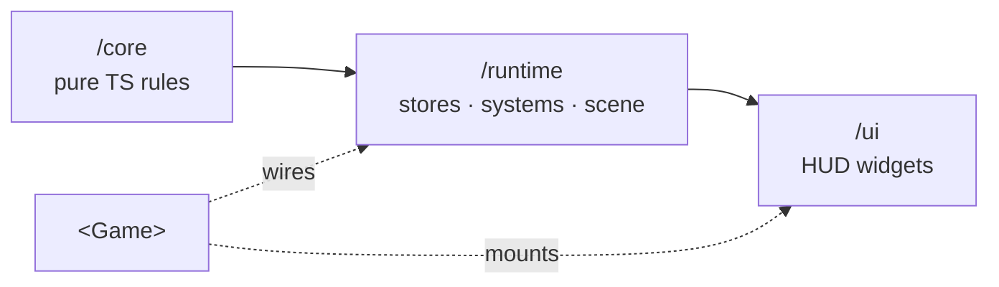

The engine is split into three layers, each its own entrypoint. The split is about dependencies: each layer can only depend *downward*, never up.

## /core: pure RPG rules

`@artificer-forge/engine/core` is **pure TypeScript**: no Vue, no Three, no reactivity. It is the RPG ruleset, written as plain functions and types, and tested with vitest only. Because it has no framework dependencies, the same rules run in a Vue component, a worker, or a test with no setup.

It re-exports seven rule modules (`core/index.ts`):

| Module | Exports | Concern |
|--------|---------|---------|
| `aoe` | `entitiesInCircle`, `entitiesInCone`, `entitiesInLine`, `Vec2`, `TargetEntities` | Area-of-effect target math. See [AoE](/combat/aoe) |
| `appearance` | `Sex`, `ModularSlot`, `HornPattern`, `CharacterAppearance`, `SegmentMaterialOverride` | Modular character recipe types. See [Modular Characters](/characters/modular-characters) |
| `statusEffects` | `STATUS_EFFECT_IDS`, `StatusEffectId` | The closed set of status ids. Definitions are content. See [Status Effects](/characters/status-effects/overview) |
| `damage` | `computeDamage`, `ArmorType`, `ArmorHpState`, `DamageResult` | Armor-pool-first damage resolution. See [Armor](/combat/armor) |
| `inventory` | `carryCapacity`, `totalWeight`, `encumbrance`, `WeightedItem` | Weight and encumbrance math. See [Stackables and Weight](/inventory/stackables-and-weight) |
| `armor` | `deriveMaxArmor`, `ArmorItem` | Max armor pools from equipped items |
| `surface` | `SurfaceKind`, `KIND_CONFIG` (`types`), plus the `matrix`, `grid`, `sim` and `texture` modules | Surface cells, spread, decay, transitions. See [Surfaces](/surfaces/overview) |

A representative example, `armor.ts` is a single pure reducer over equipped items:

```ts
import { deriveMaxArmor } from '@artificer-forge/engine/core'

const { physical, magical } = deriveMaxArmor(equippedItems)
```

::note
`/core` is the only layer with no Vue or Three import. If a rule needs reactivity or a Three object, it belongs in `/runtime`, not here.
::

## /runtime: stores, systems, controllers, scene

`@artificer-forge/engine/runtime` is the Vue + TresJS layer. It wraps the `/core` rules in reactive Pinia stores, drives them with systems, exposes controllers, and provides in-scene Tres components. `runtime/index.ts` is large; the inventory below groups every export by area.

### Stores

| Export | Purpose |
|--------|---------|
| `useGameStore` + `EntityState`, `Position`, `Team`, `EquipmentSlotKey`, `ALL_EQUIPMENT_SLOTS`, `MoveResult`, `MoveFailReason`, `ContentSource`, `EntityTemplate`, `SceneDef`, `ClassTemplate` | Entities, party, selection, flags, inventory, content source. See [Game Store](/core-concepts/game-store) |
| `useCombatStore` | Targeting cursor state. See [Combat Store](/combat/combat-store) |
| `useDialogStore` | Active dialog tree and node. See [Dialog](/dialog/overview) |
| `useSurfaceStore` | Surface grid instance. See [Surface System](/surfaces/surface-system) |
| `usePortraitStore` | Baked portrait cache (LRU, persisted). See [Portraits](/portraits/overview) |
| `useEnvironmentStore` | Wind and grading refs shared across vegetation and terrain. See [Environment](/environment/overview) |
| `useDamageTypeStore` + `DamageTypeDefinition`, `DamageTypeLoader` | Damage type definitions loaded from content |
| `useStatusEffectStore` + `StatusEffectDefinition`, `StatusEffectLoader` | Status effect definitions loaded from content |

### Composables

| Export | Purpose |
|--------|---------|
| `useGameConfig`, `provideGameConfig`, `defaultGameConfig` + `GameConfig`, `BloomConfig`, `DofConfig`, `OutlinePreset`, `AntialiasMode` | Render config. See [Game Config](/engine-architecture/game-config) |
| `useSceneRefs` + `CharacterRef`, `InteractableRef` | Registry of live component refs. See [Scene Refs](/core-concepts/scene-refs) |
| `useContextMenu`, `useContextMenuProvider` + `ContextMenuState`, `ContextMenuApi`, `ContextMenuKey` | Right-click menu state and dispatch. See [Entity Commands](/core-concepts/commands) |
| `useCharacterAnimations` + `AnimationName`, `AnimationNameType`, `PlayOptions`, `RigSize` | Clip playback with cross-fade. See [Animations](/characters/animations) |
| `useCharacterController`, `usePointerController` + `ControllerMode`, `CharacterControllerOptions`, `AnimationControls`, `PointerControllerOptions` | Movement. See [Controller](/characters/controller) |
| `useEquipment` + `UseEquipmentOptions` | Bone-attach weapons and modular armor. See [Equipment](/characters/equipment) |
| `useAbilitySystem`, `useActionBar` + `ActionSlot`, `WeaponSlot` | Ability phases and the action bar model. See [Abilities](/combat/abilities), [Action Bar](/combat/action-bar) |
| `useAoESystem` + `AoEShape`, `AoEConfig` | Ground-target shapes. See [AoE](/combat/aoe) |
| `useProjectile` + `ProjectileConfig` | Arc projectiles. See [Projectiles](/combat/projectiles) |
| `useDialogEngine`, `useDialogCamera` + `DialogNode`, `DialogChoice`, `DialogCheck`, `DialogContext`, `ResolvedChoice`, `CheckRoll`, `evaluateCondition(s)`, `resolveText`, `availableChoices`, `rollCheck`, `applyEffects` | Dialog traversal and camera. See [Dialog Engine](/dialog/dialog-engine), [Camera Director](/dialog/camera-director) |
| `useActorBehavior` | Idle behaviour for non-party characters. See [Actors](/actors/overview) |
| `useStatusEffects`, `useStatusEffectOverlay`, `useStatusEffectParticles`, `useStatusEffectAnimations`, `useStatusEffectTexts` + `StatusTextEntry` | Per-effect visuals on a rig. See [Status Effects](/characters/status-effects/overview) |
| `useInventory`, `useLoot` | Inventory modal and loot popover state. See [Inventory](/inventory/overview) |
| `useSurface` | Surface queries for an entity. See [Surface System](/surfaces/surface-system) |
| `isEditableTarget` | Keyboard guard: skip hotkeys while typing in inputs |
| `createWebGPURenderer`, `createTransparentWebGPURenderer` | Renderer factories for `<TresCanvas :renderer>` |

### Components

| Export | Purpose |
|--------|---------|
| `Character`, `Actor`, `Interactable`, `Nameplate`, `StatusEffectBadge`, `StatusEffectBadges`, `StatusEffectText` | Entity rendering. See [Rendering](/entities/rendering), [Interactables](/entities/interactables) |
| `CameraController` | Default `#camera` slot content. See [Game Component](/engine-architecture/game-component) |
| `CombatSystem`, `SurfaceSystem`, `TrajectoryPreview` | Default `#systems` slot content plus the projectile arc |
| `DialogCameraDirector` | Dialog camera tweens |
| `Floor` | Flat ground plane with optional grading, emits `click` |
| `PortraitStudio`, `PortraitSubject`, `PortraitBackground`, `PortraitLights` | Offscreen portrait baking. See [Portrait Studio](/portraits/studio) |
| `Foliage`, `Grass`, `GrassTufts`, `Flowers`, `Trees`, `WindLines` | Instanced vegetation. See [Foliage](/environment/foliage) |
| `TerrainGround`, `TerrainQuadtree`, `Water` | Heightmap terrain and water |

### Modular characters

`registerPartManifest`, `resolvePartPath`, `resolvePartRig`, `manifestRigPath`, `DEFAULT_RIG_KEY`, `ModularPartRef`, `ModularPartManifest`, `useModularRig`, `useModularArmor`, `ArmorPiece`, `registerSegmentMaterials`, `resolveSegmentMaterial`, `segmentMatcher`, `SegmentMaterialFactory`, `loadGltf`. See [Modular Characters](/characters/modular-characters).

### Portraits

`portraitSignature`, `PortraitAppearance`, `createBakeQueue`, `BakeQueue`, `PORTRAIT_CAMERA`, `PORTRAIT_RENDERING`, `PORTRAIT_LIGHTS`, `PortraitFraming`, `frameFromHead`, `resolvePortraitBackground`, `DEFAULT_PORTRAIT_BACKGROUND`, `usePortraitStudio`, `PortraitSubjectDescriptor`, `usePortraitRenderer`. See [Portraits](/portraits/overview).

### Environment: grading, wind, vegetation, terrain

| Area | Exports |
|------|---------|
| Grading | `createGradingContext`, `GradingContext`, `GradingProps`, `GradingContextOptions`, `stylizedOutput`, `StylizedOutputOptions`, `createDropShadowCatcher`, `applyGradingToModel`, `ApplyGradingOptions`, `createPresetTrack`, `createPhaseTween`, `lerpPresets`, `wrap01`, `Preset` |
| Wind | `createWindUniforms`, `WindUniforms`, `WindSettings`, `advanceWindTime`, `windOffset`, `DEFAULT_WIND_ANGLE`, `DEFAULT_WIND_STRENGTH`, `DEFAULT_WIND_TIME_FREQUENCY`, `createWindLines`, `spawnWindLine`, `updateWindLines`, `createWindLineGeometry`, `createWindLineMaterial`, `windLineHandles`, `remapClamp` |
| Vegetation | `createFoliage`, `applyFoliageTexture`, `FoliageOptions`, `createGrass`, `createGrassGeometry`, `buildGrassMaterial`, `GrassOptions`, `BladeDetail`, `createGrassTufts`, `GrassTuftsOptions`, `createFlowers`, `FLOWER_PRESETS`, `FlowerShape`, `FlowersOptions`, `extractCanopyReferences`, `CanopyExtractOptions` |
| Scatter | `createScatterFocus`, `followAnchor`, `followFade`, `followFadeIn`, `ScatterFocus`, `ScatterFocusSettings`, `createScatterBake`, `ScatterBake`, `ScatterBakeInput`, `ScatterAttribute`, `controlMaskNode`, `coverageNode`, `CoverageOptions`, `createDensityMapNode`, `channelNode`, `DensityChannel`, `countAbove`, `MASK_EPSILON`, `PUNT_Y` |
| Trample | `createTrampleMap`, `TrampleMap`, `TrampleSettings`, `TrampleUniforms`, `trampleUv`, `worldToPixel` |
| Terrain | `createControlMap`, `CONTROL_CHANNEL`, `sampleControlChannel`, `setControlPixels`, `readControlPixels`, `controlUv`, `createHeightMap`, `HeightMapMeta`, `sampleHeightAt`, `intersectHeightField`, `setHeightPixels`, `readHeightPixels`, `createHeightField`, `HeightEncoding`, `sampleHeight`, `heightUv`, `createQuadtree`, `Quadtree`, `QuadtreeNode`, `createTerrainQuadtree`, `TerrainQuadtree`, `createTerrainUniforms`, `buildTerrainMaterial`, `createWaterUniforms`, `buildWaterMaterial` |

These are documented in the [Environment](/environment/overview) section.

```ts
import {
  useGameStore,
  CombatSystem,
  SurfaceSystem,
  CameraController,
  Character,
  useCharacterController,
} from '@artificer-forge/engine/runtime'
```

## /ui: HUD widgets

`@artificer-forge/engine/ui` is the 2D DOM overlay, built on Nuxt UI. `@nuxt/ui` is an **optional** peer dependency: only apps that use this layer need it. Widgets are skinnable through the standard Nuxt UI `:ui` prop.

| Group | Exports |
|-------|---------|
| Root | `Hud` (mounts context menu, action bar, inventory modal, loot popover, item context menu, dialog panel) |
| Composables | `useEntityActions`, `useItemContextMenu`, `useItemDrag` |
| Action bar | `ActionBar`, `ActionBarPortrait`, `ActionBarResources`, `ActionBarSlots`, `ActionBarTabs`, `ActionBarWeapon`, `ActionPointsGroup`. See [Action Bar](/combat/action-bar) |
| Panels | `CharacterPanel`, `PartyPanel`, `DialogPanel`, `EntityContextMenu`. See [Party HUD](/actors/party-hud), [Dialog Panel](/dialog/dialog-panel) |
| Inventory | `BagGrid`, `CharacterInventoryModal`, `CharacterPreview`, `CharacterPreviewModel`, `EquipmentSlot`, `ItemCell`, `ItemContextMenu`, `ItemTooltip`, `LootPopover`, `PortraitDropZone`, `WeightBar`, `WorldItem`. See [Inventory UI](/inventory/ui-components) |

```ts
import { Hud, ActionBar, CharacterInventoryModal } from '@artificer-forge/engine/ui'
```

`WorldItem` is a Tres component even though it ships from `/ui`: it renders a dropped item's model in the scene and needs `<Suspense>` because it loads a GLB.

## What lives where

| Concern | Layer |
|---------|-------|
| "How much damage does this hit deal?" | `/core` (`damage`) |
| "Sum armor from equipped items" | `/core` (`armor`) |
| "Which entities does this spell cover?" | `/core` (`aoe`) |
| Reactive entity / party state | `/runtime` (`useGameStore`) |
| Per-frame combat resolution in the scene | `/runtime` (`CombatSystem`) |
| Click-to-move | `/runtime` (`useCharacterController`) |
| In-scene character mesh | `/runtime` (`Character`) |
| Terrain, grass, water, grading | `/runtime` |
| Action bar, inventory modal, context menu | `/ui` |

## Dependency direction



`/runtime` builds on `/core`; `/ui` builds on `/runtime`. The root `<Game>` component sits on top, wiring runtime systems into the scene and mounting the `/ui` HUD.
