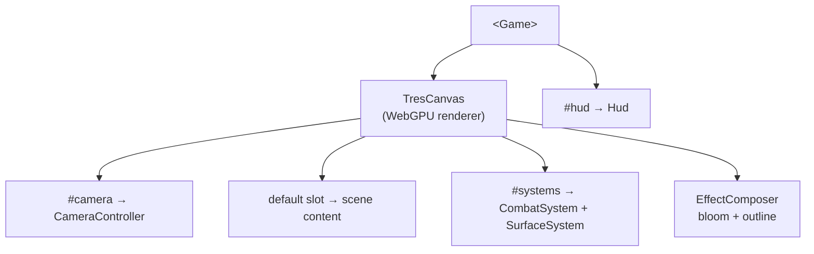

`<Game>` is the engine's composition root, the single component apps mount to get a working scene. It owns the `<TresCanvas>`, the renderer, the camera, the in-scene systems (runtime) and the HUD overlay (ui). Import it from the package root:

```ts
import { Game } from '@artificer-forge/engine'
```

## Slots

Every slot ships a sensible default; override only what you need.

| Slot | Default | Purpose |
|------|---------|---------|
| `#camera` | `CameraController` (receives the `camera` prop) | Camera + controls |
| *default* | — | Your scene content (floor, characters, props…) |
| `#systems` | `CombatSystem` + `SurfaceSystem` | Per-frame gameplay systems |
| `#hud` | `Hud` | The 2D DOM overlay |

::warning
Passing an **empty** `#systems` slot suppresses the default combat + surface systems — exactly what you want for non-gameplay scenes such as menus or character select. Likewise an empty `#camera` or `#hud` slot removes that default. (`GameContextProvider` only forwards these slots when the page actually provides them, so it doesn't accidentally blank out the defaults.)
::

## The `camera` prop

The default `CameraController` is configured through the `camera` prop, forwarded with `v-bind`. Its shape, exactly as defined in `Game.vue`:

```ts
interface CameraProps {
  position?: [number, number, number]
  lookAt?: [number, number, number]
  target?: [number, number, number]
  near?: number
  far?: number
  controls?: boolean
}
```

The prop is ignored when the `#camera` slot is overridden, since you then own the camera entirely.

## Renderer & post-processing policy

The renderer and post-processing are **engine policy**, baked into `<Game>` — not app concerns:

- A **WebGPU renderer** (`three/webgpu` `WebGPURenderer`) with `NoToneMapping`.
- An `EffectComposer` (from `@artificer-forge/post-processing`) running **bloom** and an **outline** pass.
- A shared context-menu provider (`useContextMenuProvider`) and outline-pass provider (`useOutlinePassProvider`).

The composer's bloom and outline-preset values come from [`useGameConfig()`](/engine-architecture/game-config), so apps tune the look without touching the renderer.

## Composition example

```vue
<script setup lang="ts">
import { Game } from '@artificer-forge/engine'
import { Floor, Character } from '@artificer-forge/engine/runtime'
</script>

<template>
  <Game :camera="{ position: [0, 8, 12], target: [0, 0, 0], controls: true }">
    <!-- default slot: scene content -->
    <Floor />
    <Character model="/models/Ranger.glb" :position="[0, 0, 0]" />
  </Game>
</template>
```


