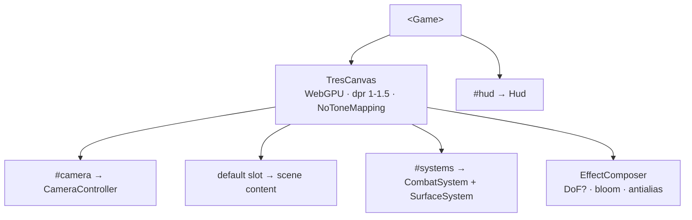

`<Game>` is the engine's composition root, the single component apps mount to get a working scene. It owns the `<TresCanvas>`, the renderer, the camera, the in-scene systems (runtime), the effect composer and the HUD overlay (ui). Import it from the package root:

```ts
import { Game } from '@artificer-forge/engine'
```

## Slots

Every slot ships a default; override only what you need.

| Slot | Default | Purpose |
|------|---------|---------|
| `#camera` | `<CameraController v-bind="camera" />` | Camera + OrbitControls |
| *default* | none | Your scene content (floor, characters, props) |
| `#systems` | `<CombatSystem />` + `<SurfaceSystem />` | Per-frame gameplay systems |
| `#hud` | `<Hud />` | The 2D DOM overlay, rendered outside the canvas |

The three named slots do not behave the same way when empty.

- `#camera` and `#hud` use Vue **fallback content** (`<slot name="camera">default</slot>`). If you pass the slot but it renders nothing, Vue shows the default anyway.
- `#systems` is **presence-keyed**: `<slot v-if="$slots.systems" name="systems" />`, else the defaults. Any `#systems` template, even an empty one, removes `CombatSystem` and `SurfaceSystem`.

The reason is in `Game.vue`: with fallback semantics an empty `#systems` would silently restore `CombatSystem`, and its ground-click plane would outrank a scene's own terrain. Presence keying makes "no systems" possible.

::tip
To run a scene without gameplay systems (menus, character select, terrain tests), pass an empty `#systems` template:

```vue
<Game>
  <template #systems />
  <MyMenuScene />
</Game>
```
::

The playground's `GameContextProvider` forwards each named slot only when the page provides it, so a wrapper never blanks a default by accident.

## The canvas

`<Game>` configures `<TresCanvas>` like this. None of it is a prop; it is engine policy.

| Attribute | Value | Why |
|-----------|-------|-----|
| `clear-color` | `#020420` | Deep navy background, the fog color pages use with `<TresFog>` |
| `window-size` | on | Canvas fills the viewport |
| `:dpr` | `[1, 1.5]` | A `[min, max]` clamp. Every post pass pays the pixel multiplier; above 1.5 flat colour fields and cutout foliage stop showing a difference |
| `:renderer` | `createWebGPURenderer` | `three/webgpu` `WebGPURenderer`. TSL materials in the engine need it |
| `:tone-mapping` | `NoToneMapping` | Tone mapping happens in the composer, after bloom |
| `shadows` | on | |
| `@pointer-missed` | closes the context menu | A click on empty space dismisses the right-click menu |

## Providers

`<Game>` installs three providers so the canvas and the HUD share one instance of each:

| Provider | Package | Consumer |
|----------|---------|----------|
| `useContextMenuProvider()` | `/runtime` | `Character`, `Actor`, `Interactable` open it; `Hud` renders it. See [Entity Commands](/core-concepts/commands) |
| `useOutlinePassProvider()` | `@artificer-forge/post-processing` | `Character` adds hovered rigs to the outline selection |
| `useDofFocusProvider()` | `@artificer-forge/post-processing` | `Character` claims the DoF focus for the party leader (`setFocusTarget(group)`) |

`useContextMenu()` throws outside `<Game>`. `useDofFocus()` returns `null` without a provider, so components can guard with `if (!dofFocus) return`.

## The `camera` prop

The default `CameraController` is configured through the `camera` prop, forwarded with `v-bind`. Its type is `CameraProps` (alias of `CameraControllerProps`) from `@artificer-forge/engine/runtime`, not a local interface. Defaults come from `CAMERA_DEFAULTS`, exported so a debug GUI can seed its sliders from the same numbers.

```ts
import type { CameraProps } from '@artificer-forge/engine/runtime'
import { CAMERA_DEFAULTS } from '@artificer-forge/engine/runtime'
```

| Name | Type | Default | Purpose |
|------|------|---------|---------|
| `position` | `[number, number, number]` | `[12.86, 12.57, 15.52]` | Camera position |
| `lookAt` | `[number, number, number]` | none | Passed to `<TresPerspectiveCamera>` only when set |
| `target` | `[number, number, number]` | none | OrbitControls target; also the origin the follow offset is measured from |
| `near` | `number` | `0.1` | |
| `far` | `number` | `1000` | |
| `controls` | `boolean` | `true` | Mount `<OrbitControls>`. They are disabled while `gameStore.inputBlocked` is true |
| `fov` | `number` | `40` | |
| `maxPolarAngle` | `number` | `Math.PI / 2` | Radians. Equal min/max locks the pitch |
| `minPolarAngle` | `number` | `Math.PI / 2` | Radians |
| `maxDistance` | `number` | `100` | |
| `minDistance` | `number` | `0.1` | |
| `distance` | `number` | none | Declared in the type, not read by `CameraController` |
| `up` | `[number, number, number]` | none | Declared in the type, not read by `CameraController` |
| `follow` | `boolean \| string` | `false` | `true` follows `party.leader`; a string follows that entity id |
| `followHeight` | `number` | `1.2` | Added to the followed character's Y (origin is at the feet) |
| `followSmoothing` | `number` | `6` | Exponential smoothing rate for the anchor, `1 - exp(-rate * delta)` |

The prop is ignored when the `#camera` slot is overridden, since you then own the camera entirely.

### Camera follow

When `follow` is set, `CameraController` reads the target's live position through `useSceneRefs().getCharacterRef(id)?.getPosition()` each frame (the store only syncs position on arrival). It moves the OrbitControls target to the smoothed anchor and keeps the camera offset the user dragged to, so orbiting still works while following. On the first frame after `follow` turns on, it re-seats the camera at the authored `position - target` offset, clamped to `[minDistance, maxDistance]`.

## Post-processing policy

`<Game>` mounts one `EffectComposer` from `@artificer-forge/post-processing` and binds it to [`useGameConfig()`](/engine-architecture/game-config):

```vue
<EffectComposer
  :outline-presets="config.outlinePresets"
  :bloom="{ strength, radius, threshold, smoothWidth, resolutionScale }"
  :dof="config.dof.enabled ? config.dof : undefined"
  :antialias="config.antialias"
/>
```

- **Bloom** is always on, with `resolutionScale` shrinking the mip chain.
- **Depth of field** is passed only when `config.dof.enabled` is true; `undefined` removes the pass.
- **Antialias** is `'msaa' | 'fxaa' | 'none'`, fixed at first build.
- **Outline** presets are forwarded, but the outline pass is currently commented out in `EffectComposer.vue`. Hovering still updates the selection; nothing draws it.

See [Post-processing](/post-processing/overview) for the pass chain.

## Composition example

`<Character>` takes an `entityId` and reads the rest from the store. Spawn first, then render.

```vue
<script setup lang="ts">
import { Game } from '@artificer-forge/engine'
import { Character, Floor, useGameStore } from '@artificer-forge/engine/runtime'

const gameStore = useGameStore()

onMounted(async () => {
  const id = await gameStore.spawnFromTemplate('cedric', { x: 0, y: 0, z: 0 })
  gameStore.addToParty(id)
})

const characters = computed(() =>
  [...gameStore.entities.values()].filter(e => e.type === 'character'),
)
</script>

<template>
  <Game :camera="{ position: [0, 8, 12], target: [0, 0, 0], follow: true }">
    <TresAmbientLight :intensity="0.8" />
    <Floor />
    <Character v-for="e in characters" :key="e.id" :entity-id="e.id" />
  </Game>
</template>
```

`Character` props: `entityId: string` (required), `grading?: GradingContext | null`, `groundHeight?: Node<'float'> | null`. The last two are for graded terrain scenes; see [Environment](/environment/overview).


```mermaid
graph TD
  GAME["&lt;Game&gt;"] --> CANVAS["TresCanvas<br/>WebGPU · dpr 1-1.5 · NoToneMapping"]
  CANVAS --> CAM["#camera → CameraController"]
  CANVAS --> SCENE["default slot → scene content"]
  CANVAS --> SYS["#systems → CombatSystem + SurfaceSystem"]
  CANVAS --> FX["EffectComposer<br/>DoF? · bloom · antialias"]
  GAME --> HUD["#hud → Hud"]
```
