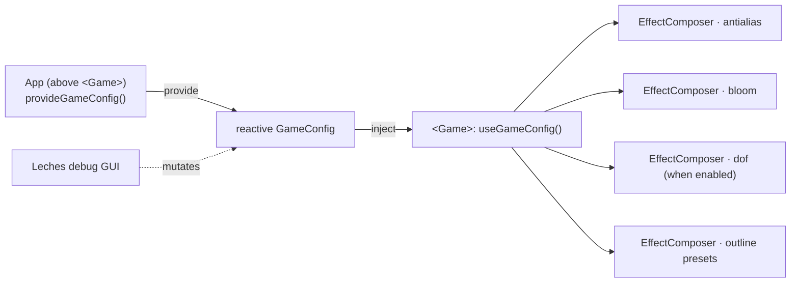

`GameConfig` is the render configuration shared between the engine's `<Game>` host and the app. The engine ships defaults; an app overrides them (from a debug GUI or a settings store) by providing the config *above* `<Game>`.

## The config shape

From `runtime/useGameConfig.ts`:

```ts
export type AntialiasMode = 'msaa' | 'fxaa' | 'none'

export interface GameConfig {
  antialias: AntialiasMode
  bloom: BloomConfig
  dof: DofConfig
  outlinePresets: Record<string, OutlinePreset>
}
```

### `antialias`

| Name | Type | Default | Purpose |
|------|------|---------|---------|
| `antialias` | `'msaa' \| 'fxaa' \| 'none'` | `'msaa'` | Must match `EffectComposer`'s `AntialiasMode`. Fixed when the composer first builds |

### `bloom: BloomConfig`

| Name | Type | Default | Purpose |
|------|------|---------|---------|
| `strength` | `number` | `0.7` | |
| `radius` | `number` | `0.4` | |
| `threshold` | `number` | `0.8` | Luminance above which pixels bloom |
| `smoothWidth` | `number` | `0.3` | Soft knee around the threshold |
| `resolutionScale` | `number` | `0.5` | Mip-chain scale. `1` = three's stock half-res chain, `0.5` = quarter res |

### `dof: DofConfig`

| Name | Type | Default | Purpose |
|------|------|---------|---------|
| `enabled` | `boolean` | `false` | Off by default: a top-down camera puts the whole play area near one depth, so DoF reads as tilt-shift |
| `focalLength` | `number` | `6` | Depth band (world units) around the focus plane before a fragment is fully blurred |
| `bokehScale` | `number` | `2` | |
| `focusDistance` | `number` | `15` | Focus depth when nothing has claimed the focus |
| `focusHeight` | `number` | `1` | Added to the focus target's Y (character origin is at the feet) |
| `smoothing` | `number` | `8` | Focus depth smoothing rate |
| `resolutionScale` | `number` | `0.25` | Scale of the CoC + bokeh passes. `0.5` ~ three's stock chain, `0.25` = quarter res |

The focus target is claimed by the party leader's `<Character>` through `useDofFocus().setFocusTarget(group)`. See [Depth of Field](/post-processing/depth-of-field).

### `outlinePresets`

| Name | Type | Default |
|------|------|---------|
| `party` | `OutlinePreset` | `{ visibleEdgeColor: '#00e5ff', edgeThickness: 3 }` |
| `interactive` | `OutlinePreset` | `{ visibleEdgeColor: '#ffcc00', edgeThickness: 3 }` |
| `hostile` | `OutlinePreset` | `{ visibleEdgeColor: '#ff4444', edgeThickness: 3 }` |
| `neutral` | `OutlinePreset` | `{ visibleEdgeColor: '#ffffff', edgeThickness: 3 }` |
| `ally` | `OutlinePreset` | `{ visibleEdgeColor: '#00e5ff', edgeThickness: 3 }` |

`OutlinePreset` is `{ visibleEdgeColor: string, edgeThickness: number }`. The outline pass is currently disabled in `EffectComposer.vue`, so these presets are forwarded but not drawn.

## The three functions

All three are exported from `@artificer-forge/engine/runtime`:

```ts
import { defaultGameConfig, provideGameConfig, useGameConfig } from '@artificer-forge/engine/runtime'
```

| Function | Signature | Purpose |
|----------|-----------|---------|
| `defaultGameConfig()` | `() => GameConfig` | Returns a **new** plain object with the defaults above. Use it to reset a GUI or to build a settings screen |
| `provideGameConfig(overrides?)` | `(Partial<GameConfig>) => GameConfig` | Merges `overrides` onto the defaults, wraps the result in `reactive()`, `provide()`s it and returns it |
| `useGameConfig()` | `() => GameConfig` | Injects the provided config. Without a provider it returns `reactive(defaultGameConfig())`, a **fresh object per call** |

### Merge semantics

`provideGameConfig` merges one level deep per sub-object:

```ts
const config = reactive<GameConfig>({
  antialias: overrides.antialias ?? base.antialias,
  bloom: { ...base.bloom, ...overrides.bloom },
  dof: { ...base.dof, ...overrides.dof },
  outlinePresets: { ...base.outlinePresets, ...overrides.outlinePresets },
})
```

So `provideGameConfig({ dof: { enabled: true } })` keeps every other DoF default, and `{ outlinePresets: { boss: {...} } }` adds a preset without dropping the five built-ins.

::warning
If two components each call `useGameConfig()` without a provider above them, they get two unrelated objects. Mutating one does not affect the other. Always provide once, above `<Game>`, when you want to drive the config from outside.
::

## Wiring a debug GUI

The playground's `GameContextProvider` provides the config, then binds Leches (`@tresjs/leches`) folders for bloom and DoF and writes the slider values back into the reactive object:

```ts
const config = provideGameConfig()

const { postprocessingBloomStrength, /* radius, threshold, smoothWidth, resolutionScale */ }
  = useControls('postprocessing', {
    bloomStrength: { value: config.bloom.strength, min: 0, max: 3, step: 0.01, type: 'range' },
    // ...
  }, { uuid })

const { dofEnabled, dofFocalLength, /* bokehScale, focusDistance, focusHeight, smoothing, resolutionScale */ }
  = useControls('dof', {
    enabled: { value: config.dof.enabled, type: 'boolean' },
    focalLength: { value: config.dof.focalLength, min: 0.1, max: 120, step: 0.1, type: 'range' },
    // ...
  }, { uuid })

watchEffect(() => {
  config.bloom.strength = toValue(postprocessingBloomStrength)
  config.dof.enabled = toValue(dofEnabled)
  config.dof.focalLength = toValue(dofFocalLength)
  // ...
})
```

::note
`provideGameConfig()` returns the reactive object. Mutate its fields directly, as the `watchEffect` does. No second provide call is needed; `<Game>` already sees the changes. `antialias` is the exception: the composer reads it once at build time.
::


