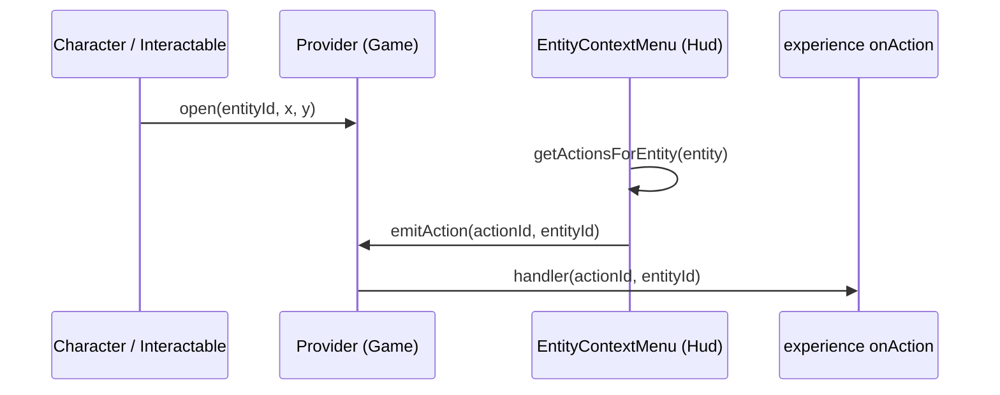

When the player right-clicks an entity in the scene, the engine opens a context menu with the actions valid for that entity (Examine, Talk, Attack, Loot, Pick Up). This is the primary way the player issues commands to the world.

The system spans two engine layers:

::note
The menu *provider* (open/close state + action dispatch) lives in `@artificer-forge/engine/runtime`. The *action definitions* (which actions exist per entity type, labels, icons, conditions) live in `@artificer-forge/engine/ui`, because they produce Nuxt UI `DropdownMenuItem`s.
::

## The provider: `useContextMenuProvider`

`<Game>` installs the provider once so the canvas (`@pointer-missed` closes the menu) and the HUD share one instance. It owns the reactive state and a set of action handlers, and `provide()`s the API down the tree.

```ts
import { useContextMenuProvider } from '@artificer-forge/engine/runtime'

const { state, open, close, emitAction } = useContextMenuProvider()
```

| Member | Type | Purpose |
|--------|------|---------|
| `state` | `{ open: boolean, entityId: string \| null, x: number, y: number }` | Drives visibility and screen position |
| `open(entityId, x, y)` | `(string, number, number) => void` | Open for an entity at client coordinates |
| `close()` | `() => void` | |
| `emitAction(action, entityId)` | `(string, string) => void` | Run every registered handler |

## The consumer: `useContextMenu`

Any component under `<Game>` reads or drives the menu with `useContextMenu()`. It returns the full `ContextMenuApi` (`state, open, close, onAction, emitAction`). `Character`, `Actor` and `Interactable` call `open` on right-click:

```ts
import { useContextMenu } from '@artificer-forge/engine/runtime'

const { open } = useContextMenu()

function handleContextMenu(event: TresPointerEvent) {
  event.nativeEvent.preventDefault()
  open(props.entityId, event.nativeEvent.clientX, event.nativeEvent.clientY)
}
```

Your experience reacts to a chosen action with `onAction`. The handler is removed on unmount.

```ts
const { onAction, state: ctxState } = useContextMenu()

onAction((action, entityId) => {
  switch (action) {
    case 'use':
    case 'close':
      handleInteractableClick(entityId)
      break
    case 'pickup': {
      const recipient = gameStore.selectedEntityId ?? gameStore.party.leader
      if (recipient) gameStore.pickupItem(entityId, recipient)
      break
    }
  }
})
```

`ctxState.x` / `ctxState.y` hold the last click position, which the chest page reuses to anchor the loot popover.

::warning
`useContextMenu` throws `useContextMenu must be used within a Game component` without a provider above it. Mount your scene inside `<Game>`.
::

## The actions: `useEntityActions`

`useEntityActions()` (UI layer) returns `getActionsForEntity(entity)` and the raw `actionsByType` table. Each `EntityAction` is `{ id, label, icon, color?, condition?(entity) }`. Conditions run against the live `EntityState`, so the menu always reflects the current world.

```ts
import { useEntityActions } from '@artificer-forge/engine/ui'

const { getActionsForEntity, actionsByType } = useEntityActions()

// DropdownMenuItem[][] with each item carrying `_actionId`
const items = getActionsForEntity(gameStore.getEntity(entityId))
```

`actionsByType` is keyed by `EntityState['type']`. The exact sets, in menu order:

### Characters

| Id | Label | Shown when |
|----|-------|------------|
| `examine` | Examine | always |
| `loot` | Loot | dead (`hp <= 0` or `dead`) |
| `talk` | Talk | alive and not `hostile` |
| `attack` | Attack (red) | alive and (`hostile` or `faction !== 'player'`) |
| `follow` | Follow | alive, not `hostile`, `faction === 'player'` |

### Interactables

| Id | Label | Shown when |
|----|-------|------------|
| `examine` | Examine | always |
| `loot` | Loot | `subtype === 'corpse'` |
| `use` | Open | not a corpse, not `locked`, not `opened` |
| `close` | Close | not a corpse, not `locked`, `opened` |
| `lockpick` | Lockpick | `locked` |
| `attack` | Attack (red) | `destructible` |

### Items

| Id | Label | Shown when |
|----|-------|------------|
| `examine` | Examine | always |
| `pickup` | Pick Up | always |

::caution
The character conditions read `entity.hostile`, but `EntityState` has no `hostile` field (hostility is `team === 'hostile'`). In practice `hostile` is always `undefined`, so Talk shows for enemies and Attack shows for anyone outside `faction: 'player'`. Gate on `entity.team` in your `onAction` handler until this is fixed.
::

## HUD wiring

`Hud` (from `/ui`) reads the provider and renders `EntityContextMenu`:

```vue [ui/components/Hud.vue]
<script setup lang="ts">
import { useContextMenu } from '@artificer-forge/engine/runtime'
const { state, emitAction } = useContextMenu()
</script>

<template>
  <EntityContextMenu
    :state="state"
    @update:open="state.open = $event"
    @action="emitAction"
  />
  <ActionBar />
  <CharacterInventoryModal />
  <LootPopover />
  <ItemContextMenu />
  <DialogPanel />
</template>
```

`EntityContextMenu` is a custom DOM menu, not `UDropdownMenu`: Nuxt UI's dismissable layer treats the opening right-click as an outside interaction and closes the menu immediately over the canvas. It closes on outside click and Escape, and renders nothing when the entity has no valid actions.

## Flow



1. Right-click: the in-scene component calls `open(entityId, x, y)`.
2. `EntityContextMenu` reads `state`, filters `actionsByType[entity.type]` by condition, renders the items.
3. The player picks one: the menu emits `action`, `Hud` forwards it to `emitAction`.
4. Every `onAction` handler runs. Your experience resolves the command.

::note
Action definitions are data, not behaviour. They describe what a player *can* do; wiring an action id to game logic is the job of your `onAction` handlers. Nothing in the engine reacts to `follow` or `lockpick` yet.
::

For keyboard-driven debug commands (spawn, animate, damage) see the playground [Command Palette](/core-concepts/command-palette).
