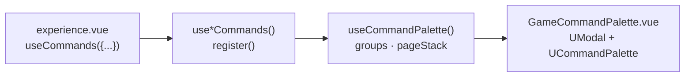

The playground has a keyboard command palette (Cmd+K / Ctrl+K) for debug actions: spawn or remove entities, play any animation on the selected character, add or remove status effects, recruit or dismiss companions, deal typed damage. It is **playground code**, not part of the engine. It lives in `apps/playground/composables/` and `apps/playground/components/GameCommandPalette.vue`, and is auto-imported like any Nuxt composable.



## `useCommandPalette`

Module-level shared state (plain `ref`s outside the function), so every caller sees the same palette.

```ts
export interface CommandItem { id: string, label: string, icon?: string, onSelect: () => void }
export interface CommandGroup { id: string, label: string, items: CommandItem[] }
export interface CommandPage { id: string, label: string, groups: CommandGroup[] }
```

| Member | Type | Purpose |
|--------|------|---------|
| `isOpen` | `Ref<boolean>` | |
| `groups` | `Ref<CommandGroup[]>` | Root-level groups |
| `pageStack` | (internal) | Nested pages pushed by items |
| `currentGroups` | `ComputedRef<CommandGroup[]>` | Top page's groups, or `groups` at root |
| `breadcrumbs` | `ComputedRef<string[]>` | Labels of the pages on the stack |
| `registerGroup(group)` | `(CommandGroup) => void` | **Upsert** by `id`: re-registering replaces the group |
| `unregisterGroup(id)` | `(string) => void` | |
| `pushPage(page)` | `(CommandPage) => void` | Drill into a sub-menu |
| `popPage()` | `() => void` | |
| `open()`, `close()`, `toggle()` | `() => void` | `close` also clears the page stack |

Groups are `UCommandPalette`-compatible, so `CommandItem.onSelect` runs when the row is picked.

## `GameCommandPalette.vue`

Mounted once per page in `index.vue`, outside `<GameContextProvider>` (it is DOM, not canvas). It binds the shared state to Nuxt UI:

- `defineShortcuts({ meta_k: toggle, ctrl_k: toggle })`
- `UModal` whose `open` mirrors `isOpen`; closing the modal calls `close()`
- `UCommandPalette` with `:groups="currentGroups"` and a breadcrumb row from `breadcrumbs`
- Backspace on an empty search field calls `popPage()`
- The search term resets when the palette closes or the page changes

## `useCommands(options)`

Call it once in an experience component. Each `true` flag builds one command group and registers it in `onMounted`, unregistering in `onUnmounted`.

```ts
useCommands({ entities: true, animations: true, statusEffects: true, recruit: true })
```

| Option | Composable | Group id | Adds |
|--------|-----------|----------|------|
| `entities` | `useEntityCommands` | `entities` | Spawn (any character template from `queryCollection('entities')`), Remove, Select |
| `animations` | `useAnimationCommands` | `anim-*` (one per category) | Every `AnimationName`, grouped into Movement, General, Combat Melee, Combat Ranged, Simulation, Tools, Special (Skeletons). Plays on the **selected** character's `CharacterRef` |
| `statusEffects` | `useStatusEffectCommands` | `status-effects` | Add / Remove Status Effect, pick character, pick effect from `useStatusEffectStore` |
| `recruit` | `useRecruitCommands` | `party` | Recruit from `recruitableEntities`, Dismiss from `dismissableEntities` |
| `damageNumbers` | `useDamageNumberCommands` | `damage-numbers` | Deal Damage (character → damage type → normal/critical) and Heal. Calls `gameStore.applyDamage` then `ref.showDamage` |

`useCommands` resolves the selected character with `useSceneRefs().getCharacterRef(gameStore.selectedEntityId)`, so animation commands need a selected entity with a registered ref. See [Scene Refs](/core-concepts/scene-refs).

### Nested pages

Multi-step commands push pages instead of flooding the root list. From `useEntityCommands`:

```ts
const entitiesGroup: CommandGroup = {
  id: 'entities',
  label: 'Entities',
  items: [
    {
      id: 'entities-spawn',
      label: 'Spawn',
      icon: 'i-heroicons-user-plus',
      onSelect: () => pushPage({ id: 'entities-spawn', label: 'Spawn', groups: buildSpawnPage() }),
    },
    // Remove, Select ...
  ],
}
```

`buildSpawnPage()` is called at push time, so the sub-menu reflects the current store (only living entities appear under Remove, only effects the character does not have appear under Add Status Effect).

## Adding a group

Follow the same shape: a composable that returns `register` / `unregister`.

```ts [composables/useMyCommands.ts]
import type { CommandGroup } from './useCommandPalette'

export function useMyCommands() {
  const { registerGroup, unregisterGroup, close } = useCommandPalette()

  const group: CommandGroup = {
    id: 'my-group',
    label: 'My Group',
    items: [
      { id: 'my-action', label: 'Do the thing', icon: 'i-lucide-zap', onSelect: () => { doThing(); close() } },
    ],
  }

  return {
    register: () => registerGroup(group),
    unregister: () => unregisterGroup('my-group'),
  }
}
```

Then add a flag to `CommandsOptions` in `useCommands.ts` and wire `register`/`unregister` in its mount hooks. Call `close()` in `onSelect` for one-shot actions; leave the palette open only when you push a page.

::tip
Group ids must be unique across the palette. `registerGroup` replaces a group with the same id, which is what lets a page re-register with fresh data, but two composables sharing an id will overwrite each other.
::
