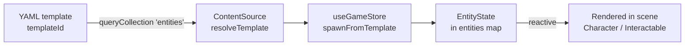

The entity system separates **static definitions** (templates) from **runtime state** (instances). Templates live in YAML files via `@nuxt/content`, instances are managed by the engine's game store (`@artificer-forge/engine/runtime`).

## Architecture

```
content/entities/          # Templates (static definitions)
├── characters/
│   ├── companions/
│   │   └── hero.yaml
│   └── enemies/
│       └── goblin-scout.yaml
├── items/
│   └── longsword.yaml
└── interactables/
    └── chest-common.yaml

stores/game.ts             # Runtime state (live instances)
```

## Template vs Instance

| Aspect | Template | Instance |
|--------|----------|----------|
| Storage | YAML file | Pinia store |
| Identity | `templateId` | `id` (generated) |
| Data | Base stats, model paths | Current HP, position |
| Lifecycle | Loaded at build | Spawned at runtime |

## Flow



1. Define entity in YAML with `templateId`
2. The app's `ContentSource` resolves it via `queryCollection('entities')`
3. Call `gameStore.spawnFromTemplate('hero', position)` — the store creates an instance with a unique `id` and merged state
4. A Vue component iterates `gameStore.entities` and renders each one

::note
The engine does not query content directly. The app injects a `ContentSource` (backed by `queryCollection`) via `gameStore.configureContent(...)`; `spawnFromTemplate` resolves templates through it. See [Game Store](/core-concepts/game-store).
::

## Entity Types

Three entity types, each with specific fields:

- **character** - NPCs, enemies, party members (stats, AI, animations)
- **item** - Weapons, consumables, equipment (damage, effects, stackable, **containerId/slot**)
- **interactable** - Chests, doors, levers (locked, lootTable, destructible)

### Items as Entities

Items are first-class entities, not properties of a character. A sword in the world, a sword in a chest, and a sword in your hand are the same record with a different `containerId`/`slot`:

| Field | Meaning |
|-------|---------|
| `containerId` | Owning entity id, or `null` if the item is in the world |
| `slot` | When equipped, the equipment slot name (`mainHand`, `helmet`, …) |
| `quantity` | Stack count for stackable items |
| `position` | World position (only meaningful when `containerId === null`) |

See [Inventory Overview](/inventory/overview) for the full item-entity model and the `moveItem` primitive that powers equip / drop / pickup / transfer.

## Key Concepts

### Nuxt Content v3 API

Templates use `queryCollection` (not `queryContent`):

```ts
// Query all entities
const entities = await queryCollection('entities').all()

// Query by type
const characters = await queryCollection('entities')
  .where('type', '=', 'character')
  .all()

// Query single template
const hero = await queryCollection('entities')
  .where('templateId', '=', 'hero')
  .first()
```

### Reserved Fields

::warning
Nuxt Content v3 reserves `id` for the file path. Use `templateId` for custom identifiers.
::

```yaml
# Wrong - id gets overwritten
id: hero

# Correct
templateId: hero
```

### Smart vs Dumb Components

- **Experience page** (smart) - Accesses store, manages entity lifecycle
- **Character component** (dumb) - Receives props, renders model

This keeps rendering components reusable and testable.
