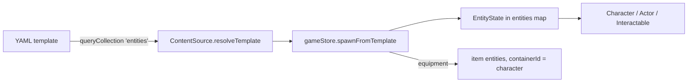

The entity system separates **static definitions** (templates) from **runtime state** (instances). Templates are YAML files read by `@nuxt/content`. Instances live in the engine's Pinia game store (`useGameStore` from `@artificer-forge/engine/runtime`).

## Content layout

The playground's `content/` folder (real files, 2026-08):

```
apps/playground/content/
├── entities/
│   ├── characters/
│   │   ├── player.yaml
│   │   ├── companions/   borin, cedric, fenrath, hero, tav, zynrae
│   │   ├── enemies/      orc_scout.yaml
│   │   └── npcs/         guard-captain.yaml
│   ├── items/
│   │   ├── armor/        breastplate, cedric-*, common-pants, leather-jerkin,
│   │   │                 leather-sandals, ring-of-warding, wild-raider-*
│   │   ├── consumables/  healing_potion.yaml
│   │   └── weapons/      bow, dagger, orc_axe, shortsword
│   └── interactables/    chest-common.yaml
├── scenes/               character-scene, corpse-scene, dialog-scene, …
├── abilities/            arrow-shot, dash, fireball, magic-missile, melee-attack, throw
├── classes/              fighter, rogue
├── damage-types/         bludgeoning, fire, force, ice, lightning, necrotic, piercing, slashing
├── dialogs/              guard-captain, orc_scout_prison, zynrae (+ .layouts/*.json)
└── status-effects/       blessed, burning, frozen, hasted, poisoned, shocked, slowed, warm, wet

packages/engine/src/runtime/stores/game.ts   # runtime instances (EntityState)
```

Folder depth under `entities/` is free: the collection source is `entities/**/*.yaml`, and the engine only reads `templateId`.

## Template vs instance

| Aspect | Template | Instance |
|--------|----------|----------|
| Storage | YAML file | `gameStore.entities` (a `Map<string, EntityState>`) |
| Identity | `templateId` | `id` = `${templateId}_${Date.now()}` |
| Data | Base stats, model or appearance, starting gear | Current HP, position, armor pools, status effects |
| Lifecycle | Indexed at build | Created by `spawnFromTemplate`, removed by `removeEntity` or `loadScene` |

## Flow


```mermaid
flowchart LR
  A[YAML template] -->|queryCollection 'entities'| B[ContentSource.resolveTemplate]
  B --> C[gameStore.spawnFromTemplate]
  C --> D[EntityState in entities map]
  C -->|equipment| E[item entities, containerId = character]
  D --> F[Character / Actor / Interactable]
```

1. Write a YAML file with a `templateId`.
2. The app injects a `ContentSource` once (see below). The engine never imports `queryCollection`.
3. `await gameStore.spawnFromTemplate('cedric', { x: 0, y: 0, z: 0 })` copies the template fields into an `EntityState`, seeds the default abilities (`melee-attack`, `dash`, `throw`), spawns every `equipment` entry as an item entity owned by the character, and fills the armor pools.
4. A scene component iterates the store and renders each entity with `<Character>`, `<Actor>` or `<Interactable>` ([Rendering](/entities/rendering)).

::warning
`spawnFromTemplate` throws `content source not configured` if `configureContent()` did not run first. In the playground this happens in a Nuxt plugin, so pages never see it.
::

## Content injection (`plugins/gameData.ts`)

The engine exposes five resolvers on the store. The playground wires them to Nuxt Content and preloads the two lookup stores:

```ts
// apps/playground/plugins/gameData.ts
gameStore.configureContent({
  resolveTemplate: templateId =>
    queryCollection('entities').where('templateId', '=', templateId).first(),
  resolveScene: sceneId =>
    queryCollection('scenes').where('sceneId', '=', sceneId).first(),
  resolveAbility: abilityId =>
    queryCollection('abilities').where('abilityId', '=', abilityId).first(),
  resolveDialog: dialogId =>
    queryCollection('dialogs').where('dialogId', '=', dialogId).first(),
  resolveClass: classId =>
    queryCollection('classes').where('classId', '=', classId).first(),
})

await Promise.all([
  damageTypeStore.load(() => queryCollection('damageType').all()),
  statusEffectStore.load(() => queryCollection('statusEffect').all()),
])
```

The collections and their id fields:

| Collection | Source | Id field | Consumer |
|------------|--------|----------|----------|
| `entities` | `entities/**/*.yaml` | `templateId` | `spawnFromTemplate`, `useEquipment`, `useModularArmor` |
| `scenes` | `scenes/*.yaml` | `sceneId` | `loadScene` ([Scenes](/entities/scenes)) |
| `abilities` | `abilities/*.yaml` | `abilityId` | ability system ([Abilities](/combat/abilities)) |
| `classes` | `classes/*.yaml` | `classId` | action bar emblem and colour |
| `damageType` | `damage-types/*.yaml` | `damageTypeId` | `useDamageTypeStore` (armor gate, colour, icon) |
| `dialogs` | `dialogs/*.yaml` | `dialogId` | dialog engine ([Dialog](/dialog/overview)) |
| `statusEffect` | `status-effects/*.yaml` | `statusEffectId` | `useStatusEffectStore` ([Status effects](/characters/status-effects/overview)) |

## Entity types

`type` is one of three values. The rest of the schema is optional and grouped by type ([Templates](/entities/templates)):

- **character**: stats, `team`, `controllable`, `ai`, abilities, `dialogId`, starting `equipment`, and either a single `model` + `rig` or a modular `appearance` recipe.
- **item**: `subtype` (`weapon`, `armor`, `boots`, `consumable`, …), `damage`, `armor`, `effect`, weight and value, stacking, and for body-worn gear the `modular` + `texture` blocks.
- **interactable**: `locked`, `hp`, `destructible`, `lootTable`, and the code-driven `animations` block ([Interactables](/entities/interactables)).

### Two render paths for characters

A character template is rendered one of two ways, decided once at mount by the presence of `appearance`:

| Path | Template fields | Renderer |
|------|-----------------|----------|
| Single GLB | `model: /models/characters/hero.glb`, `rig: Rig_Medium` | `useGLTF(model, { draco: true })`, rig = `nodes[rig]` |
| Modular | `appearance: { body, head, hair, … }`, `sex` | `useModularRig` assembles KayKit parts on a shared skeleton |

Modular characters take their visible armor from the equipped items (`item.modular.assets`), not from `appearance`. See [Modular characters](/characters/modular-characters).

### Items as entities

Items are entities, not fields on a character. A sword on the floor, in a chest, and in a hand is the same record with a different `containerId`/`slot`:

| Field | Meaning |
|-------|---------|
| `containerId` | Owning entity id, or `null` when the item lies in the world |
| `slot` | Equipment slot name when equipped (`mainHand`, `armor`, …) |
| `quantity` | Stack count for stackables |
| `position` | World position, only meaningful when `containerId === null` |

`spawnItemEntity` copies `modular`, `texture`, `damage`, `armor`, `properties`, `range`, `effect`, `value`, `usable`, `weight`, `stackable`, `maxStack` from the item template onto the instance, so renderers never re-query content. See [Inventory](/inventory/overview).

## Nuxt Content v3 notes

Use `queryCollection`, not `queryContent`:

```ts
const cedric = await queryCollection('entities')
  .where('templateId', '=', 'cedric')
  .first()
```

::warning
Nuxt Content reserves `id` for the file path. Use `templateId` (or `sceneId`, `abilityId`, …) for your own identifiers.
::

The content index is built at startup. Restart the dev server after adding or renaming YAML files.
