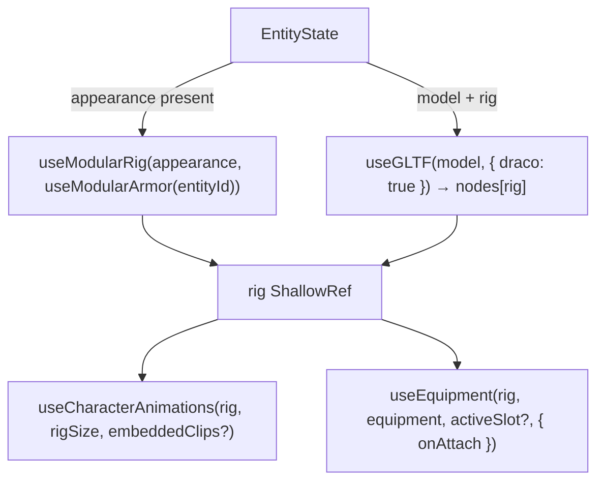

A scene component (the "experience") spawns entities into the store and renders each one with an engine component keyed by `entity-id`. The components read everything else (model or appearance, position, equipment, status effects) from `useGameStore`.

```ts
import { Actor, Character, Floor, Interactable } from '@artificer-forge/engine/runtime'
```

| Component | Use for | Owns its transform? |
|-----------|---------|---------------------|
| `Character` | Party members. Click-to-move, weapon switching, DoF focus, damage numbers | Yes: reads the store position once at mount, writes it back on arrival |
| `Actor` | Everyone else: NPCs, enemies, villagers | No: binds `entity.position` / `entity.rotation` reactively |
| `Interactable` | Chests, doors, levers | No: binds `entity.position` (rotation is not applied) |

::warning
`Character` is not reactive to `updateEntity(id, { position })` after mount. The controller owns the group, and `onArrive` syncs back to the store. To place a party member, pass the position to `spawnFromTemplate` or update it before the component mounts.
::

## Experience page

Trimmed from `apps/playground/pages/character/modular/experience.vue`. The page has no `<TresCanvas>`; `GameContextProvider` in `index.vue` supplies it.

```vue
<script setup lang="ts">
import { Actor, Character, Floor, useGameStore, useSceneRefs } from '@artificer-forge/engine/runtime'

const gameStore = useGameStore()
const { setCharacterRef } = useSceneRefs()

onMounted(async () => {
  const playerId = await gameStore.spawnFromTemplate('tav', { x: 0, y: 0, z: 0 })
  gameStore.addToParty(playerId)
  gameStore.selectEntity(playerId)

  const { spawnPoint } = await gameStore.loadScene('character_scene')
  gameStore.updateEntity(playerId, { position: spawnPoint })

  const cedricId = await gameStore.spawnFromTemplate('cedric', { x: spawnPoint.x - 2, y: 0, z: spawnPoint.z - 1 })
  gameStore.addToParty(cedricId)

  // Same template, different look and team: rendered by Actor because it is not in the party.
  await gameStore.spawnFromTemplate('tav', { x: spawnPoint.x + 3, y: 0, z: spawnPoint.z - 2 }, {
    name: 'Villager',
    team: 'neutral',
    controllable: false,
    ai: { behavior: 'idle' },
    appearance: {
      body: 'HUM_F_MEDIUM_Body_A',
      head: 'HUM_F_Head_A',
      hair: 'GEN_F_Hair_Long_B',
      beard: null,
      eyebrows: 'GEN_Eyebrows_Thin_B',
      horns: null,
      skinColor: '#8d5524',
      hairColor: '#2c222b',
    },
    sex: 'F',
  })
})

const characterEntities = computed(() => gameStore.partyEntities)
const actorEntities = computed(() => gameStore.actorEntities)
</script>

<template>
  <TresAmbientLight :intensity="0.8" />
  <TresDirectionalLight :position="[5, 5, 5]" :intensity="1.5" cast-shadow />
  <Character
    v-for="entity in characterEntities"
    :ref="(el: any) => setCharacterRef(entity.id, el)"
    :key="entity.id"
    :entity-id="entity.id"
  />
  <Actor
    v-for="entity in actorEntities"
    :key="entity.id"
    :entity-id="entity.id"
  />
  <Floor />
</template>
```

`partyEntities` and `actorEntities` (characters not in the party) are store getters, so recruiting an NPC moves it from `<Actor>` to `<Character>` automatically.

No `<Suspense>` is needed. Both rig paths resolve asynchronously behind a `v-if="rig"` guard.

## Two rig paths

`Character` and `Actor` decide the rig source once, at setup. The check is `!!entity.appearance` and it is deliberately not reactive: an entity never switches paths.



| | Single GLB | Modular |
|---|-----------|---------|
| Rig | `nodes[entity.rig ?? 'Rig_Medium']` | Bare skeleton `rig_medium.glb` / `rig_small.glb`, parts rebound by bone name |
| Rig size for animation packs | `rig` minus the `Rig_` prefix (`Rig_Large` → `Large`) | From the body part: `resolvePartRig(appearance.body)` (`medium` → `Medium`, `small` → `Small`) |
| Embedded clips | `state.animations` from the GLB are added to the packs | none |
| Body armor | not rendered | `helmet, armor, cloak, trousers, gauntlets, boots` from equipped items |
| Weapons | `useEquipment` on `handslotr` / `handslotl` | same |

Details of the modular path: [Modular characters](/characters/modular-characters).

## `Character`

### Props

| Name | Type | Default | Purpose |
|------|------|---------|---------|
| `entityId` | `string` | `''` | Store entity to render |
| `grading` | `GradingContext \| null` | `null` | Stylized-output grading applied to every mesh and attached weapon (`applyGradingToModel`) |
| `groundHeight` | `Node<'float'> \| null` | `null` | Ground height for the contact-occlusion term on terrain. Read once, at first grading |

### What it does

- Loads the rig (either path) and calls `useCharacterAnimations(rig, rigSize, singleGltf?.animations)`.
- Movement: `useCharacterController(characterRef, { play }, { speed: 3 })`, `update(delta)` in `useLoop().onBeforeRender`. `onArrive` writes position and rotation to the store; the `target` watcher mirrors `moveTarget` into the store.
- Weapons: `useEquipment(rig, derivedEquipment, effectiveWeaponSlot, { onAttach })`. `effectiveWeaponSlot` is the action bar's `activeWeaponSlot` for the party leader and `undefined` (both weapons visible) for other party members.
- Status effects: `useStatusEffectOverlay`, `useStatusEffectParticles`, `useStatusEffectAnimations`, `useStatusEffectTexts`.
- Shadows: `castShadow = true` on every mesh, no `receiveShadow` (hair self-shadowing stripes the face at grazing sun angles).
- DoF: the party leader's group is the focus target (`useDofFocus().setFocusTarget`); cleared on leader change or unmount.
- Pointer: hover outlines non-selected party members (`'party'`) and hostiles while targeting (`'hostile'`); click confirms a combat target; right-click opens the [entity context menu](/core-concepts/commands).
- Overlays inside the `<primitive>`: `Nameplate` (dead, or hovered and not the selected entity) with the live-baked portrait from `usePortraitRenderer`, `DamageNumber` list, `StatusEffectText` list.

### Automatic death pose

The component guarantees the pose itself, whoever set `hp`:

```ts
const isDead = computed(() => (entity.value?.hp ?? 1) <= 0 || !!entity.value?.dead)

watch(() => [isDead.value, Object.keys(actions).length] as const, ([dead, len]) => {
  if (!len || !dead) return
  cancelMovement()
  if (actions[AnimationName.DEATH_A_POSE]) {
    play(AnimationName.DEATH_A_POSE, { fadeTime: 0.3, once: true })
  }
}, { immediate: true })
```

It re-checks when the action count changes, so a character spawned dead (corpse scene) drops into the pose as soon as the `General` pack loads. The ability system additionally plays the `Death_A` fall on a kill, then hands over to the pose. `Actor` has no death watcher and exposes no ref: `useActorBehavior` only skips the idle when `hp <= 0`, so a dead Actor keeps its last pose and shows the dead nameplate.

### Exposed surface (`defineExpose`)

| Member | Signature |
|--------|-----------|
| `play` | `(name, fadeTimeOrOpts?: number \| PlayOptions, timeScale?) => void` |
| `stop` | `(fadeTime?) => void` |
| `currentAnimName` | `Readonly<Ref<AnimationNameType>>` |
| `actions` | `Readonly<Record<string, AnimationAction \| null>>` |
| `AnimationName` | the enum object, for callers without the import |
| `moveTo` | `(point: Vector3) => void` |
| `cancelMovement` | `() => void` |
| `onArrive` | `EventHookOn<Vector3>` |
| `getPosition` | `() => Vector3 \| null`, the live group position (the store only updates on arrival) |
| `showDamage` | `(value, type, critical?) => void` |
| `meleeAttack` | plays `Melee_1H_Attack_Chop` |
| `lookAt` | `(point: Vector3) => void`, yaw only |
| `attachToHand` / `detachFromHand` | `(slot: 'mainHand' \| 'offHand', object)` extra props on the hand bones, separate from equipment |

`CharacterRef` in `useSceneRefs` types the subset other systems call (`play, actions, getPosition, moveTo, onArrive, showDamage, meleeAttack, lookAt, attachToHand, detachFromHand, cancelMovement`). Register with `setCharacterRef(entity.id, el)` as in the example above; see [Scene Refs](/core-concepts/scene-refs).

## `Actor`

One prop, `entityId: string`. Same two rig paths, then:

- `useCharacterAnimations(rig)` (always `Medium` packs).
- `useEquipment(rig, equipment)` with no active slot: both weapons stay visible.
- `useActorBehavior(entity, play)`: plays `ai.idleAnimation` if it is a valid `AnimationName`, else `Idle_A`. There is no follow or aggro logic.
- Status overlays, particles and animations as `Character`.
- `<primitive cast-shadow receive-shadow>`, hover outline coloured by `entity.team`, `Nameplate` when dead or hovered, right-click context menu.

The group binds `:position` and `:rotation` from the store, so `updateEntity` moves an Actor immediately.

## `Interactable`

Chests and other code-animated props. Props `entityId` and `debug` (BVH wireframe), emits `interact(entityId)` on click. See [Interactables](/entities/interactables).

## World items

Dropped items (`gameStore.worldItems`: `type === 'item'`, no container, has a `model`) render with `WorldItem` from `@artificer-forge/engine/ui`, wrapped in `<Suspense>`:

```vue
<Suspense v-for="worldItem in worldItems" :key="worldItem.id">
  <InventoryWorldItem :item="worldItem" />
</Suspense>
```

## Reactive updates

- `removeEntity(id)`: the component unmounts (`v-if="entity"`), rigs and materials are disposed.
- `updateEntity(id, { hp })`: nameplates, death pose (`Character`) and corpse looting react through the store.
- `updateEntity(id, { position })`: moves `Actor` and `Interactable`; does not move a mounted `Character` (see the warning at the top).
