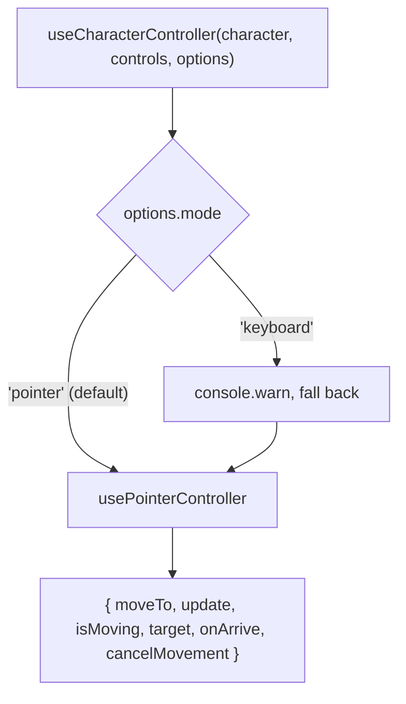

`useCharacterController` (from `@artificer-forge/engine/runtime`) is a facade over movement controllers. It picks an implementation from `options.mode` and returns the same shape either way.

| Mode | Implementation | Input |
|------|----------------|-------|
| `pointer` (default) | `usePointerController` | Click-to-move |
| `keyboard` | not implemented | Logs a warning and falls back to `pointer` |



## Signature

```ts
export function useCharacterController(
  character: Ref<Group | undefined>,
  animationControls: AnimationControls,
  options: CharacterControllerOptions = { speed: 3 },
)

export type AnimationControls = {
  play: (name: AnimationNameType, fadeTime?: number, timeScale?: number) => void
}

export interface CharacterControllerOptions {
  mode?: 'pointer' | 'keyboard'  // default 'pointer'
  speed: number                  // metres per second
  baseAnimSpeed?: number         // speed the walk clip was authored for, default 2
}
```

`play` from [`useCharacterAnimations`](/characters/animations) satisfies `AnimationControls` directly.

### Returns

| Property | Type | Purpose |
|----------|------|---------|
| `moveTo(point)` | `(Vector3) => void` | Set the target (cloned) and play `Walking_A` at `speed / baseAnimSpeed` |
| `update(delta)` | `(number) => void` | Advance one frame. Call from `useLoop().onBeforeRender` |
| `isMoving` | `ComputedRef<boolean>` | `target !== null` |
| `target` | `ShallowRef<Vector3 \| null>` | Current target, `null` when idle |
| `onArrive(fn)` | `EventHookOn<Vector3>` | Fires once with the reached point |
| `cancelMovement()` | `() => void` | Clear the target. No idle is played; the current clip keeps running |

## Pointer controller

`update` measures and steps on the XZ plane only:

```ts
const ARRIVE_RADIUS = 0.1  // metres, measured on XZ

function update(delta: number) {
  if (!character.value || !target.value) return

  const position = character.value.position
  const dx = target.value.x - position.x
  const dz = target.value.z - position.z
  const distance = Math.hypot(dx, dz)

  if (distance < ARRIVE_RADIUS) {
    const arrivedAt = target.value.clone()
    target.value = null
    animationControls.play(AnimationName.IDLE_A)
    arriveHook.trigger(arrivedAt)
    return
  }

  character.value.rotation.y = Math.atan2(dx, dz)

  const step = Math.min(speed * delta, distance)
  position.x += (dx / distance) * step
  position.z += (dz / distance) * step
}
```

Why XZ only: the scene owns `y` (terrain grounding, physics). If arrival were measured in 3D and something kept rewriting the character's height, `distance` could never drop under `ARRIVE_RADIUS` and the character would walk forever. The target keeps its `y` as data for markers.

Why the clamp: a long frame would otherwise overshoot the target and orbit it. `Math.min(speed * delta, distance)` lands exactly on the point.

### Animation speed scaling

```ts
const animTimeScale = speed / baseAnimSpeed   // 3 / 2 = 1.5 by default
animationControls.play(AnimationName.WALKING_A, 0.3, animTimeScale)
```

Set `baseAnimSpeed` to the ground speed the walk clip was authored for. A character with `speed: 5` plays the walk at 2.5x; `speed: 1.5` plays it at 0.75x.

### Using it directly

```ts
import { usePointerController } from '@artificer-forge/engine/runtime'

const { moveTo, update } = usePointerController(characterRef, { play }, { speed: 3 })
```

## Integration in `Character.vue`

Trimmed from the engine component:

```ts
const characterRef = ref<Group>()

const { moveTo, update, target, onArrive, cancelMovement } = useCharacterController(characterRef, { play }, {
  speed: 3,
})

// Store sync only on arrival, not every frame.
function syncToStore() {
  if (!characterRef.value) return
  const pos = characterRef.value.position
  const rot = characterRef.value.rotation
  gameStore.updateEntity(props.entityId, {
    position: { x: pos.x, y: pos.y, z: pos.z },
    rotation: { x: rot.x, y: rot.y, z: rot.z },
  })
}
onArrive(syncToStore)

// Mirror the target so other systems (trample, markers) can read it from the store.
watch(target, (newTarget) => {
  gameStore.updateEntity(props.entityId, {
    moveTarget: newTarget ? { x: newTarget.x, y: newTarget.y, z: newTarget.z } : null,
  })
}, { immediate: true })

// Initial placement: read once when the group exists.
watch(characterRef, (group) => {
  if (group && entity.value) {
    const { position, rotation } = entity.value
    group.position.set(position.x, position.y, position.z)
    if (rotation) group.rotation.set(rotation.x, rotation.y, rotation.z)
  }
}, { immediate: true })

const { onBeforeRender } = useLoop()
onBeforeRender(({ delta }) => update(delta))
```

```vue
<TresGroup v-if="entity" ref="characterRef">
  <primitive v-if="rig" :object="rig" />
</TresGroup>
```

The group has no `:position` binding. The controller owns the transform between arrivals, and the store is the record of the last resting place. `getPosition()` on the exposed ref returns the live position for systems that need it per frame.

::warning
Do not sync in `update()`. Writing to the store 60 times a second triggers every store watcher (nameplates, portraits, party panel) on every frame.
::

## Scene wiring

The playground's click-to-move floor lives in `CombatSystem.vue`, which raycasts the ground and calls `moveTo` on the selected character's `CharacterRef`. For a minimal setup:

```vue
<script setup lang="ts">
import { useSceneRefs, useGameStore } from '@artificer-forge/engine/runtime'
import type { TresPointerEvent } from '@tresjs/core'

const gameStore = useGameStore()
const { getCharacterRef } = useSceneRefs()

function onGroundClick(event: TresPointerEvent) {
  const id = gameStore.selectedEntityId
  if (id) getCharacterRef(id)?.moveTo(event.point)
}
</script>

<template>
  <Floor @click="onGroundClick" />
</template>
```

`Floor` re-emits its `click` with the `TresPointerEvent`, whose `point` is the world hit.

## Stopping

`cancelMovement()` clears the target. `Character.vue` calls it when the entity dies before playing the death pose. Play `Idle_A` yourself if you need the character to stop walking in place; the controller only plays idle on a real arrival.
