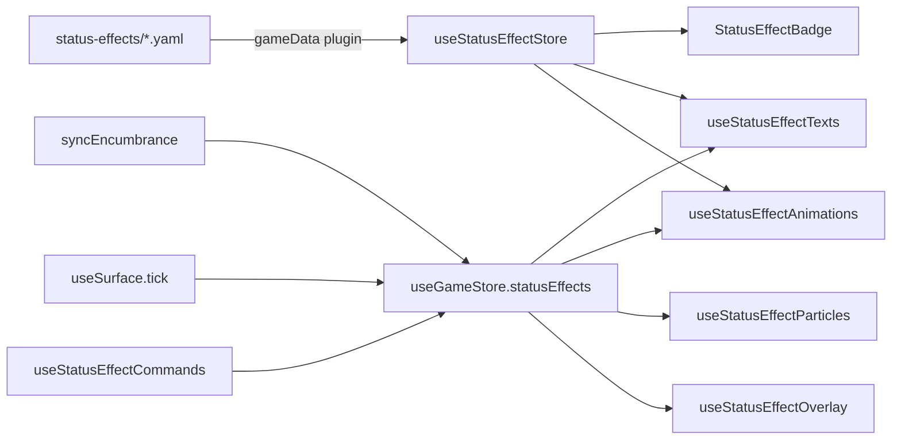

A status effect is an id stored on an entity. Everything else (label, colors, icon, whether it hurts) comes from a YAML definition the app loads into a Pinia store. The 3D visuals are separate composables that watch the game store and react on their own.

::note
**Across the layers**

- **Rules** (`@artificer-forge/engine/core`): `STATUS_EFFECT_IDS` and the `StatusEffectId` union. Plain TS, no Vue, no Three.
- **Runtime** (`@artificer-forge/engine/runtime`): `useStatusEffectStore` holds the definitions, `useGameStore` holds the applied effects per entity, and four composables (`useStatusEffectOverlay`, `useStatusEffectParticles`, `useStatusEffectAnimations`, `useStatusEffectTexts`) drive the in-scene visuals. `StatusEffectBadge`, `StatusEffectBadges` and `StatusEffectText` are exported from the same entry.
- **VFX** (`@artificer-forge/vfx`): the TSL emissive builders (`STATUS_OVERLAY_BUILDERS`) and the ember `Points` system (`createEmberSystem`). The runtime composables only wire them to a rig.
- **Content** (`apps/playground/content/status-effects/*.yaml`): one file per effect.
::

## Available effects

| Effect | Badge | Type | Armor gate | Flinch | Visual | Applied by |
|--------|-------|------|------------|--------|--------|------------|
| [Poisoned](/characters/status-effects/poisoned) | :status-effect-badge{effectId="poisoned"} | `debuff` | `physical` | yes | Worley noise overlay | poison surface, palette |
| [Shocked](/characters/status-effects/shocked) | :status-effect-badge{effectId="shocked"} | `cc` | `magical` | no | Badge only | electrified water/blood, palette |
| [Burning](/characters/status-effects/burning) | :status-effect-badge{effectId="burning"} | `dot` | `magical` | yes | FBM flame overlay + embers | fire surface, palette |
| [Blessed](/characters/status-effects/blessed) | :status-effect-badge{effectId="blessed"} | `buff` | `none` | no | Badge only | palette |
| [Hasted](/characters/status-effects/hasted) | :status-effect-badge{effectId="hasted"} | `buff` | `none` | no | Badge only | palette |
| [Frozen](/characters/status-effects/frozen) | :status-effect-badge{effectId="frozen"} | `cc` | `magical` | no | Hex lattice overlay | palette |
| [Wet](/characters/status-effects/wet) | :status-effect-badge{effectId="wet"} | `debuff` | `none` | no | Badge only | water/blood surface, palette |
| [Slowed](/characters/status-effects/slowed) | :status-effect-badge{effectId="slowed"} | `debuff` | `none` | no | Badge only | oil surface, palette |
| [Warm](/characters/status-effects/warm) | :status-effect-badge{effectId="warm"} | `buff` | `none` | no | Badge only | fire proximity |
| [Encumbered](/characters/status-effects/encumbered) | :status-effect-badge{effectId="encumbered"} | (no YAML) | (no YAML) | no | Badge only | inventory weight |

"Badge only" means the id has no overlay, particle, animation, or gameplay code. It shows in the HUD and pops a floating label. Nothing else reads it yet.

::warning
`encumbered` is applied by `useGameStore.syncEncumbrance` but is **not** in `STATUS_EFFECT_IDS` and has **no** YAML file. In the playground its badge renders with no icon and no color because `store.get('encumbered')` is `undefined`. See [Encumbered](/characters/status-effects/encumbered).
::

## Ids

`packages/engine/src/core/statusEffects.ts`:

```ts
export const STATUS_EFFECT_IDS = [
  'poisoned',
  'shocked',
  'burning',
  'blessed',
  'hasted',
  'frozen',
  'wet',
  'slowed',
  'warm',
] as const

export type StatusEffectId = typeof STATUS_EFFECT_IDS[number]
```

The ids live in `core` so that content validation, the HUD, and the surface simulation share one list without importing Vue or Three.

## Definitions are content

Each effect is a YAML file in `apps/playground/content/status-effects/`. `content.config.ts` declares the `statusEffect` collection:

```ts
statusEffect: defineCollection({
  type: 'data',
  source: 'status-effects/*.yaml',
  schema: z.object({
    statusEffectId: z.string(),
    label: z.string(),
    type: z.enum(['buff', 'debuff', 'dot', 'cc']),
    armorGate: z.enum(['physical', 'magical', 'none']),
    flinch: z.boolean(),
    color: z.string(),
    bgColor: z.string(),
    icon: z.string(),
  }),
}),
```

| Field | Type | Read by |
|-------|------|---------|
| `statusEffectId` | `string` | Store key. A `z.string()` on purpose: Nuxt Content cannot resolve an imported Zod enum and would push the field into meta JSON instead of a column. |
| `label` | `string` | Badge tooltip, floating text, command palette item |
| `type` | `'buff' \| 'debuff' \| 'dot' \| 'cc'` | Stored only. No code branches on it yet. |
| `armorGate` | `'physical' \| 'magical' \| 'none'` | Stored only. Which armor pool should block the effect; the combat code does not read it yet. |
| `flinch` | `boolean` | `useStatusEffectAnimations`. `true` on `poisoned` and `burning`. |
| `color` | Tailwind text class | Badge icon color, floating text color |
| `bgColor` | Tailwind bg class | Badge circle background |
| `icon` | `i-lucide-*` | Badge icon, command palette item icon |

Example, `burning.yaml`:

```yaml
statusEffectId: burning
label: Burning
type: dot
armorGate: magical
color: text-orange-400
bgColor: bg-orange-900
icon: i-lucide-flame
flinch: true
```

### Loading into the store

The engine never fetches content. The app hands the store a loader once, in `apps/playground/plugins/gameData.ts`:

```ts
const statusEffectStore = useStatusEffectStore()

await statusEffectStore.load(
  () => queryCollection('statusEffect').all() as unknown as Promise<StatusEffectDefinition[]>,
)
```

`useStatusEffectStore` (`runtime/stores/statusEffects.ts`):

| Member | Type | Purpose |
|--------|------|---------|
| `load(loader)` | `(loader: () => Promise<StatusEffectDefinition[]>) => Promise<void>` | Hydrates once. Returns early if the map already has entries, so calling it twice is safe. |
| `get(id)` | `(id: StatusEffectId) => StatusEffectDefinition \| undefined` | Lookup by id |
| `allEffects` | `ComputedRef<StatusEffectDefinition[]>` | Array view, used by the command palette |
| `effects` | `Ref<Map<string, StatusEffectDefinition>>` | Raw map |

`useStatusEffects()` is a thin wrapper that returns `{ getDefinition }` over the same store.

::warning
`useStatusEffects.ts` still exports a hardcoded `STATUS_DEFINITIONS` table. Nothing reads it. Its colors already drift from the YAML. Treat the store as the only source of truth.
::

## Applying and removing

Effects live on `EntityState.statusEffects` as `StatusEffect[]` (`runtime/stores/game.ts`):

```ts
export interface StatusEffect {
  id: StatusEffectId
  turnsLeft?: number
}
```

```ts
const gameStore = useGameStore()

gameStore.addStatusEffect(entityId, 'poisoned')
gameStore.removeStatusEffect(entityId, 'burning')
```

`addStatusEffect` is a no-op when the id is already present. The surface system relies on this and calls it every frame while an entity stands in a surface. `turnsLeft` is declared and rendered by the badge chip, but nothing sets it yet (there is no turn system).

### Sources

| Source | What it applies |
|--------|-----------------|
| Command palette (`useStatusEffectCommands`) | Any id in the store, on any character |
| Surfaces (`useSurface.tick`) | `statusForCell(cell)` returns a `SurfaceStatusId` (`burning`, `poisoned`, `shocked`, `wet`, `slowed`) for the cell under each character. Surface statuses are **not** removed when the entity walks out; there is no duration system yet. |
| Surfaces, radiant heat | `warm` when a fire cell is within `FIRE_WARM_RADIUS = 5` cells but not underfoot. Added and removed live, and never applied while `burning` is present. |
| Inventory (`syncEncumbrance`) | `encumbered` when carried weight reaches capacity, removed when it drops below. |

See [Surface variants](/surfaces/variants) for the full cell-to-status table.

## HUD components

### StatusEffectBadge

A colored circle with an icon and a tooltip. Reads the definition from `useStatusEffectStore`.

```vue
<StatusEffectBadge effect-id="poisoned" :turns-left="3" />
```

| Prop | Type | Default | Purpose |
|------|------|---------|---------|
| `effectId` | `StatusEffectId` | required | Which definition to render |
| `turnsLeft` | `number` | `undefined` | Shows a `UChip` counter when set |

### StatusEffectBadges

Renders one badge per effect. Renders nothing when the array is empty.

```vue
<StatusEffectBadges :status-effects="entity.statusEffects" direction="row" />
```

| Prop | Type | Default | Purpose |
|------|------|---------|---------|
| `statusEffects` | `StatusEffect[]` | required | Effects to render |
| `direction` | `'row' \| 'col'` | `'col'` | Flex direction |

Used by `Nameplate.vue` (`row`) and by the party HUD `CharacterPanel.vue` (`col`).

### StatusEffectText

A floating label that rises above the character when it gains an effect. It is a cientos `Html` at `[0, 2.2, 0]`, styled with the definition's `color`, and runs a 2 s CSS `status-text-rise` keyframe. Font size scales with camera distance (`dist / 15`) so it stays readable when zoomed out. It emits `done` on `animationend`.

| Prop | Type | Purpose |
|------|------|---------|
| `entry` | `StatusTextEntry` | `{ id, label, color }` from `useStatusEffectTexts` |

## Scene composables

All four composables take the entity id as a `ComputedRef<string>`, watch the game store themselves, and clean up with `onScopeDispose`. Call them once in `setup`; there is nothing to call on change.

| Composable | Signature | Reacts to | Does |
|------------|-----------|-----------|------|
| `useStatusEffectOverlay` | `(rig: ComputedRef<Object3D \| null \| undefined>, entityId: ComputedRef<string>) => void` | `statusEffects` and rig readiness | Swaps `material.emissiveNode` on every mesh in the rig with a TSL node from `@artificer-forge/vfx`. One overlay at a time, priority `burning > poisoned > frozen`. |
| `useStatusEffectParticles` | `(rig, entityId) => void` | `burning` present or not | Adds `createEmberSystem().points` to the rig and advances it in `useLoop().onBeforeRender`. |
| `useStatusEffectAnimations` | `(entityId: ComputedRef<string>, play: (name, fadeTime?) => void) => void` | Any effect whose definition has `flinch: true` | Runs `HIT_A` every 3 s, returns to `SKELETONS_IDLE` after 800 ms. Stops when the entity has `hp <= 0`. |
| `useStatusEffectTexts` | `(entityId: ComputedRef<string>) => { texts: Ref<StatusTextEntry[]>, removeText(id) }` | Ids added since the last change | Pushes one `StatusTextEntry` per new id. Nothing on removal. |

### Overlay gotchas

- The overlay stores each mesh's original `emissiveNode` in a `Map<Mesh, node>` and restores it in `clearOverlay`. Meshes that share one material are a trap: the second mesh captures the already-patched node as its "original", so the restore can leave the overlay in place.
- Only the first material of a multi-material mesh is patched.
- The watch also tracks `!!rig.value`, so an effect applied before the GLB finishes loading is picked up when the rig appears.

### Wiring in Character.vue

The real wiring is three lines plus the floating texts (`runtime/components/Character.vue`):

```ts
useStatusEffectOverlay(rig, computed(() => props.entityId))
useStatusEffectParticles(rig, computed(() => props.entityId))
useStatusEffectAnimations(computed(() => props.entityId), play)

const { texts: statusTexts, removeText: removeStatusText } = useStatusEffectTexts(computed(() => props.entityId))
```

```vue
<StatusEffectText
  v-for="entry in statusTexts"
  :key="entry.id"
  :entry="entry"
  @done="removeStatusText(entry.id)"
/>
```

`Actor.vue` wires the first three the same way. It does not render `StatusEffectText`.

## Command palette

`useStatusEffectCommands(onDone?: () => void)` in `apps/playground/composables/useStatusEffectCommands.ts` returns `{ register, unregister }`. It registers one group, `status-effects`, with two items:

- **Add Status Effect**: pick a character, then pick any definition from `store.allEffects` not already on the entity.
- **Remove Status Effect**: pick a character that has effects, then pick one of its effects.

Both call `close()` on the palette and then `onDone?.()`.

You normally do not call it directly. `useCommands({ statusEffects: true })` creates it and registers it on mount:

```ts
// apps/playground/pages/character/basic/experience.vue
useCommands({ entities: true, animations: true, statusEffects: true, recruit: true })
```

Enabled on `character/{basic,modular,party,large}`, `npc/basic`, and `combat/{ranged,damage-numbers}`.

## Data flow


