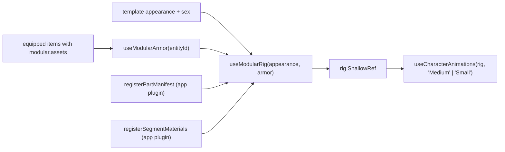

A modular character is assembled at runtime from KayKit part GLBs on one bare skeleton. The template carries an `appearance` recipe instead of `model`; armor meshes come from the items the character has equipped. `Character`, `Actor`, the inventory doll and the portrait studio all build the same rig through `useModularRig`.



Playground pages: `/character/modular` (Tav and Cedric in the party, a re-skinned Tav as a neutral `Actor`) and `/character/create` (the customizer, exports a template YAML).

## The `appearance` recipe

`CharacterAppearance` in `@artificer-forge/engine/core`:

| Field | Type | Purpose |
|-------|------|---------|
| `body` | `string` | Part id, e.g. `HUM_M_MEDIUM_Body_A`. Names the skeleton through the manifest (`rig: medium \| small`) |
| `head` | `string` | Rigid mesh parented to the `head` bone, e.g. `HUM_M_Head_A`, `HUM_M_Head_Cedric` |
| `hair`, `beard`, `eyebrows`, `horns` | `string \| null` | Skinned parts. `null` = none |
| `accessory` | `string \| null` (optional) | Piercings and similar. Optional so older templates validate |
| `skinColor`, `hairColor` | `string` | Hex colours applied to materials named `Skin` and `Hair` |
| `hornColorA`, `hornColorB` | `string?` | Horn gradient stops. Defaults `#2b2230`, `#8a6d5c` |
| `hornPattern` | `'gradient' \| 'repeated' \| 'solid'` | Default `gradient` |
| `hornWeight` | `number?` (0..1) | Where colour A hands over to B. Default `0.5` |
| `equipmentTint` | `Partial<Record<ModularSlot, string>>` | Tint id per slot, matched against the item's `texture.tints[].id` |
| `segmentMaterials` | `SegmentMaterialOverride[]` | `{ segments, material, params? }` per-segment material swaps |

`ModularSlot = 'helmet' | 'armor' | 'cloak' | 'trousers' | 'gauntlets' | 'boots'`.

Armor is deliberately **not** in `appearance`. The equipped items are the truth, so a jerkin picked up in a chest shows up on the body without touching the recipe. `sex` on the entity selects the fitted mesh (`assets.M` / `assets.F`).

Part ids are filename stems. `HUM_M_MEDIUM_Body_A` is `files/models/characters/bodies/HUM_M_MEDIUM_Body_A.glb` in the assets package, and also the mesh node name inside that file. The naming convention and manifest are covered in [Assets package](/characters/assets-package).

Real recipes: `tav.yaml`, `cedric.yaml`, `borin.yaml` on the [Templates](/entities/templates) page.

## `useModularRig`

```ts
import { useModularArmor, useModularRig } from '@artificer-forge/engine/runtime'

export function useModularRig(
  appearance: MaybeRefOrGetter<CharacterAppearance | undefined>,
  armor?: MaybeRefOrGetter<ArmorPiece[]>,
): { rig: ShallowRef<Object3D | undefined>, version: Ref<number> }

const { rig, version } = useModularRig(() => entity.value?.appearance, useModularArmor(() => props.entityId))
```

`rig` becomes the skeleton root (`Rig_Medium` or `Rig_Small`) after the first load; parts attach into it as they arrive. `version` increments on every completed async load. Watch it together with `rig` when you need to run over the final meshes:

```ts
// Character.vue: grading must see the parts, not an empty skeleton.
watch([rig, () => modular?.version.value], ([rigValue]) => {
  if (rigValue && props.grading) applyGradingToModel(rigValue, props.grading)
}, { immediate: true })
```

### Skeleton

`rigKey = resolvePartRig(appearance.body)` (`'medium'` when the body names none). `manifestRigPath(rigKey)` gives the bare skeleton GLB registered by the app (`/models/characters/rig_medium.glb` or `rig_small.glb`). The GLB is loaded through `loadGltf`, cloned with `SkeletonUtils.clone` (keeps bone bindings), and every `Bone` is indexed by name in `boneByName`. A body change to another rig disposes all prepared parts and rebuilds.

If no manifest is registered the composable warns `No part manifest registered — call registerPartManifest() at app startup` and renders nothing.

### Loading parts: `loadGltf`

Every part and armor GLB goes through `runtime/modular/gltfCache.ts`: one `GLTFLoader` with one `DRACOLoader` (`setWorkerLimit(2)`), and a `Map<path, Promise<GLTF>>`. The cached scene is never mutated; callers clone what they attach. A character with ten parts costs ten parses once per session, not ten decoder instances per character.

Requests are keyed by part id. Unknown ids (not in the manifest and no explicit path) warn once and are remembered in `failedIds`.

### Rebinding skinned parts

Part files carry their own skeleton with a different joint order. `prepareSkinned(id)` clones each `SkinnedMesh`, swaps only the bones:

```ts
const bones = srcMesh.skeleton.bones.map(b => boneByName.get(b.name) ?? b)
mesh.bind(new Skeleton(bones, srcMesh.skeleton.boneInverses), srcMesh.bindMatrix)
mesh.frustumCulled = false   // skinned bounds do not follow the shared skeleton
```

Joint order and bind inverses stay the part's own; the bone objects now belong to the shared skeleton, so one `AnimationMixer` on the rig drives hair, body and armor together. Skinned slots: `body, hair, beard, eyebrows, accessory, horns`, plus every armor piece. The **head** is rigid: `prepareHead` clones the node named after the part and parents it to the `head` bone, like a weapon on a hand bone.

### Per-instance materials (`adoptMesh`)

Every cloned mesh gets cloned materials, so two Tavs never share a `Skin` material:

- material named `Horns` → the shared horn material (below)
- `Skin` and `Eyes` → `roughness = 1` (the GLBs export them glossy)
- `userData.materials`, `userData.baseMaterial`, `userData.baseMap` remember the originals for tints, overrides and restore
- `castShadow = true`

### Assembly effect

One `watchEffect` reads `version`, then for the head and each skinned slot calls `syncSlot(slot, appearance[slot])`: detach the old part, `request` the new one, `prepare*` it, and `parent.add`. Parts still loading attach on the next `version` bump. `syncArmor(pieces)` does the same for `ArmorPiece[]`, keyed by piece id, loading from `piece.path` instead of the manifest.

## Armor from equipped items

`useModularArmor(entityId)` turns the six body slots into `ArmorPiece[]` (`{ id, path, hides, tint }`); the item contract and the sex-fallback rule are on the [Equipment](/characters/equipment) page. Inside `useModularRig`:

**Hiding segments.** A second effect collects `hides` from the pieces that are actually attached (`armorAttached`), so a piece still loading does not leave an invisible arm. Each key becomes a regex over the body group's child names:

```ts
const token = k[0]!.toUpperCase() + k.slice(1)       // 'armL' -> 'ArmL', 'leg' -> 'Leg'
new RegExp(`_${token}(L|R)?(_|$)`)                    // matches HUM_M_ArmL_A, HUM_M_LegL_A + HUM_M_LegR_A
child.visible = !matchers.some(r => r.test(child.name))
```

Body segments are separate child meshes named `HUM_M_Torso_A`, `HUM_M_ArmL_A`, `HUM_M_HandR_A`, … which is why the body is exported in pieces.

**Tint atlases.** For each attached piece, `m.map = tint ? loadAtlas(tint) : baseMap`. `loadAtlas` caches textures per URL with `flipY = false` (glTF UVs) and `SRGBColorSpace`.

## Skin and hair tint

A `watchEffect` walks the head, every skinned slot and every attached armor piece and recolours by **material name**:

```ts
if (m.name === 'Skin') m.color.copy(skin)
else if (m.name === 'Hair') m.color.copy(hair)
```

Part authors must keep those material names; anything else is left alone. Armor is included because pieces can expose skin (sandals ship their own foot mesh with a `Skin` material).

## Horns

Meshes with a `Horns` material get a TSL material from `@artificer-forge/vfx`:

```ts
import { createHornMaterials, type HornMaterialSet } from '@artificer-forge/vfx'
hornSet ??= createHornMaterials()   // { std, toon, uniforms }
```

The rig uses `hornSet.std`; the customizer's toon mode uses `hornSet.toon`. Uniforms driven from `appearance`: `colorA`, `colorB`, `weight`, `pattern` (`gradient` 0, `repeated` 1, `solid` 2). `updateHornBounds` scans the horn mesh UVs and bounding box to set `useUv`, `vMin`/`vMax` or `posMin`/`posMax`, so horns with collapsed UVs grade along bind-pose Y instead.

Outside WebGPU (or outside a `TresCanvas`, in tests) the fallback is a `MeshStandardMaterial` named `Horns` coloured with `hornColorA`. The horn set is shared across rig swaps and disposed on unmount.

## Segment material swaps

`appearance.segmentMaterials` swaps the material of body segments by key. Cedric's ghost arm:

```yaml
segmentMaterials:
  - segments: [armR, handR]
    material: ghost
    params: { color: '#88ccff', glowStrength: 12, fresnelPower: 1.2 }
```

`material` names a factory the app registered:

```ts
// apps/playground/plugins/modularParts.ts
import { registerSegmentMaterials } from '@artificer-forge/engine/runtime'
import { ghostMaterial, type GhostMaterialOptions } from '@artificer-forge/vfx'

registerSegmentMaterials({
  ghost: (params, { isWebGPU }) => {
    const opts = (params ?? {}) as GhostMaterialOptions
    if (isWebGPU) return ghostMaterial(opts).material
    const fallback = new MeshStandardMaterial({ color: opts.color ?? '#88ccff', transparent: true, opacity: 0.55, roughness: 0.35, depthWrite: false })
    fallback.name = 'GhostFallback'
    return fallback
  },
})
```

```ts
export type SegmentMaterialFactory = (params: Record<string, unknown> | undefined, ctx: { isWebGPU: boolean }) => Material
export function registerSegmentMaterials(map: Record<string, SegmentMaterialFactory>): void
export function resolveSegmentMaterial(name: string): SegmentMaterialFactory | undefined
export function segmentMatcher(key: string): RegExp
```

`segmentMatcher('armR')` matches exactly one side (`_ArmR(_|$)`); `segmentMatcher('arm')` matches both (`_Arm(L|R)?(_|$)`). The effect first restores every body child to `userData.baseMaterial`, then applies overrides in order, so removing an entry reverts cleanly. One material instance is created per override index, name and renderer (`isWebGPU`) per rig; time-based uniforms are never shared between characters. The engine never hardcodes shaders: an unknown `material` name warns and is skipped.

## Disposal

`disposePrepared()` runs on rig swap and unmount: removes every prepared object, disposes its cloned materials (and the `userData.gradedMaterial` cached by `applyGradingToModel`), and clears the slot bookkeeping. Horn and override materials are disposed on unmount only.

## Startup wiring

Two registrations must happen before the first modular character mounts. The playground does both in `plugins/modularParts.ts`:

```ts
import manifest from '#build/character-parts.mjs'
import { registerPartManifest, registerSegmentMaterials } from '@artificer-forge/engine/runtime'

registerPartManifest({
  rigs: manifest.rigs,
  parts: [...manifest.bodies, ...manifest.heads, ...manifest.hair, ...manifest.beards, ...manifest.eyebrows, ...manifest.horns],
})
```

::warning
The plugin does not spread `manifest.accessories`. An `appearance.accessory` id resolves to `Unknown part id` in the game until it is added; the customizer preview loads accessories through its own loader and is unaffected.
::

## The customizer (`/character/create`)

`apps/playground/pages/character/create/index.vue` is a lab page on its own `TresCanvas` (`createWebGPURenderer`). It does not use the engine rig; `components/CharacterPreview.vue` implements the same rebind approach with `useGLTF` per part, plus preview-only features (toon material variant, octahedral bone overlay, "No gear" toggle, any `AnimationName` on a select).

- `useCharacterCustomization()` holds the state: race, sex, part ids, colours, horn settings, `equipment` (starter set per rig from `utils/gearDefaults.ts`), `equipmentTint`. Switching race snaps skin to the race default and re-dresses when the rig changes.
- Part lists come from the generated manifest filtered with `forRaceSex(parts, race, sex)`.
- Armor pieces are built from item YAML the same way as `useModularArmor`, plus `fitsRig(item.modular, race)`.
- **Download Template** runs `customizationToTemplateYaml(state, name)` and saves a `content/entities/characters/`-ready YAML (Tav-style defaults for stats, abilities and slots).

`customizationToAppearance(state)` is the mapping the future "Play" flow would pass as `spawnFromTemplate` overrides.
