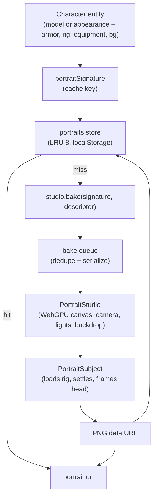

Character portraits in Artificer Forge are **not authored images**. They are rendered from the same model the character uses in-scene: a single GLB, or a modular assembly of body parts plus equipped armor. An off-screen `TresCanvas` frames the head, captures a frame to a PNG data URL, and caches it under a signature derived from the character's appearance. Change a character's gear, tint or model and the portrait re-bakes; move them around the map and it does not.

Everything lives under the portrait module and is re-exported from the runtime entry:

```ts
import {
  PortraitStudio,
  PortraitSubject,
  PortraitBackground,
  PortraitLights,
  usePortraitStudio,
  usePortraitRenderer,
  usePortraitStore,
  createBakeQueue,
  frameFromHead,
  PORTRAIT_CAMERA,
  PORTRAIT_LIGHTS,
  PORTRAIT_RENDERING,
  portraitSignature,
  resolvePortraitBackground,
} from '@artificer-forge/engine/runtime'
```

## Why render instead of author?

- **Always in sync**: equip a sword or a crimson jerkin and the portrait shows it. No re-export step.
- **One source of truth**: the portrait is the model, so there is no drift between the in-scene character and its UI icon.
- **Per-appearance caching**: bakes are expensive (a GLTF load, an idle settle, two rendered frames), so each result is cached under a [signature](/portraits/signature) and only re-runs when the look changes. The cache is global, not per entity: two characters that look identical share one bake.

## Mount the studio once

`PortraitStudio` is mounted once at the app root, outside any game canvas. The playground does it in `app.vue`:

```vue
<!-- apps/playground/app.vue -->
<script setup lang="ts">
import { PortraitStudio, usePortraitStore } from '@artificer-forge/engine/runtime'

const portraitStore = usePortraitStore()
onMounted(() => portraitStore.hydrate())
</script>

<template>
  <UApp>
    <NuxtPage />
    <ClientOnly>
      <PortraitStudio />
    </ClientOnly>
  </UApp>
</template>
```

The studio canvas is a second WebGPU device. It exists only while bakes are pending and is torn down two seconds after the last one settles, so an idle page pays nothing for it. See [Studio](/portraits/studio).

## The bake pipeline

A bake flows from the character's appearance through a single shared studio and out as a PNG. The studio is a module-scope singleton: one off-screen canvas serves every caller, and the [bake queue](/portraits/bake-queue) serializes requests so only one subject renders at a time.



::note
`usePortraitRenderer(entityId)` is the entry point most UI code touches. It returns a reactive `url` ref you can bind to an ``. The studio, queue, store and signature underneath are wired up for you. `Nameplate`, `CharacterPanel` and `ActionBar` all use it.
::

## Where to go next

- [Studio](/portraits/studio): the components that render a subject (`PortraitStudio`, `PortraitSubject`, `PortraitBackground`, `PortraitLights`), the renderer settings, framing and backdrops.
- [Bake Queue](/portraits/bake-queue): how bakes are serialized, deduped, and stored.
- [Signature](/portraits/signature): how the cache key is built and when it invalidates.
