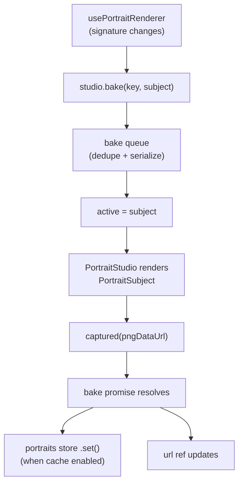

A bake is expensive: a GLTF load, an idle settle, and two rendered frames before the canvas is read to a PNG. To keep that cheap and correct, the engine serializes bakes through a single off-screen studio, dedupes concurrent requests, and caches results by [signature](/portraits/signature). Three pieces cooperate: the **bake queue**, **`usePortraitRenderer`**, and the **portraits store**.

## `usePortraitRenderer`

The entry point for UI. Pass an entity id (a value, ref or getter) and get back a reactive `url`:

```ts
import { usePortraitRenderer } from '@artificer-forge/engine/runtime'

const { url } = usePortraitRenderer(() => props.entityId)
```

```vue
<template>
  
</template>
```

It computes an `appearance` for the entity — `model`, `rig` (defaulting to `Rig_Medium`), derived `equipment`, resolved `background`, the authored `portrait` fallback, and a `signature`. The watcher keys off the **signature string**, not the entity object: the game store replaces the whole entity on every mutation (including each movement tick), so watching the entity directly would re-bake constantly. Keying off the signature means a bake only re-runs when the appearance genuinely changes.

When the signature changes:

- **Non-character or modelless entity** → `url` falls back to the authored `portrait`.
- **Cache hit** (same signature) → `url` is served from the store.
- **Otherwise** → `url` shows the fallback (authored portrait or stale cache) as a placeholder, then `studio.bake()` is requested; when it resolves, `url` is swapped to the fresh PNG. If the bake fails, the fallback stays.

::warning
The persistent cache is currently **disabled** (`PORTRAIT_CACHE_ENABLED = false`) while portrait framing is being calibrated, so every load re-bakes from current settings rather than serving a stale image. The store plumbing below remains in place; it is re-enabled by flipping that flag and bumping `PORTRAIT_CACHE_VERSION`.
::

## `usePortraitStudio` — producer / consumer

`usePortraitStudio()` is a module-scope singleton: one studio shared by all callers. It exposes a producer side (request a bake) and a consumer side (the `PortraitStudio` component reports the result):

```ts
const { active, bake, captured, failed } = usePortraitStudio()
```

- `bake(key, subject)` → `Promise<string>` — request a portrait; resolves with a PNG data URL. Routed through the bake queue.
- `active` — a `shallowRef` holding the descriptor the studio should render right now (or `null`).
- `captured(url)` / `failed(err)` — called by `PortraitStudio` once it has rendered + captured (or hit an error). These settle the in-flight promise and clear `active`.

A **watchdog** guards each bake: a stuck render (backgrounded tab, dropped rAF, never-ready subject) rejects after `10_000`ms so the serialized queue can never hang forever.

## `createBakeQueue` — serialize + dedupe

The queue ensures only one subject renders at a time (one renderer, one canvas) and that the same appearance is never baked twice concurrently:

```ts
interface BakeQueue {
  request: (key: string, run: () => Promise<string>) => Promise<string>
}
```

- **Dedupe** — if a `key` is already in flight, the existing promise is returned; the work runs once.
- **Serialize** — each request chains off the previous one's tail, so bakes run strictly one after another.
- **Never stalls** — the tail advances even on failure (the rejection is caught for chaining), and dedupe cleanup runs in `finally`, so a failed bake never leaves the queue or the in-flight map stuck.

The renderer builds the key as `` `${id}:${signature}` `` — the entity id plus its appearance signature — so two characters with identical gear still get distinct cache entries while a single character's repeated requests for the same look collapse to one bake.

## The portraits store

`usePortraitStore()` is a Pinia store that persists baked portraits to `localStorage` under `af:portraits`. It is the cache layer behind the renderer.

```ts
interface PortraitEntry {
  url: string
  signature: string
}
```

| Member | Purpose |
|--------|---------|
| `entries` | `Record<id, PortraitEntry>` — in-memory map |
| `hydrate()` | Load from `localStorage` (client-only; SSR-safe) |
| `get(id)` | Read a cached entry |
| `set(id, url, signature)` | Cache a baked portrait and persist |
| `invalidate(id)` | Drop a character's cached portrait and persist |

Persistence is **client-only** — every access guards on `window`, so the store is safe under SSR. A corrupt cache or exceeded quota is swallowed: portraits simply regenerate next session.

## Putting it together


