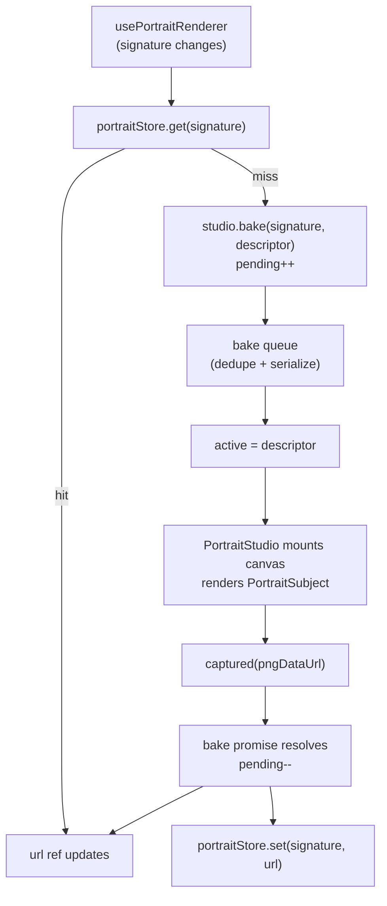

A bake is expensive: a GLTF or modular load, an idle settle, and two rendered frames before the canvas is read to a PNG. To keep that cheap and correct, the engine serializes bakes through a single off-screen studio, dedupes concurrent requests, and caches results by [signature](/portraits/signature). Four pieces cooperate: **`usePortraitRenderer`**, **`usePortraitStudio`**, the **bake queue**, and the **portraits store**.

## `usePortraitRenderer`

The entry point for UI. Pass an entity id (a value, ref or getter) and get back a reactive `url`:

```ts
import { usePortraitRenderer } from '@artificer-forge/engine/runtime'

const { url } = usePortraitRenderer(() => props.entityId)
```

```vue
<template>
  
</template>
```

It computes an `appearance` for the entity: `model`, the modular `appearance` recipe, resolved `armor` pieces (via `useModularArmor`, only for modular characters), `rig` (default `Rig_Medium`), derived `equipment`, resolved `background`, the authored `portrait` fallback, and a `signature`. The watcher keys off the **signature string**, not the entity object: the game store replaces the whole entity on every mutation (including each movement tick), so watching the entity directly would re-bake constantly.

When the signature changes:

- **Non-character or entity with neither `model` nor `appearance`**: `url` falls back to the authored `portrait`.
- **Cache hit** (`portraitStore.get(signature)`): `url` is served from the store.
- **Otherwise**: `url` shows the authored `portrait` as a placeholder, then `studio.bake(signature, descriptor)` is requested. When it resolves, the PNG is stored with `portraitStore.set(signature, dataUrl)` and `url` swaps to it. If the bake fails, the fallback stays.

```ts
// usePortraitRenderer.ts (trimmed)
const cached = PORTRAIT_CACHE_ENABLED ? portraitStore.get(a.signature) : undefined
if (cached) { url.value = cached; return }

url.value = a.fallback
studio
  .bake(a.signature, { model: a.model, appearance: a.modular, armor: a.armor, rig: a.rig, equipment: a.equipment, background: a.background })
  .then((dataUrl) => {
    if (PORTRAIT_CACHE_ENABLED) portraitStore.set(a.signature, dataUrl)
    url.value = dataUrl
  })
  .catch(() => {})
```

::note
`PORTRAIT_CACHE_ENABLED` is `true`. Set it to `false` only while calibrating framing, when you want every load to re-bake from current settings. A stale image can only survive a pipeline change if `PORTRAIT_CACHE_VERSION` is not bumped alongside it.
::

## `usePortraitStudio`: producer / consumer

`usePortraitStudio()` returns module-scope singleton state: one studio shared by all callers. It exposes a producer side (request a bake) and a consumer side (the `PortraitStudio` component reports the result):

```ts
const { active, pending, bake, captured, failed } = usePortraitStudio()
```

| Member | Type | Purpose |
|--------|------|---------|
| `bake` | `(key: string, subject: PortraitSubjectDescriptor) => Promise<string>` | Request a portrait; resolves with a PNG data URL. Routed through the bake queue |
| `active` | `ShallowRef<PortraitSubjectDescriptor \| null>` | The descriptor the studio should render right now |
| `pending` | `Ref<number>` | Requests asked for but not yet settled, **including** those still waiting in the queue |
| `captured` | `(url: string) => void` | Called by `PortraitStudio` once it has rendered and captured. Settles the promise, clears `active` |
| `failed` | `(err: unknown) => void` | Same, for a load or capture error |

`pending` is what `PortraitStudio` watches to decide whether the canvas should exist. `active` is the wrong signal for that: it drops to `null` between every capture, so a party of four would tear the WebGPU device down and rebuild it three times. `pending` is incremented per caller and decremented in a `finally`, so deduped requests (which share one promise) still balance out.

A **watchdog** guards each bake: a stuck render (backgrounded tab, dropped rAF, never-ready subject) rejects after `10_000`ms so the serialized queue can never hang forever.

## `createBakeQueue`: serialize + dedupe

The queue ensures only one subject renders at a time (one renderer, one canvas) and that the same appearance is never baked twice concurrently:

```ts
interface BakeQueue {
  request: (key: string, run: () => Promise<string>) => Promise<string>
}
```

- **Dedupe**: if a `key` is already in flight, the existing promise is returned; the work runs once.
- **Serialize**: each request chains off the previous one's tail, so bakes run strictly one after another.
- **Never stalls**: the tail advances even on failure (the rejection is caught for chaining), and dedupe cleanup runs in `finally`, so a failed bake never leaves the queue or the in-flight map stuck.

The key is the **bare signature**. Two characters with identical gear collapse to one bake, which is correct: they look the same.

## The portraits store

`usePortraitStore()` is a Pinia store that persists baked portraits to `localStorage` under `af:portraits`. It is the cache layer behind the renderer. Entries are keyed by **signature**, never by entity id: ids are minted per spawn (`hero_${Date.now()}`), so an id-keyed cache could not survive a reload.

```ts
import { usePortraitStore } from '@artificer-forge/engine/runtime'

const portraitStore = usePortraitStore()
```

| Member | Signature | Purpose |
|--------|-----------|---------|
| `entries` | `Ref<Record<string, string>>` | signature -> PNG data URL, insertion order = recency order |
| `hydrate()` | `() => void` | Load from `localStorage`. Idempotent, client-only |
| `get(signature)` | `(signature: string) => string \| undefined` | Read a cached URL and touch it for recency (in memory only) |
| `set(signature, url)` | `(signature: string, url: string) => void` | Cache a baked portrait, evict the oldest beyond `MAX_ENTRIES`, persist |
| `invalidate(signature)` | `(signature: string) => void` | Drop one cached portrait and persist |

### LRU with `MAX_ENTRIES = 8`

A bake is a base64 PNG of roughly 400 KB, against a localStorage budget of about 5 MB per origin. Every distinct look mints a new entry and nothing else evicts them, so without a cap the quota fills after about ten gear swaps and every later write silently fails. `set` deletes the oldest keys past 8; `get` re-inserts the hit key so eviction drops a look nobody is showing rather than the party's own portraits. If `persist` still hits the quota, it drops the oldest half and retries once.

### Hydration is lazy

`hydrate()` is called from `get()` and `set()`, not at store setup and not from a root `onMounted`. Pinia restores the store's state from the SSR payload (an empty object) right after setup runs, so an eager read is overwritten; and a root component's `onMounted` fires after its children's, so the first lookup of the session would miss a cache nobody had read yet. Hydration also drops entries that are not plain strings (an older build stored `{ url, signature }` objects under entity ids).

Every access guards on `window`, so the store is safe under SSR. A corrupt cache is swallowed: portraits simply regenerate.

## Putting it together


```mermaid
graph TD
  RENDERER["usePortraitRenderer<br/>(signature changes)"] --> GET["portraitStore.get(signature)"]
  GET -- hit --> URL["url ref updates"]
  GET -- miss --> BAKE["studio.bake(signature, descriptor)<br/>pending++"]
  BAKE --> QUEUE["bake queue<br/>(dedupe + serialize)"]
  QUEUE --> ACTIVE["active = descriptor"]
  ACTIVE --> STUDIO["PortraitStudio mounts canvas<br/>renders PortraitSubject"]
  STUDIO --> CAPTURED["captured(pngDataUrl)"]
  CAPTURED --> RESOLVE["bake promise resolves<br/>pending--"]
  RESOLVE --> SET["portraitStore.set(signature, url)"]
  RESOLVE --> URL
```
