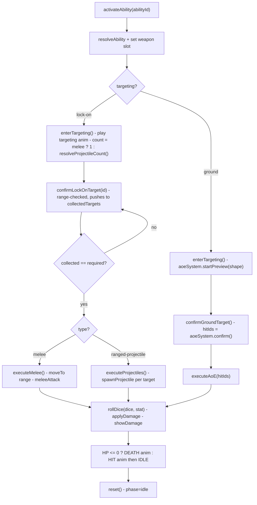

`useAbilitySystem` is the runtime engine that turns an ability template into a played-out attack: it manages the targeting phase, collects targets, plays animations, fires projectiles or AoE shapes, rolls damage and applies it. It is a `createSharedComposable` singleton, so the action bar, combat store and scene all see the same `phase`.

```ts
import { useAbilitySystem } from '@artificer-forge/engine/runtime'

const ability = useAbilitySystem()
```

## Ability templates

Abilities are data. Each template (resolved via `gameStore.resolveAbility(id)`) declares its kind and how it targets:

```ts
interface AbilityTemplate {
  abilityId: string
  name: string
  type: 'melee' | 'ranged-projectile' | 'ranged-aoe' | 'utility'
  targeting: 'lock-on' | 'ground' | 'self'
  animations: { targeting?: string, execute: string, recover?: string }
  projectile?: { model?: string, visual?: string, color?: string, speed: number, arc: 'distance-based' | 'straight' | 'parabolic' }
  aoe?: { shape: 'circle' | 'cone' | 'line', radius?: number, width?: number, angle?: number }
  damage?: { dice: string, type: string, stat: string }
  range?: { normal: number, long?: number }
  cost: 'action' | 'bonusAction' | 'free'
  baseProjectiles?: number
  scalingStat?: string
  scalingThreshold?: number
}
```

`type` selects which execution branch runs; `targeting` selects how targets are gathered.

## The resolution pipeline



## Phases

`phase` is a readonly ref cycling `idle` → `selecting` → `executing` → `idle`. `activateAbility` no-ops unless `phase === 'idle'`.

| Phase | Meaning |
|-------|---------|
| `idle` | Nothing active; ready to cast |
| `selecting` | Targeting — collecting lock-on targets or placing the AoE preview |
| `executing` | The animation + damage sequence is running |

## Returned API

```ts
{
  phase,               // Readonly<Ref<'idle' | 'selecting' | 'executing'>>
  activeAbility,       // Readonly<Ref<AbilityTemplate | null>>
  currentTargetIndex,  // Readonly<Ref<number>>
  requiredTargets,     // Readonly<Ref<number>>
  activateAbility,     // (abilityId: string) => Promise<void>
  confirmLockOnTarget, // (entityId: string) => void
  confirmGroundTarget, // () => void
  cancel,              // () => void
}
```

### `activateAbility(abilityId)`

Entry point, called from the action bar's `onSlotActivated`. Resolves the template, sets the active weapon slot (magic and `ranged-aoe` hide weapons; `ranged-projectile` uses `offHand`), then:

- **`lock-on`**: enters targeting, plays the targeting animation, and sets `requiredTargets` — `1` for melee, otherwise `resolveProjectileCount()` (a base count plus a bonus scaled off `scalingStat` past `scalingThreshold`). For projectiles with a `model`, the projectile mesh is attached to the caster's off-hand during aiming.
- **`ground`**: enters targeting and starts an [AoE preview](/combat/aoe) at the caster's feet using the template's `aoe` shape, coloured by the damage type.

### `confirmLockOnTarget(entityId)`

Validates the target is hostile and (for ranged abilities) within `range`, pushes it onto `collectedTargets`, and increments `currentTargetIndex`. Once enough targets are collected it cancels targeting and runs `executeMelee()` (melee) or `executeProjectiles()`.

### `confirmGroundTarget()`

Confirms the AoE placement: cancels targeting, calls `aoeSystem.confirm()` to get the hit entity ids, then runs `executeAoE(hitIds)`.

### `cancel()`

Aborts a cast. Returns the caster to idle, detaches any attached projectile model, cancels the AoE preview, and resets. Wired to Escape / right-click by the [combat store](/combat/combat-store).

## Damage resolution

All three execution branches (`executeMelee`, `executeProjectiles`, `executeAoE`) resolve damage the same way per target:

```ts
const statValue = attackerEntity.stats?.[ability.damage.stat] ?? 10
const { total, critical } = rollDice(ability.damage.dice, statValue)   // @artificer-forge/utils
gameStore.applyDamage(targetId, total, ability.damage.type)            // armor-aware, see Armor
targetRef.showDamage(total, ability.damage.type, critical)
// HP <= 0 → DEATH_A → DEATH_A_POSE ; otherwise HIT_A → IDLE_A
```

`applyDamage` routes through the [armor](/combat/armor) pools; `rollDice` lives in `@artificer-forge/utils`.

::note
Melee moves the attacker to `MELEE_RANGE` (1.5 units) in front of the target and waits for `onArrive` before striking. Projectiles fire near-simultaneously with a small random stagger, applying damage on each projectile's arrival.
::

## Related

- [Combat Overview](/combat/overview) — the full phase flow
- [Area of Effect](/combat/aoe) — `useAoESystem`, used by `ground` targeting
- [Projectiles](/combat/projectiles) — `useProjectile` + `TrajectoryPreview`
- [Armor](/combat/armor) — how `applyDamage` resolves against armor pools
