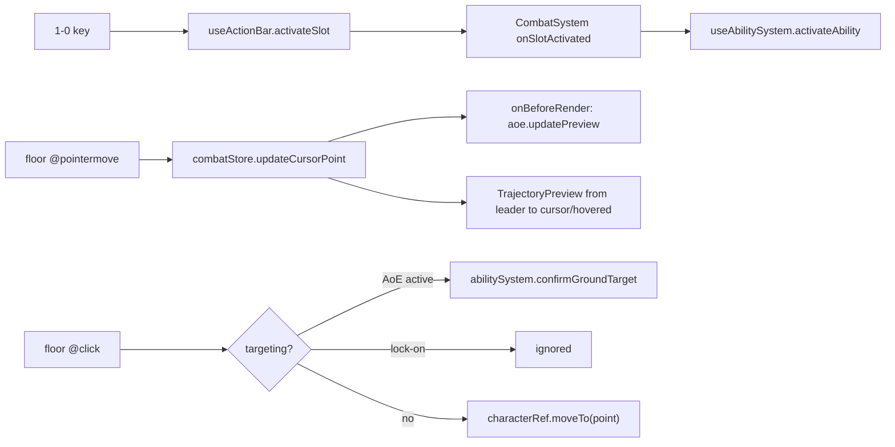

`CombatSystem` is the one scene component that wires the combat composables to the 3D world. The stores and composables hold state; `CombatSystem` gives them a floor to click, a cursor to track, a render loop, and the visuals that show the player what will happen. `<Game>` mounts it by default.

```ts
import { CombatSystem } from '@artificer-forge/engine/runtime'
```

## Where it is mounted

`Game.vue` renders `CombatSystem` and `SurfaceSystem` inside the canvas unless the consumer fills the `systems` slot:

```vue
<!-- packages/engine/src/Game.vue (trimmed) -->
<slot />
<slot v-if="$slots.systems" name="systems" />
<template v-else>
  <CombatSystem />
  <SurfaceSystem />
</template>
```

The check is on slot **presence**, not output. A `<slot>` falls back to its default whenever the provided content renders nothing, so an empty `#systems` would silently mount the defaults and the ground-click plane would outrank a scene's terrain. To replace the systems, provide the slot:

```vue
<Game>
  <MyScene />
  <template #systems>
    <CombatSystem />
    <!-- no SurfaceSystem -->
  </template>
</Game>
```

## What it owns

| Concern | Implementation |
|---------|----------------|
| Floor plane | Invisible `100 x 100` `TresMesh`, `rotation-x = -PI/2`, `position-y = 0.001`, `:visible="false"` |
| Click-to-move | `@click` moves the **selected** entity via `getCharacterRef(id)?.moveTo(event.point)` |
| Ground AoE confirm | `@click` while targeting with an active AoE preview calls `abilitySystem.confirmGroundTarget()` |
| Cursor tracking | `@pointermove` feeds `combatStore.updateCursorPoint(e.point)` |
| Slot activation | `onSlotActivated(slot => abilitySystem.activateAbility(slot.abilityId))` |
| AoE frame loop | `useLoop().onBeforeRender` calls `aoeSystem.updatePreview(cursorWorldPoint, delta)` while `aoeSystem.isActive` |
| Move target | `TargetIndicator` at `selectedEntity.moveTarget` |
| Hovered hostile | `TargetReticle` (red) at the hovered entity's feet while targeting |
| Trajectory | `TrajectoryPreview` + end `TargetIndicator` + distance label for `ranged-projectile` abilities |
| Projectile counter | `Projectiles: remaining/required` label when `requiredTargets > 1` |

## The floor plane

```vue
<TresMesh
  :rotation-x="-Math.PI / 2"
  :position-y="0.001"
  :visible="false"
  @click="handleFloorClick"
  @pointermove="(e: any) => combatStore.updateCursorPoint(e.point)"
>
  <TresPlaneGeometry :args="[100, 100]" />
  <TresMeshBasicMaterial :opacity="0" transparent />
</TresMesh>
```

The plane is flat at `y = 0`. On a terrain scene it does not follow the height field; the `systems` slot exists so such a scene can supply its own click surface.

`handleFloorClick` has three outcomes, in order:

```ts
function handleFloorClick(event: any) {
  if (combatStore.isTargeting && aoeSystem.isActive.value) {
    abilitySystem.confirmGroundTarget()
    return
  }
  if (combatStore.isTargeting) return
  const entityId = gameStore.selectedEntityId
  if (!entityId) return
  getCharacterRef(entityId)?.moveTo(event.point)
}
```

1. Targeting with an AoE preview: the click **places** the spell.
2. Targeting without one (lock-on): the click on the floor does nothing; targets are confirmed by clicking a hostile `Character`.
3. Not targeting: move the selected entity.

## Ground markers

Markers sit `GROUND_OFFSET = 0.01` above the thing they mark, not above `y = 0`: on terrain a fixed height buries them in a hillside or floats them over a dip. The `y` they track comes from the entity's position or the clicked point.

- **Move target**: `<TargetIndicator :position="[target.x, target.y + 0.01, target.z]" :radius="0.8" :height="1.2" :pulse-speed="3" />` while `selectedEntity.moveTarget` is set. `Character.vue` writes `moveTarget` to the store whenever its controller target changes, and clears it on arrival.
- **Hovered hostile**: `<TargetReticle color="#ff4444" :radius="0.8" />` at `hoveredTargetId`'s feet, only while `combatStore.isTargeting`.

Both components come from `@artificer-forge/vfx`, see [VFX: Target Reticle](/vfx/target-reticle).

## Trajectory preview

The preview is **automatic**. It shows whenever all of these hold:

```ts
const showTrajectory = computed(() => {
  if (!combatStore.isTargeting) return false
  const ability = abilitySystem.activeAbility.value
  return ability?.type === 'ranged-projectile' && !!combatStore.cursorWorldPoint
})
```

| Value | Source |
|-------|--------|
| `from` | party leader position `+ 1.2` on y (hand height) |
| `to` | hovered hostile `+ 1.0` on y, else the cursor point at `y = 0` |
| `arc` | `activeAbility.projectile.arc`, default `'distance-based'` |
| `color` | `#ff4444` when out of range, else `#ffffff` |

Out of range means the XZ distance from `from` to `to` exceeds `range.long ?? range.normal`. The same colour drives a second `TargetIndicator` at the arc's end (`pulse-speed 4`) and the distance label (`12.3m`) rendered with cientos `Html` above it.

`from`, `to` and `arc` are the same values `executeProjectiles` later passes to `spawnProjectile`, so the drawn arc is the real flight path. See [Projectiles](/combat/projectiles).

## Projectile counter

Multi-projectile abilities (`baseProjectiles` plus the `scalingStat` bonus, see [Abilities](/combat/abilities)) require one click per projectile. While `requiredTargets > 1` the label under the distance reads:

```ts
const projectilesLabel = computed(() => {
  const remaining = abilitySystem.requiredTargets.value - abilitySystem.currentTargetIndex.value
  return `Projectiles: ${remaining}/${abilitySystem.requiredTargets.value}`
})
```

## AoE frame loop

`useAoESystem` has no render loop of its own. `CombatSystem` drives it:

```ts
const { onBeforeRender } = useLoop()
onBeforeRender(({ delta }) => {
  if (!aoeSystem.isActive.value || !combatStore.cursorWorldPoint) return
  aoeSystem.updatePreview(combatStore.cursorWorldPoint, delta)
})
```

`updatePreview` moves the shape to the cursor (circle) or aims it from the caster (cone, line), pulses opacity and turns it red beyond `range`. See [Area of Effect](/combat/aoe).

## Flow



## Related

- [Combat Overview](/combat/overview): the phase machine the visuals reflect
- [Combat Store](/combat/combat-store): `updateCursorPoint`, `hoveredTargetId`, `isTargeting`
- [Abilities](/combat/abilities): `activateAbility`, `confirmGroundTarget`, `requiredTargets`
- [Game component](/engine-architecture/game-component): the `systems` slot
