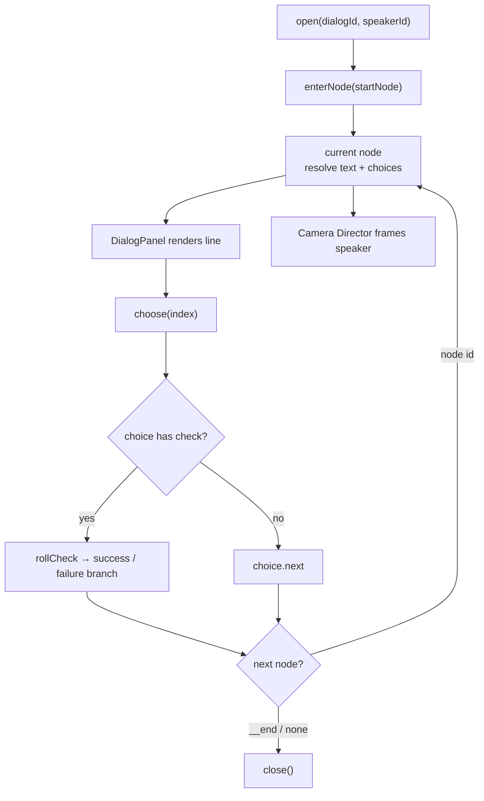

The dialog system is the engine's branching-conversation runtime. It takes an authored dialog tree (nodes, choices, skill checks, conditions, effects) and plays it: resolving the text to show, the choices the player can pick, the skill rolls behind gated options, and the game-state mutations each step triggers. A companion camera director frames whoever is speaking, and a HUD panel renders the line and choices.

The whole system is reactive Pinia state. A page opens a dialog, the store walks the tree, and three independent consumers react to the same state: the [Dialog Panel](/dialog/dialog-panel) (text + choices), the [Camera Director](/dialog/camera-director) (cinematic framing), and any in-scene effects that fire as flags/items/status-effects change.

## Pieces

| Piece | Import from | Role |
|-------|-------------|------|
| `useDialogStore` | `@artificer-forge/engine/runtime` | Active-tree state, current node/text/choices, `open`/`choose`/`close` |
| `useDialogEngine` | `@artificer-forge/engine/runtime` | Pure logic: context, text resolution, choice gating, skill rolls, effects |
| `useDialogCamera` | `@artificer-forge/engine/runtime` | Cinematic camera tween, driven off store state |
| `DialogCameraDirector` | `@artificer-forge/engine/runtime` | In-canvas wrapper that runs `useDialogCamera` |
| `DialogPanel` | `@artificer-forge/engine/ui` | HUD overlay rendering the line + choices |

## Flow



When `currentNodeId` changes, the camera director re-frames the new speaker; when it clears (on `close`), the camera restores its pre-dialog transform.

::note
This section documents the **runtime** that plays an authored dialog tree. The trees themselves are written with the visual authoring tool, the `@artificer-forge/dialog-editor` Nuxt module — a separate package and **out of scope here**. This runtime simply consumes the graph that the editor produces.
::

## Minimal usage

A page mounts the camera director inside the canvas, the panel in the HUD, and calls `open` to start a conversation:

```vue
<script setup lang="ts">
import { DialogCameraDirector, useDialogStore } from '@artificer-forge/engine/runtime'
import { DialogPanel } from '@artificer-forge/engine/ui'

const dialogStore = useDialogStore()

function talkTo(npcEntityId: string, dialogId: string) {
  dialogStore.open(dialogId, npcEntityId)
}
</script>

<template>
  <!-- inside the TresCanvas -->
  <DialogCameraDirector />
  <!-- in the HUD / DOM overlay -->
  <DialogPanel />
</template>
```
