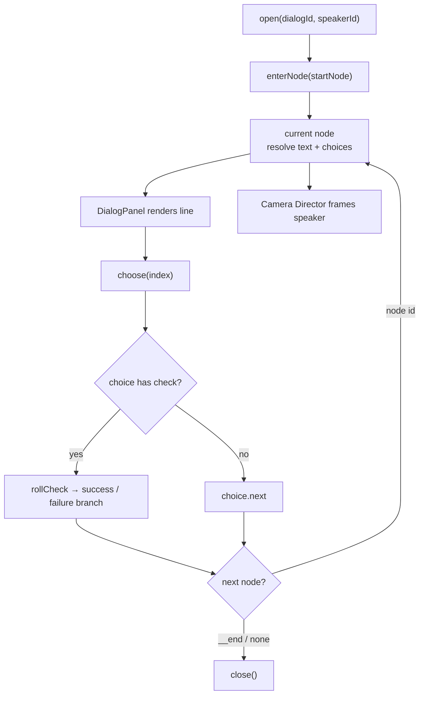
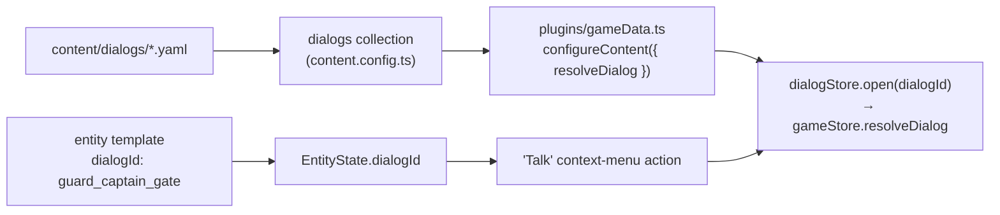

The dialog system is the engine's branching-conversation runtime. It takes an authored dialog tree (nodes, choices, skill checks, conditions, effects) and plays it: resolving the text to show, the choices the player can pick, the skill rolls behind gated options, and the game-state mutations each step triggers. A companion camera director frames whoever is speaking, and a HUD panel renders the line and choices.

The whole system is reactive Pinia state. A page opens a dialog, the store walks the tree, and three independent consumers react to the same state: the [Dialog Panel](/dialog/dialog-panel) (text + choices), the [Camera Director](/dialog/camera-director) (cinematic framing), and any in-scene effects that fire as flags/items/status-effects change.

## Pieces

| Piece | Import from | Role |
|-------|-------------|------|
| `useDialogStore` | `@artificer-forge/engine/runtime` | Active-tree state, current node/text/choices, `open`/`choose`/`close` |
| `useDialogEngine` | `@artificer-forge/engine/runtime` | Pure logic: context, text resolution, choice gating, skill rolls, effects |
| `useDialogCamera` | `@artificer-forge/engine/runtime` | Cinematic camera tween, driven off store state |
| `DialogCameraDirector` | `@artificer-forge/engine/runtime` | In-canvas wrapper that runs `useDialogCamera` |
| `DialogPanel` | `@artificer-forge/engine/ui` | HUD overlay rendering the line + choices (already mounted by `Hud`) |

## Flow


```mermaid
graph TD
  OPEN["open(dialogId, speakerId)"] --> START["enterNode(startNode)"]
  START --> NODE["current node<br/>resolve text + choices"]
  NODE --> PANEL["DialogPanel renders line"]
  NODE --> CAM["Camera Director frames speaker"]
  PANEL --> PICK["choose(index)"]
  PICK --> CHECK{"choice has check?"}
  CHECK -->|yes| ROLL["rollCheck → success / failure branch"]
  CHECK -->|no| BRANCH["choice.next"]
  ROLL --> NEXT{"next node?"}
  BRANCH --> NEXT
  NEXT -->|node id| NODE
  NEXT -->|__end / none| CLOSE["close()"]
```

When `currentNodeId` changes, the camera director re-frames the new speaker; when it clears (on `close`), the camera restores its pre-dialog transform.

::note
This section documents the **runtime** that plays an authored dialog tree. The trees themselves are written with the visual authoring tool, the `@artificer-forge/dialog-editor` Nuxt module. See [Dialog Editor](/dialog/dialog-editor).
::

## How a tree reaches the runtime

The engine never fetches content itself. The app injects a resolver, and the store calls it when a dialog opens. In the playground the chain is:


```mermaid
graph LR
  YAML["content/dialogs/*.yaml"] --> COLL["dialogs collection<br/>(content.config.ts)"]
  COLL --> PLUGIN["plugins/gameData.ts<br/>configureContent({ resolveDialog })"]
  PLUGIN --> STORE["dialogStore.open(dialogId)<br/>→ gameStore.resolveDialog"]
  TPL["entity template<br/>dialogId: guard_captain_gate"] --> STATE["EntityState.dialogId"]
  STATE --> TALK["'Talk' context-menu action"]
  TALK --> STORE
```

1. **YAML files.** One tree per file in `apps/playground/content/dialogs/`. The file name does not matter; the `dialogId` field inside the file is the key (`guard-captain.yaml` holds `dialogId: guard_captain_gate`). The `.layouts/` sub-folder holds JSON node positions for the editor, not runtime data.
2. **`dialogs` collection.** `apps/playground/content.config.ts` declares a `data` collection with `source: 'dialogs/*.yaml'` and a zod schema that mirrors `DialogNode` / `DialogChoice` (see [Dialog Engine](/dialog/dialog-engine)).
3. **Content source injection.** `apps/playground/plugins/gameData.ts` wires the collection into the engine:

```ts
gameStore.configureContent({
  // ...resolveTemplate, resolveScene, resolveAbility, resolveClass
  resolveDialog: dialogId =>
    queryCollection('dialogs').where('dialogId', '=', dialogId).first(),
})
```

`ContentSource.resolveDialog` is typed `(dialogId: string) => Promise<any | null>`; the dialog store casts the result to its own `DialogTree` shape. Without `configureContent`, `open` throws `[game] content source not configured`.

4. **`dialogId` on the entity.** An entity template carries `dialogId` (for example `content/entities/characters/npcs/guard-captain.yaml` has `dialogId: guard_captain_gate`). `spawnFromTemplate` copies it onto the `EntityState`, so the scene knows which NPCs can talk.
5. **The talk action.** `useEntityActions` (engine UI) offers a `Talk` entry in the entity context menu for characters that are alive and not hostile. The page listens with `useContextMenu().onAction` and opens the tree. Trimmed from `apps/playground/pages/npc/dialog/experience.vue`:

```ts
const { onAction } = useContextMenu()

onAction((action, entityId) => {
  const entity = gameStore.getEntity(entityId)
  if (action === 'talk' && entity?.dialogId) startDialog(entityId)
})

function startDialog(npcEntityId: string) {
  const npc = gameStore.getEntity(npcEntityId)!
  const leaderRef = getCharacterRef(gameStore.party.leader!)!
  // Walk the leader to 2.8 m from the NPC, then face each other and open.
  const { off } = leaderRef.onArrive(() => {
    dialogStore.open(npc.dialogId!, npcEntityId)
    off()
  })
  leaderRef.moveTo(target)
}
```

The second argument to `open` is the NPC **instance id**. The store uses it to pick the exact speaker entity when several instances share a `templateId`.

## Minimal usage

The `<Game>` component renders `<Hud>`, and `Hud` already mounts `DialogPanel`. A page only needs to add the camera director inside the canvas and call `open`:

```vue
<script setup lang="ts">
import { DialogCameraDirector, useDialogStore } from '@artificer-forge/engine/runtime'

const dialogStore = useDialogStore()

function talkTo(npcEntityId: string, dialogId: string) {
  dialogStore.open(dialogId, npcEntityId)
}
</script>

<template>
  <!-- inside the TresCanvas / Game default slot -->
  <DialogCameraDirector />
</template>
```

::warning
Do not add a second `<DialogPanel />` when your page runs inside `<Game>`. `Hud` mounts one already; a second copy renders two panels over each other. Mount `DialogPanel` yourself only when you build a custom HUD without `Hud`.
::
