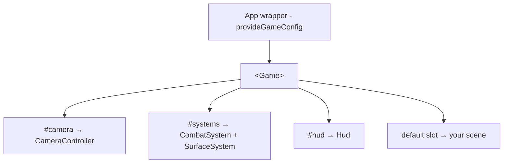

With the engine [installed](/getting-started/installation), composing a scene is two steps: an app-level wrapper that provides the game config, and a page that mounts the engine `<Game>` host with your scene content.

## How it fits together



## 1. The app-level wrapper

`<Game>` reads its render config from `useGameConfig()`, which must be provided above it. Wrap `<Game>` in a small component that calls `provideGameConfig()` and forwards slots. This is exactly what the playground does (minus its debug GUI).

```vue [components/GameContextProvider.vue]
<script setup lang="ts">
import { Game } from '@artificer-forge/engine'
import { provideGameConfig } from '@artificer-forge/engine/runtime'

interface CameraProps {
  position?: [number, number, number]
  lookAt?: [number, number, number]
  target?: [number, number, number]
  near?: number
  far?: number
  controls?: boolean
}

defineProps<{ camera?: CameraProps }>()

// Provide the engine's render config (bloom, outline presets) to <Game>.
provideGameConfig()
</script>

<template>
  <Game :camera="camera">
    <!-- Only forward these when the page provides them, otherwise an empty
         slot would suppress Game's camera / systems / Hud defaults. -->
    <template v-if="$slots.camera" #camera>
      <slot name="camera" />
    </template>
    <template v-if="$slots.systems" #systems>
      <slot name="systems" />
    </template>
    <template v-if="$slots.hud" #hud>
      <slot name="hud" />
    </template>
    <slot />
  </Game>
</template>
```

::alert{type="info"}
`provideGameConfig()` must run **above** `<Game>`. The `<Game>` component calls `useGameConfig()` internally to read bloom/outline settings — without a provider it has nothing to read.
::

## 2. A page that uses it

The page supplies a camera via the `#camera` slot and drops scene content into the default slot. Default systems and HUD are inherited automatically.

```vue [pages/index.vue]
<script setup lang="ts">
import { Floor, useGameStore } from '@artificer-forge/engine/runtime'

const gameStore = useGameStore()

onMounted(async () => {
  const playerId = await gameStore.spawnFromTemplate('hero', { x: 0, y: 0, z: 0 })
  gameStore.addToParty(playerId)
})
</script>

<template>
  <GameContextProvider>
    <template #camera>
      <TresPerspectiveCamera :position="[0, 0, 1]" :near="0.1" :far="100" />
    </template>

    <!-- default slot: your scene -->
    <TresAmbientLight :intensity="0.8" />
    <TresDirectionalLight :position="[5, 5, 5]" :intensity="1.5" cast-shadow />
    <Floor />
  </GameContextProvider>
</template>
```

That's a complete scene: a WebGPU canvas, a camera, the default combat and surface systems running, the HUD overlay, and a floor lit by two lights.

## The default slots

`<Game>` provides sensible defaults for three named slots. Override any of them; leave them empty to keep the default.

| Slot | Default | Override when |
|------|---------|---------------|
| `#camera` | `CameraController` (driven by the `camera` prop) | You want a custom camera, e.g. a raw `<TresPerspectiveCamera>` |
| `#systems` | `CombatSystem` + `SurfaceSystem` | You need a different system set; pass an **empty** `#systems` slot for non-gameplay scenes (menus, character select) |
| `#hud` | `Hud` | You want a custom 2D overlay or none |

The default slot (no name) is your scene graph — lights, characters, environment.

See [the Game component reference](/engine-architecture/game-component) for full slot detail and the `camera` prop shape.
