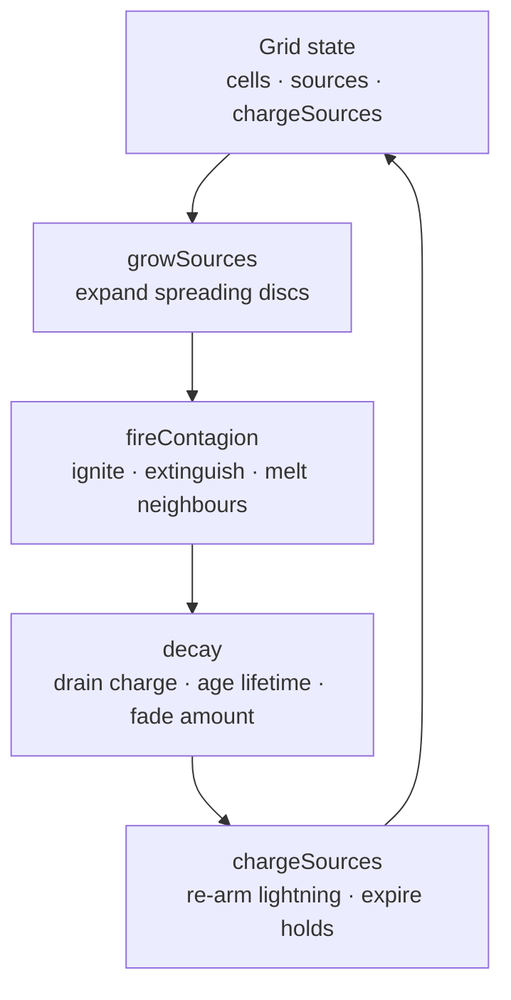

Surfaces are the ground-level hazards of the world: pools of water, oil, poison and blood, plus fire that spreads across them. They are simulated as a **cellular automaton over a grid** — a flat field of cells, each holding one kind of surface, advanced one step per frame.

The system splits cleanly across the engine's layers: the **rules are pure** (`/core`), and a **runtime singleton** owns the live grid, textures and per-frame loop (`/runtime`).

## The grid

A surface field is a `SurfaceGrid` — a factory (`createSurfaceGrid`) over closure state, not a class. It holds:

| Piece | What it is |
|-------|-----------|
| `cells` | Flat row-major buffer of `SurfaceCell`. Each cell has a `kind`, an `amount` (0..1 coverage), a `lifetime` (seconds left, or `Infinity` while spreading), an `electrified` charge (0..1) and a `frozen` flag. |
| `sources` | Active spreading liquid puddles (`SurfaceSource`) — a disc that grows to `targetRadius` then stops. |
| `chargeSources` | Lightning charges (`ChargeSource`) holding `electrified=1` on their cells for a fixed hold. |

The grid maps world space ↔ cells (`worldToCell`, `cellToWorld`, `sample`) and offers stamping helpers (`stampDisc`, `seed`, `cellsInDisc`, `clear`). By default the field is centred on the world origin.

## The tick

`step(grid, dt)` is the single pure entry point that advances the whole field. It runs four phases in a fixed order each frame:



Order matters: charge re-arming runs **after** decay so a held charge reads exactly `1` (decay would otherwise nibble the re-armed value before the texture is packed).

- **growSources** — each active source advances its frontier by `speed * dt`, stamping the wider disc. When it reaches `targetRadius` it stops growing and hands every cell of that kind a finite `baseLifetime` so decay can later reclaim it.
- **fireContagion** — fire checks its 4-neighbours and ignites flammable kinds (oil/poison), is extinguished by water, and melts frozen cells back to water. Snapshotted first so a freshly-lit cell doesn't cascade within one tick.
- **decay** — drains `electrified` charge, ages `lifetime`, then fades `amount` once lifetime hits 0. Frozen cells skip ageing (freeze pauses decay), and non-finite (`Infinity`) lifetimes are skipped (still growing, or permanent).
- **chargeSources** — re-arms each lightning charge to `electrified=1`, counts down its hold, and removes expired charges so decay can start fading them.

::alert{type="info"}
Clamping `dt` is the caller's job — `SurfaceSystem` passes `Math.min(delta, 0.1)` so a frame hitch can't make a pool skip across the field in one step.
::

## Core vs runtime

The simulation is pure; everything reactive lives one layer up.

| Layer | Owns | Pieces |
|-------|------|--------|
| `/core` (`surface`) | The rules — no Vue, no Three | `createSurfaceGrid`, `step`, `applyEvent`, `statusForCell`, `fireInteraction`, `KIND_CONFIG`, the texture packers |
| `/runtime` | Live state + rendering | `useSurface` (singleton engine), `useSurfaceStore` (declarative data), `SurfaceSystem.vue` (renderer) |

The split mirrors a level-loader future: **`useSurfaceStore` holds declarative `SurfaceSourceDef[]`** (the level-data target), `useSurface` watches that store and *hydrates* the grid, runs the sim, and packs textures, while `SurfaceSystem` is a pure renderer that reads those textures.

```ts
import { createSurfaceGrid, step, applyEvent } from '@artificer-forge/engine/core'
import { useSurface, useSurfaceStore, SurfaceSystem } from '@artificer-forge/engine/runtime'
```

::alert{type="info"}
`SurfaceSystem` is a **default gameplay system** in `<Game>` — it ships in the `#systems` slot alongside `CombatSystem`, so any scene under `<Game>` already renders surfaces. See [Surface System](/surfaces/surface-system).
::
