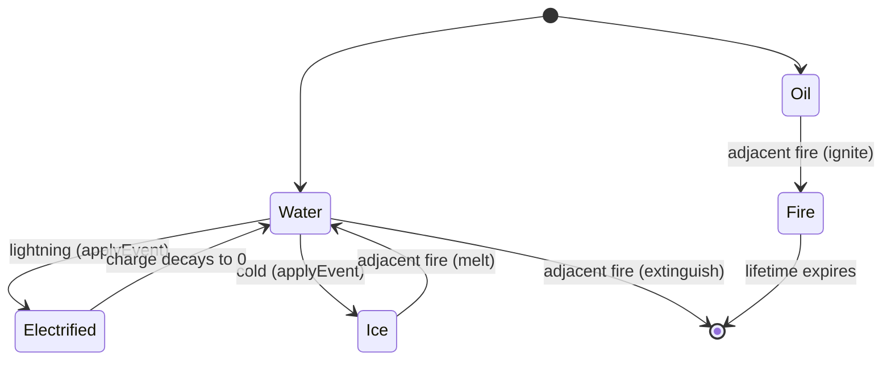

A surface cell has a base **kind** plus two orthogonal **state** flags (`frozen`, `electrified`). Ice is not a kind — it's a frozen *state* of water or blood. Everything below is driven by `KIND_CONFIG` in `core/surface/types.ts` and the rules in `matrix.ts` / `sim.ts`.

## Kinds

`SurfaceKind = 'fire' | 'water' | 'oil' | 'poison' | 'blood'`. From `KIND_CONFIG`:

| Kind | Flammable | Liquid | Base lifetime | Default radius | Spread speed | Status inflicted |
|------|-----------|--------|---------------|----------------|--------------|------------------|
| `water` | no | yes | ∞ (permanent) | 3 | 4 cells/s | `wet` |
| `blood` | no | yes | ∞ (permanent) | 2 | 3 cells/s | `wet` |
| `oil` | yes | yes | 30 s | 2 | 2 cells/s | `slowed` |
| `poison` | yes | yes | 18 s | 2 | 3 cells/s | `poisoned` |
| `fire` | no | no | 6 s | 1 | 0 (stamped instantly) | `burning` |

- **water / blood are permanent.** Their `baseLifetime` is `Infinity`, so decay skips them entirely — they are removed only by fire or `clear()`. Confirmed by `surfaceDecay.test.ts` (`water pools never decay`, `blood pools never decay`).
- **oil / poison decay.** They live for their lifetime, then `amount` fades at `0.6/s` until the cell empties. `surfaceDecay.test.ts` (`oil still decays away`) confirms oil is `null` after ~40 s.
- **fire does not spread on its own** (`spreadSpeed: 0`) — it's stamped as a full disc instantly and propagates only via `fireContagion`.

Liquid kinds spread: `seed` drops a 1-cell seed plus a growing `SurfaceSource` that expands its disc by `spreadSpeed * dt` up to its radius, then stops and gains a finite lifetime.

## Status inflicted

`statusForCell(cell)` decides what an entity standing in a cell contracts (verified in `matrix.ts`):

- `fire` → `burning`
- `poison` → `poisoned`
- electrified water/blood (`electrified > 0`) → `shocked`
- water / blood → `wet`
- `oil` → `slowed`
- **frozen** cells inflict **no** status (ice is slippery, no status in v1)

Separately, an entity within `FIRE_WARM_RADIUS` (5 cells) of a fire cell — but not standing on fire — gets `warm`. This is radiant proximity applied live by `useSurface` (added on enter, removed on leave); `burning` always supersedes it. `hasFireNear` (tested in `surfaceWarm.test.ts`) backs the proximity check.

## States: frozen and electrified

Two state flags layer on top of a liquid kind:

- **`frozen`** — a frosted ice sheet over water/blood. **Freeze pauses decay**: a frozen finite-lifetime cell never ages (`surfaceFrozen.test.ts` — a frozen oil cell still reads `lifetime: 30` after ~40 s). Charge still drains on a frozen cell. Fire **melts** ice back to water.
- **`electrified`** — a 0..1 charge on a water/blood pool that decays at `0.5/s`; while `> 0` the pool inflicts `shocked`. A lightning strike registers a `ChargeSource` that holds `electrified=1` on the whole pool for `CHARGE_HOLD = 3` seconds (re-armed every tick), then lets decay fade it. `surfaceElectrified.test.ts` confirms the 3 s hold and the fade-then-clear.

## Transitions

Variants change through fire contagion (`fireContagion`) and point events (`applyEvent`):

Verified transitions:

- **water/blood + lightning → electrified.** `applyEvent(grid, x, z, 'lightning')` flood-fills the connected liquid pool and charges it; tested in `surfaceElectrified.test.ts` (`electrifies the whole connected pool`).
- **water/blood + cold → frozen (ice).** `applyEvent(..., 'cold')` flood-fills and sets `frozen` on the pool.
- **ice + fire → water.** `fireInteraction` returns `melt` for a frozen cell; `surfaceFrozen.test.ts` (`fire melts a frozen water cell back to permanent water`) confirms it returns to permanent water.
- **oil/poison + fire → fire (ignite).** Flammable kinds ignite; oil burns hotter (lifetime ×1.5).
- **water + fire → extinguished.** Fire adjacent to water removes the fire cell.

::warning
`applyEvent` no-ops over empty ground or non-liquid cells — a lightning/cold click on bare floor or fire does nothing (`surfaceElectrified.test.ts` — `no-ops over empty ground`).
::
