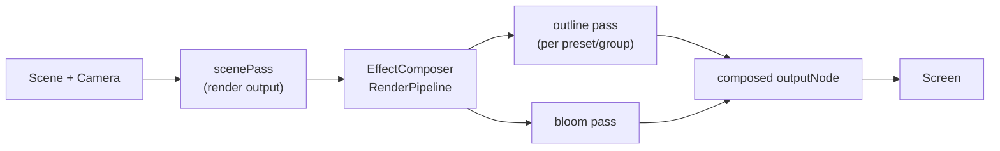

`@artificer-forge/post-processing` is the package that gives Artificer Forge its signature look: a WebGPU post-processing chain wrapping every scene render with an **outline** pass (for selection/hover highlights) and a **bloom** pass (for glow). It ships two things you actually touch: the `EffectComposer` Tres component and the `useOutlinePassProvider()` composable that drives selection.

It's a **separate package** from `@artificer-forge/engine` — the engine depends on it, but you can install and use it standalone in any TresJS scene.

## Install

::code-group
```bash [pnpm]
pnpm add @artificer-forge/post-processing
```
```bash [npm]
npm install @artificer-forge/post-processing
```
::

It declares peer dependencies, so make sure these are already in your project:

```json
"@tresjs/core": ">=5.0.0",
"three": ">=0.170.0",
"vue": ">=3.4.0"
```

::note
The composer builds a `three/webgpu` `RenderPipeline` with TSL nodes (`three/tsl`, `three/addons/tsl/display/*`). It only works under a **WebGPU renderer** — the engine's `<Game>` already configures one.
::

## Public API

Everything is exported from the package root:

```ts
import {
  EffectComposer,
  useOutlinePass,
  useOutlinePassProvider,
  OutlinePassKey,
  type OutlinePassApi,
} from '@artificer-forge/post-processing'
```

| Export | What it is |
|--------|------------|
| `EffectComposer` | Renderless Tres component. Mount inside `<TresCanvas>`; replaces the render function with the post-fx pipeline. |
| `useOutlinePassProvider()` | Provider — call once above the consumers to own the selection state. Returns the `OutlinePassApi`. |
| `useOutlinePass()` | Consumer hook — `inject`s the provided API. Throws if no provider is found. |
| `OutlinePassKey` | The Vue `InjectionKey` used by both, if you need to wire it manually. |
| `OutlinePassApi` | Type: `{ getGroup, addToSelection, removeFromSelection }`. |

The `OutlinePassApi` lets components add/remove objects from named selection **groups** (the composer renders one outline pass per group/preset):

```ts
const { addToSelection, removeFromSelection } = useOutlinePass()

addToSelection(mesh, 'hostile')     // outline mesh with the "hostile" preset
removeFromSelection(mesh, 'hostile')
// group defaults to 'default' when omitted
```

## EffectComposer props

Both props are optional. `outlinePresets` defaults to `{ default: {} }`; `bloom` is off unless you pass it.

```ts
interface OutlinePreset {
  visibleEdgeColor?: string   // default '#ffffff'
  hiddenEdgeColor?: string    // default '#4e3636'
  edgeStrength?: number       // default 3
  edgeThickness?: number      // default 1
  edgeGlow?: number           // default 0
}

interface BloomConfig {
  strength?: number     // default 0.5
  radius?: number       // default 0
  threshold?: number    // default 0
  smoothWidth?: number  // default 0.01
}

defineProps<{
  outlinePresets?: Record<string, OutlinePreset>
  bloom?: BloomConfig
}>()
```

The composer builds **one outline pass per preset** and composes their colors together, so a key in `outlinePresets` (e.g. `party`, `hostile`) is the same `name` you pass to `addToSelection`. The `bloom` config is watched **deeply** — mutating its fields re-tunes the glow live, no remount needed.

## How the engine wires it

You rarely mount `EffectComposer` by hand — the engine's `<Game>` does it for you. From `Game.vue`, post-processing is **engine policy**, driven by [`useGameConfig()`](/engine-architecture/game-config):

```vue
<script setup lang="ts">
import { EffectComposer, useOutlinePassProvider } from '@artificer-forge/post-processing'
import { useGameConfig } from '@artificer-forge/engine/runtime'

const config = useGameConfig()
useOutlinePassProvider()
</script>

<template>
  <TresCanvas :renderer="createWebGPURenderer" :tone-mapping="NoToneMapping">
    <!-- camera, scene content, systems… -->
    <EffectComposer
      :outline-presets="config.outlinePresets"
      :bloom="{
        strength: config.bloom.strength,
        radius: config.bloom.radius,
        threshold: config.bloom.threshold,
        smoothWidth: config.bloom.smoothWidth,
      }"
    />
  </TresCanvas>
</template>
```

Two things to note:

- `useOutlinePassProvider()` is called **once** in `<Game>`, so every runtime component (characters, actors, interactables) can `useOutlinePass()` and push itself into a selection group.
- The presets and bloom values come from `GameConfig`, so apps re-skin the look — see [Game Config](/engine-architecture/game-config) for the config shape and how a debug GUI mutates it live.

::warning
`useOutlinePass()` throws if there's no provider above it. Inside `<Game>` that's guaranteed; in a standalone scene you must call `useOutlinePassProvider()` yourself before any component injects it.
::

## The chain


