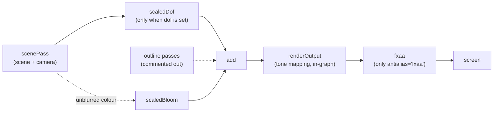

`@artificer-forge/post-processing` is the WebGPU post-processing chain that every engine canvas renders through. It is a separate workspace package. `@artificer-forge/engine` depends on it, and you can mount it in any TresJS scene that uses a WebGPU renderer.

## What the package ships today

| Piece | State | Page |
|-------|-------|------|
| `EffectComposer` | Renderless Tres component. Builds a `RenderPipeline` and replaces the canvas render function. | [EffectComposer](/post-processing/effect-composer) |
| Bloom (`ScaledBloomNode`) | Active. Three's `BloomNode` with a `resolutionScale` knob. | [Bloom](/post-processing/bloom) |
| Depth of field (`ScaledDepthOfFieldNode`) + focus tracking | Active when `dof` is passed. Off by default in `GameConfig`. | [Depth of field](/post-processing/depth-of-field) |
| Outline selection API | The `useOutlinePass` API works and the engine calls it, but the outline render pass is commented out. Nothing draws. | [Outline](/post-processing/outline) |
| Antialias modes | `'msaa'` (default), `'fxaa'`, `'none'`. | [Antialiasing](/post-processing/antialiasing) |

Character grading (the stylized finish on models) is not a post pass. It is a material-level node in the engine (`runtime/grading/`), so it lives outside this package.

## Install

The package is not published. It has no build step: `package.json` points `exports` at `./src/index.ts`. Consume it as a workspace dependency, as the engine and the playground do.

::code-group

```json [package.json]
"dependencies": {
  "@artificer-forge/post-processing": "workspace:*"
}
```

```bash [pnpm]
pnpm install
```

::

### Peer dependencies

```json
"@tresjs/core": ">=5.0.0",
"three": "^0.183.0",
"vue": ">=3.4.0"
```

::warning
`three` is pinned to `^0.183.0` on purpose. `ScaledDepthOfFieldNode` resizes private render targets of three's `DepthOfFieldNode` by name (`_invSize`, `_compositeRT`, `_CoCRT`, ...). Its constructor checks that each field exists and throws `[ScaledDepthOfFieldNode] DepthOfFieldNode.<field> is missing` on any other three version. The monorepo catalog resolves `three: ^0.183.2`.
::

## Renderer requirement

The composer imports `RenderPipeline` from `three/webgpu` and builds the graph with TSL nodes (`three/tsl`, `three/addons/tsl/display/*`). It runs only on a `WebGPURenderer`.

The engine exports two renderer factories from `@artificer-forge/engine/runtime` (`createWebGPURenderer.ts`):

| Factory | Canvas | Use for |
|---------|--------|---------|
| `createWebGPURenderer` | Opaque, `antialias: true` | Every world scene. `<Game>` uses this. |
| `createTransparentWebGPURenderer` | `alpha: true`, `antialias: true` | Canvases whose output composites over the page: portrait bakes (`portrait/Studio.vue`) and the inventory preview (`ui/components/inventory/CharacterPreview.vue`). |

`alpha` is off by default for a reason. A transparent context is `premultiplied`, so the page background gets a say in every pixel whose shader writes alpha below 1. One material that leaks a cutout alpha (the `alphaTest` path of `stylizedOutput`) and the DOM bleeds through the scene as a bright rim. `<TresCanvas :alpha>` does not reach a custom renderer factory, so transparency is chosen by picking the factory.

::caution
Do not mix WebGPU and WebGL canvases in one app. Three's WebGPU backend converts glTF `skinIndex` buffers to `Uint32Array` in place, and geometries are shared through the GLTF caches. A WebGL canvas then binds them as integer attributes and silently drops every skinned mesh.
::

## Public API

Everything is exported from the package root (`src/index.ts`):

| Export | Kind | What it is |
|--------|------|------------|
| `EffectComposer` | component | Renderless Tres component. Mount inside `<TresCanvas>`. |
| `AntialiasMode` | type | `'msaa' \| 'fxaa' \| 'none'` |
| `BloomConfig` | type | Bloom knobs, all optional. |
| `DofConfig` | type | Depth-of-field knobs, all optional. |
| `OutlinePreset` | type | Per-group outline colours and edge settings. |
| `ScaledBloomNode`, `scaledBloom` | class, factory | `BloomNode` subclass with `resolutionScale`. |
| `ScaledDepthOfFieldNode`, `scaledDof` | class, factory | `DepthOfFieldNode` subclass with `resolutionScale`. |
| `useOutlinePassProvider` | composable | Owns the selection groups. Call once above the consumers. |
| `useOutlinePass` | composable | Injects the `OutlinePassApi`. Throws without a provider. |
| `OutlinePassKey`, `OutlinePassApi` | key, type | Injection key and API shape `{ getGroup, addToSelection, removeFromSelection }`. |
| `useDofFocusProvider` | composable | Owns the DoF focus target. Call once above the consumers. |
| `useDofFocus` | composable | Injects the `DofFocusApi`. Returns `null` without a provider. |
| `DofFocusKey`, `DofFocusApi` | key, type | Injection key and API shape `{ target, setFocusTarget, clearFocusTarget }`. |

## How the engine wires it

You rarely mount `EffectComposer` by hand. The engine's `<Game>` does it and reads every value from [`useGameConfig()`](/engine-architecture/game-config). Trimmed from `packages/engine/src/Game.vue`:

```vue
<script setup lang="ts">
import { NoToneMapping } from 'three'
import { EffectComposer, useDofFocusProvider, useOutlinePassProvider } from '@artificer-forge/post-processing'
import { createWebGPURenderer, useGameConfig } from '@artificer-forge/engine/runtime'

const config = useGameConfig()
useOutlinePassProvider()
useDofFocusProvider()
</script>

<template>
  <TresCanvas
    clear-color="#020420"
    window-size
    :dpr="[1, 1.5]"
    :renderer="createWebGPURenderer"
    :tone-mapping="NoToneMapping"
    shadows
  >
    <!-- camera, scene content, systems -->
    <EffectComposer
      :outline-presets="config.outlinePresets"
      :bloom="{
        strength: config.bloom.strength,
        radius: config.bloom.radius,
        threshold: config.bloom.threshold,
        smoothWidth: config.bloom.smoothWidth,
        resolutionScale: config.bloom.resolutionScale,
      }"
      :dof="config.dof.enabled ? config.dof : undefined"
      :antialias="config.antialias"
    />
  </TresCanvas>
</template>
```

Three details matter here:

- Both providers are called once in `<Game>`. Every runtime component (`Character`, `Actor`, `Interactable`) can then call `useOutlinePass()` and `useDofFocus()`.
- `dof` is passed as `undefined` when disabled, not as `{ enabled: false }`. `undefined` is the contract that leaves the DoF pass out of the graph entirely.
- `dpr` is clamped to `[1, 1.5]`. Every post pass pays the pixel multiplier, and 1.5 is where flat colour fields and cutout foliage stop showing a difference.

## The chain

The graph is compiled once per build. Order matters: DoF blurs the raw scene only, because after bloom it would smear the glow across depth edges. Bloom reads the unblurred scene colour so its threshold sees the true highlights, and its result is added on top of the (blurred) scene.


```mermaid
graph LR
  SCENE["scenePass<br/>(scene + camera)"] --> DOF["scaledDof<br/>(only when dof is set)"]
  SCENE -. "unblurred colour" .-> BLOOM["scaledBloom"]
  DOF --> ADD["add"]
  OUTLINE["outline passes<br/>(commented out)"] -.-> ADD
  BLOOM --> ADD
  ADD --> TM["renderOutput<br/>(tone mapping, in-graph)"]
  TM --> FXAA["fxaa<br/>(only antialias='fxaa')"]
  FXAA --> SCREEN["screen"]
```

Tone mapping moves into the graph (`renderPipeline.outputColorTransform = false`) when the renderer has a tone mapping set or FXAA is on. FXAA thresholds on perceived luma, so it must run after the output transform. `<Game>` sets `NoToneMapping`, so in the default engine setup this branch is taken only in `'fxaa'` mode.
