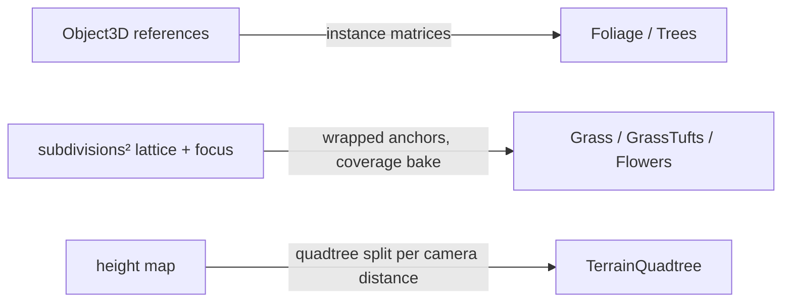

The environment layer of `@artificer-forge/engine/runtime` renders the outdoor world: a stylized lighting finish (grading), wind, vegetation (foliage, grass, tufts, flowers, trees), a trample map that vegetation bends around, and terrain plus water generated from painted maps. Everything is written in TSL and runs on `WebGPURenderer`.

## Systems

| System | Page | What it gives you |
|--------|------|-------------------|
| Grading | [/environment/grading](/environment/grading) | `createGradingContext`, `stylizedOutput`, `applyGradingToModel`: the one lighting and fog model every material below adopts |
| Environment store | [/environment/environment-store](/environment/environment-store) | `useEnvironmentStore`: wind targets and grading props, written by smart layers, read by components |
| Day cycle | [/environment/day-cycle](/environment/day-cycle) | `createPresetTrack`, `createPhaseTween` in the engine; `useDayCycle` and the presets in the playground |
| Wind | [/environment/wind](/environment/wind) | `createWindUniforms`, `windOffset`, `advanceWindTime`, plus the `WindLines` streak component |
| Foliage | [/environment/foliage](/environment/foliage) | `<Foliage>`: billboard leaf clusters for bushes and tree canopies |
| Grass | [/environment/grass](/environment/grass) | `<Grass>` blades and `<GrassTufts>` fans, two-ring LOD pattern |
| Flowers | [/environment/flowers](/environment/flowers) | `<Flowers>`: puff, poppy and daisy species from `FLOWER_PRESETS` |
| Trees | [/environment/trees](/environment/trees) | `<Trees>` and `extractCanopyReferences`: canopy markers from Blender become foliage clusters |
| Scatter | [/environment/scatter](/environment/scatter) | `createScatterFocus`, `coverageNode`, `createScatterBake`: the shared placement math for grass, tufts and flowers |
| Trample | [/environment/trample](/environment/trample) | `createTrampleMap`: a canvas texture characters stamp, vegetation flattens where it is marked |
| Terrain heightmap | [/environment/terrain-heightmap](/environment/terrain-heightmap) | Baked height PNG, `createHeightMap`, CPU and GPU height sampling |
| Terrain quadtree | [/environment/terrain-quadtree](/environment/terrain-quadtree) | `<TerrainQuadtree>`: LOD ground mesh generated from the height map |
| Terrain material | [/environment/terrain-material](/environment/terrain-material) | `createTerrainUniforms`, `buildTerrainMaterial`: painted control map blends grass, road, rock |
| Water | [/environment/water](/environment/water) | `<Water>`: depth-buffer absorption, foam, ripples |

All of it is exported from one place:

```ts
import {
  createGradingContext, stylizedOutput, applyGradingToModel,
  useEnvironmentStore, createPresetTrack, createPhaseTween,
  createWindUniforms, windOffset, WindLines,
  Foliage, Grass, GrassTufts, Flowers, Trees, extractCanopyReferences,
  createScatterFocus, createScatterBake, createTrampleMap,
  TerrainQuadtree, Water,
} from '@artificer-forge/engine/runtime'
```

## Three placement patterns

The components place geometry in three different ways. Pick the page by the pattern you need.



**Reference-driven instancing** (`Foliage`, `Trees`). You pass an array of `Object3D`. Each one becomes an instance matrix (position, max scale, random yaw). One merged cluster geometry times N instances is one draw call. The references are baked into the instance buffer at setup, so a changed list needs a remount (`Trees` does this with a `:key`).

**Scatter grid with focus** (`Grass`, `GrassTufts`, `Flowers`). The component builds `subdivisions²` anchors on a jittered lattice that spans `size` metres. With a `focus`, the lattice becomes a window that wraps around a moving centre (the party leader), so a fixed instance count always covers the ground the camera sees. A CPU bake sorts instances by coverage and draws only the live prefix. See [Scatter](/environment/scatter).

**Quadtree LOD** (`TerrainQuadtree`). The ground is not a mesh from Blender. It is generated from the baked height PNG, split into finer tiles near the camera, with skirts to hide the LOD seams. See [Terrain quadtree](/environment/terrain-quadtree).

## The grading contract

Every environment material takes the same optional prop:

```ts
grading?: GradingContext | null
```

`Foliage`, `Grass`, `GrassTufts`, `Flowers`, `Trees`, `Floor`, `Character`, `TerrainQuadtree` and `Water` all accept it. When it is set, the component builds a `MeshLambertNodeMaterial` and routes its colour through `stylizedOutput(...)`: light tint, core shadow ramp, drop shadows, fog, all driven by the one set of grading uniforms. When it is `null`, the component keeps its standalone look (its own colour ramp, no fog).

The two paths are separate node graphs. Adding or removing `grading` after mount does nothing, so decide it before the component is created. The full contract is on the [Grading](/environment/grading) page.

```vue
<script setup lang="ts">
import { createGradingContext, Foliage, Grass, useEnvironmentStore } from '@artificer-forge/engine/runtime'

const environment = useEnvironmentStore()
const grading = createGradingContext({ sceneNear: 12, sceneFar: 45 })

const { scene } = useTresContext()
watch(scene, (s) => {
  if (!s) return
  s.background = null
  s.backgroundNode = grading.fogColor // sky IS the fog gradient
}, { immediate: true })

const { onBeforeRender } = useLoop()
onBeforeRender(({ delta }) => {
  environment.tickWind(delta)
  grading.sync(environment) // store keys match GradingProps structurally
})
</script>

<template>
  <Foliage
    :references="references"
    :foliage-texture="foliageTexture"
    :wind-angle="environment.windAngle"
    :wind-strength="environment.windStrength"
    :grading="grading"
  />
  <Grass
    v-if="grassDiffuseMap"
    :diffuse-map="grassDiffuseMap"
    :wind-angle="environment.windAngle"
    :wind-strength="environment.windStrength"
    :grading="grading"
  />
</template>
```

## Policy vs mechanism

The [environment store](/environment/environment-store) is the smart layer's write target: a weather system or the day cycle writes wind targets and grading props there. The components are dumb. They receive `windAngle`, `windStrength` and `grading` as props and never read the store. The experience page in between owns the render loop: it calls `environment.tickWind(delta)`, `dayCycle.tick(delta)` and `grading.sync(environment)` once per frame.

This is why a component never imports Pinia. The same `<Grass>` works in a game scene with a live day cycle and in a static portrait scene with a fixed grading.

::note
All environment shaders are TSL (`three/tsl`) on node materials from `three/webgpu`. The renderer must be `WebGPURenderer`. WebGPU also caps vertex buffers at 8 per pipeline, which is why the scatter components pack their per-instance values into one `vec4` attribute.
::

## Where the playground uses it

| Experience | Shows |
|------------|-------|
| `apps/playground/pages/environment/foliage/experience.vue` | Foliage, Grass, WindLines, trample map, no grading (legacy look), skybox textures as background |
| `apps/playground/pages/environment/day-cycle/experience.vue` | Same scene with `createGradingContext`, `useDayCycle`, fog and ramp leches folders, cycle-driven shadow light |
| `apps/playground/pages/environment/terrain/experience.vue` | The full level: quadtree terrain, control map, water, trees from canopy markers, two-ring grass, three flower species, scatter focus on the party leader |

The foliage textures ship in `packages/assets/files/textures/foliage/` (`foliage.png`, `foliageSDF.png`, `foliageSDF.ktx`) and the grass splat in `packages/assets/files/textures/grass/splat.jpg`. The `@artificer-forge/assets` Nuxt module serves that folder as public assets, so the URL is `/textures/foliage/foliageSDF.png`.
