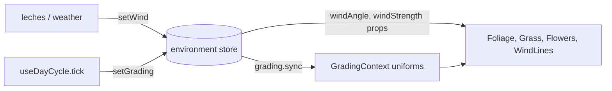

`useEnvironmentStore` is the global environment state: wind now, grading now, rain later. Smart layers (experience pages, a weather system, the day cycle) write here. Scene components stay dumb and receive these values as props. The store never touches the scene.

```ts
import { useEnvironmentStore } from '@artificer-forge/engine/runtime'

const environment = useEnvironmentStore()
```

## State

| Property | Type | Default | Purpose |
|----------|------|---------|---------|
| `windAngle` | `Ref<number>` | `DEFAULT_WIND_ANGLE` (`Math.PI * 0.6`) | CURRENT wind angle in radians. Bind this to components |
| `windStrength` | `Ref<number>` | `DEFAULT_WIND_STRENGTH` (`0.5`) | CURRENT wind strength, 0..1. Bind this to components |
| `baseWindAngle` | `Ref<number>` | same | Weather target the current angle meanders around |
| `baseWindStrength` | `Ref<number>` | same | Weather target the current strength gusts around |
| `windVariability` | `Ref<number>` | `1` | Scale of the meander. `0` = static wind |
| `lightDirection` | `Ref<Vector3>` | `(-1, -1, -1)` normalized | See `GradingProps` |
| `lightColor` | `Ref<Color>` | `#ffffff` | |
| `lightIntensity` | `Ref<number>` | `1` | |
| `shadowColor` | `Ref<Color>` | `#000000` | |
| `fogColorA` | `Ref<Color>` | `#88aaff` | |
| `fogColorB` | `Ref<Color>` | `#4455aa` | |
| `fogNearRatio` | `Ref<number>` | `0.3` | |
| `fogFarRatio` | `Ref<number>` | `1` | |

The eight grading refs have the same names as [`GradingProps`](/environment/grading#gradingprops). Pinia unwraps the refs on the store instance, so the store itself is a valid `GradingProps` and `grading.sync(environment)` works without a copy.

## Actions

### `setWind(settings)`

```ts
function setWind(settings: { angle?: number, strength?: number, variability?: number }): void
```

Sets the weather target AND snaps the current value to it, so a slider change is visible at once instead of waiting for the meander to arrive. Each key is optional.

### `tickWind(delta)`

```ts
function tickWind(delta: number): void
```

Call it from the smart layer's render loop. It moves the current values around the base values with two incommensurate sine pairs, so the pattern does not read as a loop: direction veers about ±0.45 rad over tens of seconds, strength gusts about ±0.25 (clamped to 0..1). Both are scaled by `windVariability`. When variability is `<= 0` it returns early. Skip the call entirely for static wind.

### `setGrading(props)`

```ts
function setGrading(props: Partial<GradingProps>): void
```

Copies each present key into the matching ref. `Color` and `Vector3` values are copied INTO the existing objects (`.copy`), not replaced.

## Usage

From `apps/playground/pages/environment/foliage/experience.vue`:

```vue
<script setup lang="ts">
import { Foliage, Grass, useEnvironmentStore, WindLines } from '@artificer-forge/engine/runtime'

const environment = useEnvironmentStore()

const { windAngle, windStrength, windVariability } = useControls('wind', {
  angle: { value: environment.baseWindAngle, min: -Math.PI, max: Math.PI, step: 0.01, type: 'range' },
  strength: { value: environment.baseWindStrength, min: 0, max: 1, step: 0.01, type: 'range' },
  variability: { value: environment.windVariability, min: 0, max: 2, step: 0.01, type: 'range' },
}, { uuid })

watch(windAngle, (v) => environment.setWind({ angle: v }))
watch(windStrength, (v) => environment.setWind({ strength: v }))
watch(windVariability, (v) => environment.setWind({ variability: v }))

const { onBeforeRender } = useLoop()
onBeforeRender(({ delta }) => {
  environment.tickWind(delta)
})
</script>

<template>
  <Foliage :references="references" :wind-angle="environment.windAngle" :wind-strength="environment.windStrength" />
  <Grass :wind-angle="environment.windAngle" :wind-strength="environment.windStrength" />
  <WindLines :wind-angle="environment.windAngle" :intensity="environment.windStrength" />
</template>
```

The components bind the CURRENT values (`windAngle`, `windStrength`). The leches sliders drive the BASE values through `setWind`. `tickWind` connects the two.

For grading, the [day cycle](/environment/day-cycle) writes `environment.setGrading(current)` every tick, and the experience copies the store into the shader uniforms with `grading.sync(environment)` in the same loop.



## Gotchas

::warning
- **In-place mutation.** `setGrading` writes into the existing `Color`/`Vector3` objects. A template binding like `:color="environment.lightColor"` will not re-render. Copy per frame in `onBeforeRender` (`light.color.copy(environment.lightColor)`), which is what the day-cycle experience's `syncLights()` does.
- **`tickWind` is not automatic.** Nothing calls it for you. Forget it and the wind stays exactly at the base values.
- **`windTime` is private.** The accumulator lives in the store closure and is not exposed or resettable.
::

## Related

- [Wind](/environment/wind): what the components do with `windAngle` and `windStrength`
- [Grading](/environment/grading): what `sync` does with the grading refs
- [Day cycle](/environment/day-cycle): the main writer of `setGrading`
