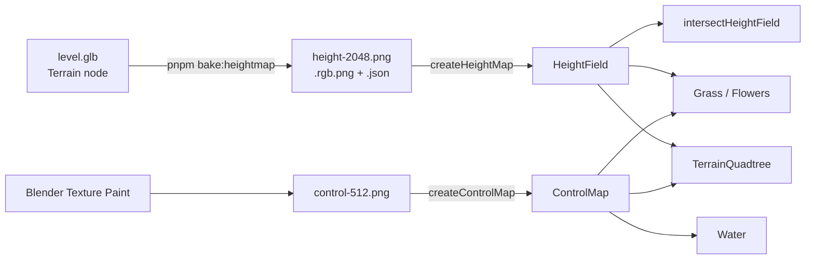

The terrain is not a mesh. It is a PNG. `scripts/bake-heightmap.mjs` turns the `Terrain` node of a level GLB into a height PNG plus a sidecar json. `createHeightMap` wraps that PNG as a `HeightField`. Everything that needs the ground reads that one texture: the [quadtree mesh](/environment/terrain-quadtree), the [grass](/environment/grass) and [scatter](/environment/scatter) fields, prop grading, and click-to-move picking. Nothing can drift from the drawn surface, because there is only one surface.

A second PNG, the **control map**, says what grows where. It is painted by hand in Blender: red is road, green is grass, blue is water. Both maps share the same world-to-uv formula and the same CPU/GPU twin readers, so they are documented together here.



## Bake the height PNG

Run the bake from the repo root after every terrain re-export from Blender.

```bash
pnpm bake:heightmap apps/playground/public/levels/level-512.glb --resolution 2048
```

| Flag | Default | Purpose |
|------|---------|---------|
| `<glb>` | required | Level file. Draco-compressed GLBs are decoded. |
| `--node` | `Terrain` | Name of the node(s) to rasterise. A rename in Blender fails loudly with the list of node names. |
| `--resolution` | `2048` | Texels per side. |
| `--size` | bounding square | World metres per side. Crops a window when smaller than the mesh. |
| `--origin` | mesh centre | World XZ centre of the window, `x,z`. |
| `--name` | GLB stem | Output stem. A cropped bake needs its own name or it overwrites the full one. |
| `--out` | GLB folder | Output directory. |

It writes three files next to the GLB:

| File | Content |
|------|---------|
| `<stem>.height-<res>.png` | 8-bit grey. `r / 255` is the normalised height. |
| `<stem>.height-<res>.rgb.png` | 24-bit packed. `(r * 65536 + g * 256 + b) / 16777215` is the normalised height. |
| `<stem>.height-<res>.json` | The `HeightMapMeta` that maps 0..1 back to metres. |

What the bake does, and why it matters when you read the result:

- The window is **square** because `heightUv()` divides both axes by one `size`. A 512 x 1024 m level gets a 1024 m window with padding unless you crop it with `--size` and `--origin`.
- The highest surface per texel wins, the same as a top-down orthographic render with a depth test.
- Texels no triangle claims are clamped outward from the mesh edge and ramped across gaps, which is what `ClampToEdgeWrapping` would show anyway.
- A cropped bake recomputes `minHeight` and `maxHeight` from the window only. The full range would spend the 8-bit ladder on terrain you cut away.
- The PNGs are written with `palette: false`. A palettised PNG quantises the heights.
- The console prints `grey step`, the metres one grey level represents. That number decides the encoding (next section).

The json always says `encoding: "grey"` because it describes the `.png`. Set `encoding: 'rgb'` yourself when you load the `.rgb.png`.

::note
The script imports `@gltf-transform/core`, `@gltf-transform/extensions`, `draco3dgltf` and `sharp`. They resolve from the root `node_modules`; the first three are declared by `packages/assets`, `sharp` is only there as a hoisted transitive dependency. Run it from the repo root.
::

The playground ships two bakes in `apps/playground/public/levels/`: `level-512.height-2048.*` (1024 m window, the level used by `/environment/terrain`) and `testbed.height-512.*` (60 m window, the original test level).

## HeightMapMeta

`HeightMapMeta` is the sidecar json, minus `source`, `node` and `encodingNotes`.

| Field | Type | Purpose |
|-------|------|---------|
| `resolution` | `number` | Texels per side. |
| `size` | `number` | World metres per side of the square window. |
| `origin` | `[number, number]` | World XZ **centre** of the window, not a corner. |
| `minHeight` | `number` | Metres at value 0. |
| `maxHeight` | `number` | Metres at value 1. |
| `texelSize?` | `number` | `size / resolution`. Computed when missing. |
| `flipY?` | `boolean` | Default `false`. Flip this if the level comes out mirrored along Z. |
| `encoding?` | `HeightEncoding` | `'grey'` (default) or `'rgb'`. |

## Encoding: grey or rgb

```ts
export type HeightEncoding = 'grey' | 'rgb'
```

| | `grey` | `rgb` |
|---|---|---|
| Bits | 8, in the red channel | 24, packed across r/g/b |
| File size | about a tenth of rgb | larger |
| GPU filter | `LinearFilter`, hardware bilinear | `NearestFilter`, then a manual 4-tap bilinear in `sampleHeight` |
| Decode | `r` | `r * 65536 + g * 256 + b`, scaled by `255 / 16777215` |

Use `grey` until `(maxHeight - minHeight) / 255` is a step you can see on a hillside. The testbed spans 15 m, so one grey level is 5.9 cm and grey is fine. `level-512` spans 138 m, so one grey level is 54 cm and every slope terraces. That level loads the `.rgb.png`.

`rgb` must be sampled with `NearestFilter`. Hardware filtering would average the packed bytes of neighbouring texels and decode them to a height from nowhere. `sampleHeight` decodes each of the four neighbours first and blends afterwards. `sampleHeightAt` on the CPU does the same, so the two agree.

Both encodings share three texture settings that `createHeightMap` forces:

- `colorSpace = NoColorSpace`. An sRGB decode would bend the height ramp into a curve.
- `wrapS = wrapT = ClampToEdgeWrapping`.
- `generateMipmaps = false`. The quadtree samples the map in the **vertex** stage, which has no screen derivatives to pick a mip from, and a lower mip would flatten the hills.

## createHeightMap

```ts
import { createHeightMap } from '@artificer-forge/engine/runtime'

const field = createHeightMap({ texture, meta })
```

Returns a `HeightField`:

| Field | Type | Purpose |
|-------|------|---------|
| `texture` | `Texture` | The PNG, with the settings above applied. |
| `encoding` | `HeightEncoding` | Copied from `meta`, default `'grey'`. |
| `uniforms` | `HeightFieldUniforms` | `origin`, `size`, `texelSize`, `minHeight`, `heightRange`, for TSL. |
| `size`, `origin`, `minHeight`, `heightRange`, `resolution` | plain values | CPU mirror of the uniforms. `origin` is a `Vector2`. |
| `bake` | `(renderer) => Promise<void>` | No-op here. Kept so the type is interchangeable with `createHeightField`. |
| `dispose` | `() => void` | No-op here. `useTexture` caches the texture by URL, so disposing it would break the next mount. |

::warning
`useTexture` hands back a `Texture` with no `image` until the file lands. Do not call `createHeightMap` on it yet. Gate on `.image` (the playground's `whenLoaded` helper below), or the material throws in bind-group init every frame and the page stays blank.
::

## Read it on the GPU

```ts
import { heightUv, sampleHeight } from '@artificer-forge/engine/runtime'
import { positionWorld } from 'three/tsl'

const height = sampleHeight(field, positionWorld.xz) // metres, as a TSL node
```

`heightUv(uniforms, worldXZ)` is `(worldXZ - origin) / size + 0.5`. There is no v flip: a WebGPU framebuffer has its origin top-left, so world +Z lands at v = 1, the same as `controlUv`. `sampleHeight` picks the decode for the field's encoding and returns `normalised * heightRange + minHeight`.

## Read it on the CPU

The CPU readers exist so a character can stand on the drawn surface and a click can land on it.

```ts
import { readHeightPixels, sampleHeightAt, intersectHeightField } from '@artificer-forge/engine/runtime'

const pixels = readHeightPixels(field)          // null until the image is decoded
const y = sampleHeightAt(field, pixels, x, z)   // metres
```

| Function | Purpose |
|----------|---------|
| `readHeightPixels(field)` | Draws the image on an `OffscreenCanvas` and returns `{ data, width, height }`. Cached per texture in a `WeakMap`. Returns `null` when the image has not arrived, and does not cache that miss. |
| `setHeightPixels(field, pixels)` | Puts pixels into the cache directly. For tests, and for a field generated in memory. |
| `sampleHeightAt(field, pixels, x, z)` | Bilinear read in metres. Mirrors `heightUv` plus `LinearFilter` exactly: half-texel centres, clamp to edge, decode before blend. |
| `intersectHeightField(field, pixels, ray, target, maxDistance?)` | Ray against the field. Writes the hit into `target`, returns `true` on a hit. |

`intersectHeightField` is what makes click-to-move work on a terrain whose CPU geometry is a flat unit square. `TerrainQuadtree` overrides `mesh.raycast` with it. The algorithm:

1. Clip the ray to the field's box (XZ window plus `minHeight..maxHeight`). This runs on every pointer move, and a sky ray would otherwise walk `maxDistance` (default `size * 3`) one texel at a time.
2. March one texel per step. One texel per step means no feature the map holds can be stepped over.
3. When the ray crosses from above to below the surface, bisect 12 times between the last two samples.

A near-horizontal ray (`|dir.y| < 1e-4`) returns `false`; that is not a ground pick. A ray that starts underground (camera below a ridge) hits at its origin.

## GPU-baked alternative: createHeightField

`createHeightField` produces the same `HeightField` type from a mesh at runtime, without a PNG.

```ts
import { createHeightField } from '@artificer-forge/engine/runtime'

const field = createHeightField({ geometry, size: 60, origin: [0, 0], resolution: 512 })
await field.bake(renderer) // once, before the first frame that samples it
```

| Option | Default | Purpose |
|--------|---------|---------|
| `geometry` | required | World-space `BufferGeometry`. The bake applies no node transform. |
| `size` | required | Metres per side. |
| `origin` | `[0, 0]` | World XZ centre. |
| `resolution` | `512` | Texels per side. |

It renders `positionWorld.y` into a half-float `RenderTarget` with an orthographic camera looking straight down (`camera.up` set to `(0, 0, -1)`, since the default up vector is degenerate for that view), with tone mapping off. The target stores metres directly, so `minHeight` is 0, `heightRange` is 1 and `encoding` is `'grey'`. `dispose` releases the target. Use it when the ground exists only at runtime. The playground uses the PNG path: the bake script is the same idea run offline, and it gives you 24-bit precision and CPU pixels for free.

## Control map

The control map is the painted PNG that says where road, grass and water are.

```ts
import { createControlMap, CONTROL_CHANNEL } from '@artificer-forge/engine/runtime'

const control = createControlMap({ texture, size: 512, origin: [-7.4813, 11.8386] })
```

| Option | Default | Purpose |
|--------|---------|---------|
| `texture` | required | The painted image. r = road, g = grass, b = water. |
| `size` | required | World metres per side. |
| `origin` | `[0, 0]` | World XZ centre. |
| `anisotropy` | `4` | The ground is mostly seen at grazing angles, so more than 1 pays off. |

Returns `ControlMap { texture, uniforms: { origin, size }, size, origin }`. The texture is forced to `NoColorSpace`, `flipY = false`, `ClampToEdgeWrapping`, `LinearFilter` mag, `LinearMipmapLinearFilter` min with mipmaps. Mipmaps are on purpose here, the opposite of the height map: an unfiltered mask moires and crawls at grazing angles. Distant mips blend the channels into mush, fog covers the mush, and mush beats shimmer.

```ts
export const CONTROL_CHANNEL = { road: 0, grass: 1, water: 2 } as const
```

GPU side, `controlUv(uniforms, worldXZ)` is the same formula as `heightUv`. CPU side, the twin readers mirror the height map's:

| Function | Purpose |
|----------|---------|
| `readControlPixels(map)` | Canvas decode, cached per texture. `null` until the image lands. |
| `setControlPixels(map, pixels)` | Bypass the decode (tests, generated maps). `density.test.ts` uses it to check that CPU scatter placement matches the shader mask. |
| `sampleControlChannel(map, pixels, x, z, channel)` | Bilinear read of one channel, 0..1, at mip 0. A vertex-stage `texture()` has no derivatives, so the GPU also samples the top level. |

Who reads it: the [terrain material](/environment/terrain-material) (r and g as splat weights, b for the wet shore band), [Water](/environment/water) (b as the surface mask), and the [scatter](/environment/scatter) fields (g as the placement mask, on the CPU through `sampleControlChannel`).

### Authoring in Blender

The playground map is `apps/playground/public/levels/control-512.png`, a 512 m window around the level start. Outside it the paint clamps, so far terrain reads as bare ground. It is painted in Blender's Texture Paint mode, on the real hills. The rules that keep the channels clean:

- Paint **one channel at a time** with a pure colour (R, G or B at 1) and the brush Blend mode set to **Add**. Erase with **Subtract** and the same colour. Blender has no channel lock; the Mix blend mode would zero the other two channels under every stroke, with no warning.
- Control coverage with brush **Strength**, never with a darker colour. Blender's hex field is sRGB, its sliders are scene linear, and the image is Non-Color, so a dark hex does not write the byte you think.
- **Save the image** (Image, Save, or Alt-S). Blender does not save painted images with the .blend file.
- Export the level as glTF Binary with the default +Y up option. Blender +Y becomes three -Z, which is what `flipY = false` and the uv formula already assume.

Symptoms map to causes: mirrored front to back means `flipY` disagrees with the uv formula; repeated or cropped paint means `size` does not match the painted extent; a washed-out grey map means the texture is being decoded as sRGB (`createControlMap` did not run on it); an all-black map means the image was never saved.

## In the terrain experience

Trimmed from `apps/playground/pages/environment/terrain/experience.vue`.

```ts
// Copied from public/levels/level-512.height-2048.json (pnpm bake:heightmap); re-bake
// and copy again. size is the 1024 m bounding square because the level is 512 x 1024 m
// and heightUv() divides by one size. rgb, not grey: 138 m over 8 bits terraces hillsides.
const HEIGHT_META: HeightMapMeta = {
  resolution: 2048,
  size: 1024,
  origin: [-7.4813, -244.1614],
  minHeight: -4.7006,
  maxHeight: 133.4328,
  texelSize: 0.5,
  flipY: false,
  encoding: 'rgb',
}
const HEIGHT_MAP_URL = '/levels/level-512.height-2048.rgb.png'

// Smaller window than the height map: control-512.png only paints the 512 m around the start.
const LEVEL_SIZE = 512
const LEVEL_ORIGIN: [number, number] = [-7.4813, 11.8386]

// useTexture's ref holds a pixel-less Texture until the file lands
function whenLoaded<T extends Texture>(source: { value: T | null | undefined }) {
  return computed(() => (source.value?.image ? source.value : null))
}

const control = shallowRef<ControlMap | null>(null)
const heightField = shallowRef<HeightField | null>(null)

const { state: controlTexture } = useTexture('/levels/control-512.png')
watch(whenLoaded(controlTexture), (texture) => {
  if (texture) control.value = createControlMap({ texture, size: LEVEL_SIZE, origin: LEVEL_ORIGIN })
})

const { state: heightTexture } = useTexture(HEIGHT_MAP_URL)
watch(whenLoaded(heightTexture), (texture) => {
  if (!texture || heightField.value) return
  heightField.value = createHeightMap({ texture, meta: HEIGHT_META })
})

// CPU read: the character stands on the same surface the GPU draws
function groundHeight(x: number, z: number): number | null {
  const field = heightField.value
  if (!field) return null
  const pixels = readHeightPixels(field)
  if (!pixels) return null
  return sampleHeightAt(field, pixels, x, z)
}

// GPU read: grading's contact occlusion needs the terrain height per fragment
const characterGroundHeight = computed(() =>
  heightField.value ? sampleHeight(heightField.value, positionWorld.xz) : null)

// Priority 10 runs after Character.vue's movement update (default 0)
onBeforeRender(() => {
  const position = getCharacterRef(playerId.value!)?.getPosition()
  if (!position) return
  const y = groundHeight(position.x, position.z)
  if (y !== null) position.y = y
}, 10)
```

The level GLB is still loaded (`useGLTF('/levels/level-512.glb', { draco: true })`) for its props, but the `Terrain` mesh is skipped: `TerrainQuadtree` generates the surface from the height map, and drawing both would z-fight.
