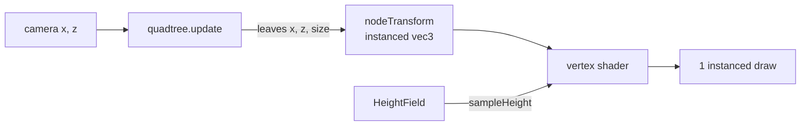

`<TerrainQuadtree>` draws the whole level in **one draw call**. A CPU quadtree decides every frame which squares cover the level at which size, given where the camera is. One shared unit grid is instanced once per leaf, and the vertex shader stretches it over the leaf's square and lifts it with `sampleHeight` from the [height field](/environment/terrain-heightmap). A LOD change is an attribute write, not a geometry rebuild.



## createQuadtree

```ts
import { createQuadtree } from '@artificer-forge/engine/runtime'

const tree = createQuadtree({ size: 1024, origin: [0, 0], maxDepth: 4, splitFactor: 1.5 })
const count = tree.update(cameraX, cameraZ)
```

| Option | Default | Purpose |
|--------|---------|---------|
| `size` | required | World metres per side of the root square. |
| `origin` | `[0, 0]` | World XZ centre. |
| `maxDepth` | `4` | The finest leaf is `size / 2^maxDepth`. Going below the height map texel buys nothing. |
| `splitFactor` | `1.5` | A node splits when the camera is within `splitFactor * nodeSize` of it. |

Returns a `Quadtree`:

| Field | Type | Purpose |
|-------|------|---------|
| `nodes` | `QuadtreeNode[]` | Pooled. Only the first `count` entries are live. Read it, never hold it. |
| `count` | `number` | Live leaves after the last `update`. |
| `update` | `(x, z) => number` | Rebuilds the leaf list from the camera position and returns `count`. |
| `maxDepth`, `splitFactor` | `number` | Mutable at runtime. The next `update` uses the new value. |

A `QuadtreeNode` is `{ x, z, size, depth }` where `x`/`z` are the **minimum corner**, not the centre.

Two choices in `update` are worth knowing:

- The distance test uses the **nearest point of the square**, not its centre. Centre distance stops the node the camera stands in from splitting.
- The tree is rebuilt from scratch every frame into a node pool. That is a few hundred compares and no allocations once warm, cheaper than an incremental tree that patches itself.

## createTerrainQuadtree

```ts
import { createTerrainQuadtree } from '@artificer-forge/engine/runtime'

const terrain = createTerrainQuadtree({ field, control, grading, grassMap, groundMap, roadMap, rockMap })
scene.add(terrain.mesh)
// per frame
terrain.update(camera.position.x, camera.position.z)
```

| Option | Default | Purpose |
|--------|---------|---------|
| `field` | required | `HeightField` from `createHeightMap` or `createHeightField`. Also sets the tree's `size` and `origin`. |
| `control` | required | `ControlMap` for the [terrain material](/environment/terrain-material). |
| `grading` | `undefined` | `GradingContext`, see [Grading](/environment/grading). |
| `grassMap`, `groundMap`, `roadMap`, `rockMap` | `undefined` | Albedo textures. Forwarded to `buildTerrainMaterial`. |
| `uniforms` | own bag | `TerrainUniforms` to share with a debug panel. |
| `segments` | `32` | Quads per side of one leaf. Trades triangles per leaf against leaf count. |
| `maxDepth` | `4` | See `createQuadtree`. |
| `splitFactor` | `1.5` | See `createQuadtree`. |
| `skirtDepth` | `4` | Metres the skirt hangs below a **root-sized** leaf's edge. Finer leaves scale it down. |

Returns a `TerrainQuadtree`:

| Field | Type | Purpose |
|-------|------|---------|
| `mesh` | `Mesh` | Named `terrain-quadtree`. `receiveShadow` on, `matrixAutoUpdate` off, `frustumCulled` off. |
| `quadtree` | `Quadtree` | Live tree. Write `maxDepth` / `splitFactor` on it to retune. |
| `uniforms` | `TerrainUniforms` | The material's uniform bag. |
| `material` | `MeshLambertNodeMaterial` | From `buildTerrainMaterial`, with `positionNode` and `normalNode` added. |
| `skirtDepth` | `UniformNode<'float'>` | Write `.value` to retune live. |
| `setWireframe` | `(value) => void` | Sets `material.wireframe` and `needsUpdate`. Topology is baked into the compiled pipeline; the flag alone keeps drawing triangles. |
| `nodeCount` | `number` | Leaves drawn on the last `update`. |
| `update` | `(x, z) => void` | Runs the tree, writes the instance attribute, sets `instanceCount`. |
| `dispose` | `() => void` | Disposes geometry and material. |

### How the mesh works

- **One unit grid** of `segments + 3` vertices per side: the `segments + 1` interior grid plus one ring on each side for the skirt. Positions are 0..1 in XZ. It carries a `normal` attribute set to +Y only because three reads the attribute before `normalNode` runs, and a `skirt` float attribute (1 on the outer ring).
- **One instanced attribute**, `nodeTransform`, a `vec3` of `(x, z, size)`. Packed into one attribute on purpose: WebGPU allows 8 vertex buffers per pipeline. It starts at a capacity of 256 leaves and doubles when needed. It is re-uploaded every frame; a 3 KB write is cheaper than tracking which leaves moved.
- **`positionNode`**: `worldXZ = nodeTransform.xy + positionGeometry.xz * nodeTransform.z`, `y = sampleHeight(field, worldXZ) - skirtDrop`. The shader emits world coordinates, which is why the mesh has a frozen identity matrix: any transform would shift the terrain off its height map.
- **`normalNode`**: central differences of `sampleHeight` one `texelSize` apart, so shading (and the rock-on-slope mask in the material) is identical at every LOD instead of following the triangle density. The result is rotated with `mat3(cameraViewMatrix)` because `NodeMaterial.setupNormal` feeds `normalNode` straight into `normalView`.
- **Bounding sphere** covers the whole level (`size` and `heightRange`), because the shader moves every vertex and the CPU-side unit grid is meaningless for culling.
- **Raycast** is overridden: the default would hit a 1 m plane at the origin. `mesh.raycast` calls `readHeightPixels` and `intersectHeightField` (see [the height map page](/environment/terrain-heightmap#read-it-on-the-cpu)), and pushes one `Intersection` with the hit point and an up normal. This is what makes `@click` deliver a usable `event.point` for click-to-move.

### Skirts

Two leaves of different depth meet along an edge. The coarse one interpolates the height linearly across a long edge; the fine one follows the map. Between them is a crack. The skirt hides it.

The grid's outer ring is clamped **onto** the border (same XZ as the edge vertices) and flagged `skirt = 1`. The vertex shader drops those vertices by

```
skirt * skirtDepth * (nodeSize * 2 / rootSize)
```

The factor is the **parent** size, not the leaf's own size, because the crack is the coarser neighbour's interpolation error. With `skirtDepth = 4` a root-sized leaf's skirt hangs 4 m; a depth-6 leaf's hangs `4 * 2 / 64 = 0.125` m. Hanging straight down, the skirt is invisible from above by design.

::tip
To see the skirts, set a **negative** `skirtDepth`. They then stick up out of every seam.
::

## `<TerrainQuadtree>`

```ts
import { TerrainQuadtree } from '@artificer-forge/engine/runtime'
```

| Prop | Type | Default | Purpose |
|------|------|---------|---------|
| `field` | `HeightField` | required | Height source and level extent. |
| `control` | `ControlMap` | required | Splat weights. |
| `grading` | `GradingContext \| null` | `undefined` | Stylized output. |
| `grassMap`, `groundMap`, `roadMap`, `rockMap` | `Texture` | `undefined` | Albedo maps. Must be loaded before mount (see below). |
| `uniforms` | `TerrainUniforms` | own bag | Share with a panel. |
| `segments` | `number` | `32` | **Not live.** It decides the shared grid's vertex layout. Remount with `:key` to change it. |
| `maxDepth` | `number` | `4` | Live. |
| `splitFactor` | `number` | `1.5` | Live. |
| `skirtDepth` | `number` | `4` | Live. |
| `wireframe` | `boolean` | `false` | Live. |

Emits `click: [event: TresPointerEvent]`, the same contract as `TerrainGround` and `Floor`. Exposes `{ uniforms, quadtree, material, nodeCount }`; `nodeCount` is a `ref` updated every frame.

The component renders `<primitive :object="terrain.mesh">`, not `<TresMesh>`, because the mesh carries the raycast override and the frozen matrix.

Per frame it reads the camera from `useLoop`'s `onBeforeRender` and calls `terrain.update(position.x, position.z)`. It primes once at the level centre so frame one is not empty.

::warning
`useTresContext().camera` is the camera **manager**, not a ref. The camera handed to `onBeforeRender` is a ref and needs `toValue()`. A plain null check on it passes and then throws.
::

::warning
The material is built once. Its node graph bakes in which maps exist, so a map that arrives after mount is silently ignored and that layer falls back to flat colour. Gate the component with `v-if` on every map you pass. Details on the [terrain material page](/environment/terrain-material#late-textures-are-ignored).
::

### Choosing depth and segments

The finest leaf is `field.size / 2^maxDepth`, and its vertex spacing is that divided by `segments`. Stop when the spacing reaches the height map texel: deeper only reads each texel twice. For `level-512` (1024 m, 2048 texels, 0.5 m texel) with `segments = 32`, depth 6 gives `1024 / (32 * 64) = 0.5` m, one vertex per texel, on 16 m leaves. The engine default of 4 is tuned for the 60 m testbed.

## In the terrain experience

Trimmed from `apps/playground/pages/environment/terrain/experience.vue`.

```ts
// segments rebuilds the shared grid, so it remounts via :key. depth 6 is one vertex
// per texel (1024 / (32 * 2^6) = 0.5 m); deeper only reads each texel twice.
const { quadtreeSegments, quadtreeDepth, quadtreeSplit, quadtreeSkirt, quadtreeWireframe } = useControls('quadtree', {
  segments: { value: 32, min: 4, max: 64, step: 4, type: 'range' },
  depth: { value: 6, min: 0, max: 8, step: 1, type: 'range' },
  split: { value: 1.5, min: 0.5, max: 6, step: 0.1, type: 'range' },
  skirt: { value: 4, min: 0, max: 40, step: 0.25, type: 'range' },
  wireframe: { value: false, type: 'boolean' },
}, { uuid })

// Keep the hit height: the controller steers XZ only, and the marker needs y.
function handleGroundClick(event: TresPointerEvent) {
  const id = playerId.value
  if (!id || !event.point) return
  getCharacterRef(id)?.moveTo(event.point)
}
```

```vue
<template>
  <!-- Every map must be loaded before mount: the material bakes in which maps exist -->
  <TerrainQuadtree
    v-if="control && heightField && grassMap && groundMap && roadMap && rockMap"
    :key="quadtreeSegments"
    :field="heightField"
    :control="control"
    :grading="grading"
    :grass-map="grassMap"
    :ground-map="groundMap"
    :road-map="roadMap"
    :rock-map="rockMap"
    :uniforms="terrain"
    :segments="quadtreeSegments"
    :max-depth="quadtreeDepth"
    :split-factor="quadtreeSplit"
    :skirt-depth="quadtreeSkirt"
    :wireframe="quadtreeWireframe"
    @click="handleGroundClick"
  />
</template>
```

The camera that drives `update` comes from `GameContextProvider` in `index.vue` (`fov 40`, `far 1000`, follow camera on the party leader), so the fine leaves follow the player.
