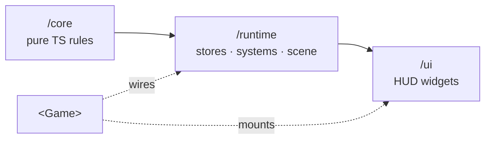

The engine is split into three layers, each its own entrypoint. The split is about dependencies: each layer can only depend *downward*, never up.

## /core — pure RPG rules

`@artificer-forge/engine/core` is **pure TypeScript**: no Vue, no Three, no reactivity. It is the RPG ruleset, written as plain functions and types, and tested with vitest only. Because it has no framework dependencies, the same rules run in a Vue component, a worker, or a test with no setup.

It re-exports six rule modules:

| Module | Concern |
|--------|---------|
| `damage` | Damage application / resolution |
| `armor` | Deriving armor pools from equipment |
| `aoe` | Area-of-effect target math |
| `surface` | Surface state rules (water, fire, ice…) |
| `inventory` | Item placement and stacking rules |
| `statusEffects` | Status effect definitions and transitions |

A representative example — `armor.ts` is a single pure reducer over equipped items:

```ts
import { deriveMaxArmor } from '@artificer-forge/engine/core'

const { physical, magical } = deriveMaxArmor(equippedItems)
```

::alert{type="info"}
`/core` is the only layer with no Vue or Three import. If a rule needs reactivity or a Three object, it belongs in `/runtime`, not here.
::

## /runtime — stores, systems, controllers, scene

`@artificer-forge/engine/runtime` is the Vue + TresJS layer. It wraps the `/core` rules in reactive Pinia stores, drives them with systems, exposes controllers (movement, animation), and provides in-scene Tres components. This is where `useGameConfig` lives.

```ts
import {
  useGameStore,
  CombatSystem,
  SurfaceSystem,
  CameraController,
  Character,
  useCharacterController,
} from '@artificer-forge/engine/runtime'
```

## /ui — HUD widgets

`@artificer-forge/engine/ui` is the 2D DOM overlay: the `Hud` root plus action bar, panels, inventory and context-menu widgets, built on Nuxt UI. `@nuxt/ui` is an **optional** peer dependency — only apps that use this layer need to install it. Widgets are skinnable through the standard Nuxt UI `:ui` prop.

```ts
import { Hud, ActionBar, CharacterInventoryModal } from '@artificer-forge/engine/ui'
```

## What lives where

| Concern | Layer |
|---------|-------|
| "How much damage does this hit deal?" | `/core` (`damage`) |
| "Sum armor from equipped items" | `/core` (`armor`) |
| "Which tiles does this spell cover?" | `/core` (`aoe`) |
| Reactive entity / party state | `/runtime` (`useGameStore`) |
| Per-frame combat resolution in the scene | `/runtime` (`CombatSystem`) |
| Click-to-move | `/runtime` (`useCharacterController`) |
| In-scene character mesh | `/runtime` (`Character`) |
| Action bar, inventory modal, context menu | `/ui` |

## Dependency direction



`/runtime` builds on `/core`; `/ui` builds on `/runtime`. The root `<Game>` component sits on top, wiring runtime systems into the scene and mounting the `/ui` HUD.
