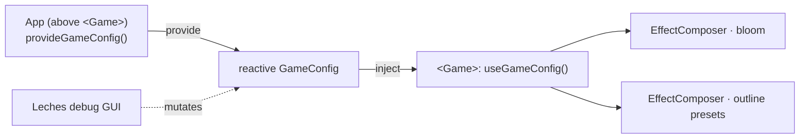

`GameConfig` is the render configuration shared between the engine's `<Game>` host and the app. The engine ships sane defaults; an app overrides them — typically from a debug GUI or a settings store — by providing the config *above* `<Game>`.

## The config shape

From `useGameConfig.ts`:

```ts
interface BloomConfig {
  strength: number
  radius: number
  threshold: number
  smoothWidth: number
}

interface OutlinePreset {
  visibleEdgeColor: string
  edgeThickness: number
}

interface GameConfig {
  bloom: BloomConfig
  outlinePresets: Record<string, OutlinePreset>
}
```

The engine defaults set `bloom` to `{ strength: 0.7, radius: 0.4, threshold: 0.8, smoothWidth: 0.3 }` and ship named outline presets (`party`, `interactive`, `hostile`, `neutral`, `ally`).

## provide / use

Two functions, both imported from `@artificer-forge/engine/runtime`:

```ts
import { provideGameConfig, useGameConfig } from '@artificer-forge/engine/runtime'
```

- **`provideGameConfig(overrides?)`** — call it *above* `<Game>` in the app. It merges your `overrides` onto the engine defaults, provides the result, and returns the **reactive** object so you can keep mutating its fields (omitted fields fall back to defaults).
- **`useGameConfig()`** — called *inside* the engine (by `<Game>`). Reads the provided config, falling back to engine defaults when none was provided.

`<Game>` reads `config.bloom` and `config.outlinePresets` and feeds them straight into the `EffectComposer`. Because the provided object is reactive, mutating a field re-renders the post-fx live.

## Wiring a debug GUI

The playground's `GameContextProvider` provides the config, then binds a Leches (`@tresjs/leches`) GUI to mutate bloom in real time:

```ts
const config = provideGameConfig()

const { postprocessingBloomStrength, /* …radius, threshold, smoothWidth */ }
  = useControls('postprocessing', {
    bloomStrength: { value: config.bloom.strength, min: 0, max: 3, step: 0.01, type: 'range' },
    // …radius / threshold / smoothWidth controls
  }, { uuid })

watchEffect(() => {
  config.bloom.strength = toValue(postprocessingBloomStrength)
  // …keep the rest of config.bloom in sync with the GUI
})
```

::alert{type="info"}
`provideGameConfig()` returns the reactive object — mutate its fields directly (as the `watchEffect` does). No second provide call needed; `<Game>` already sees the changes.
::


