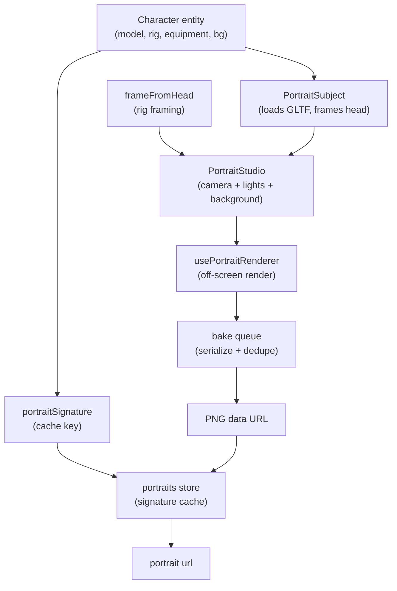

Character portraits in Artificer Forge are **not authored images** — they are rendered from the same GLTF model the character uses in-scene. An off-screen `TresCanvas` frames the head, captures a frame to a PNG data URL, and caches it keyed by a signature derived from the character's appearance. Change a character's gear or model and the portrait re-bakes; move them around the map and it does not.

Everything lives under the portrait module and is re-exported from the runtime entry:

```ts
import {
  PortraitStudio,
  PortraitSubject,
  PortraitBackground,
  PortraitLights,
  usePortraitStudio,
  usePortraitRenderer,
  createBakeQueue,
  frameFromHead,
  portraitSignature,
  resolvePortraitBackground,
} from '@artificer-forge/engine/runtime'
```

## Why render instead of author?

- **Always in sync** — equip a sword and the portrait shows the sword. No re-export step.
- **One source of truth** — the portrait is the model, so there is no drift between the in-scene character and its UI icon.
- **Per-appearance caching** — bakes are expensive (a GLTF load + a couple of frames), so each result is cached against a [signature](/portraits/signature) and only re-runs when the look genuinely changes.

## The bake pipeline

A bake flows from the character's appearance through a single shared studio and out as a PNG. The studio is a module-scope singleton: one off-screen canvas serves every caller, and the [bake queue](/portraits/bake-queue) serializes requests so only one subject renders at a time.



::alert{type="info"}
`usePortraitRenderer(entityId)` is the entry point most UI code touches — it returns a reactive `url` ref you can bind to an ``. The studio, queue and signature underneath are wired up for you.
::

## Where to go next

- [Studio](/portraits/studio) — the components that render a subject: `PortraitStudio`, `PortraitSubject`, `PortraitBackground`, `PortraitLights`, plus rig framing and backgrounds.
- [Bake Queue](/portraits/bake-queue) — how bakes are serialized, deduped, and stored.
- [Signature](/portraits/signature) — how the cache key is built and when it invalidates.
