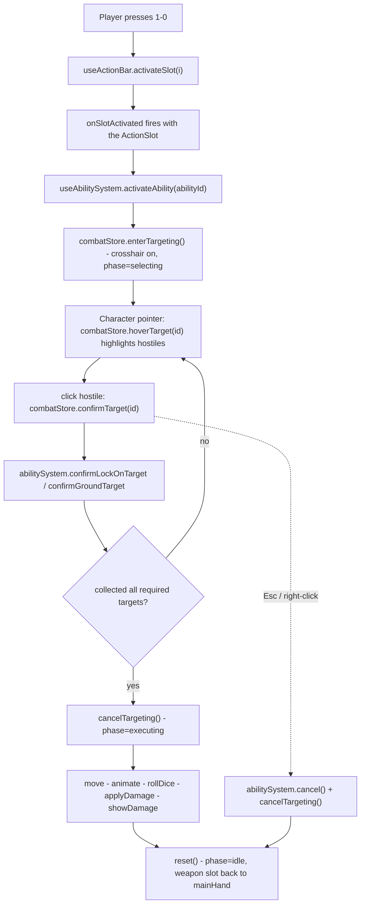

The combat system coordinates UI slots, store state, 3D pointer events, and character animation into a single attack flow. The work is split across three pieces:

| Piece | Layer | Owns |
|-------|-------|------|
| [`useActionBar`](/combat/action-bar) | runtime | The player's ability slots and which slot was activated |
| [`useCombatStore`](/combat/combat-store) | runtime | Targeting state (crosshair, hovered enemy, cursor point) |
| [`useAbilitySystem`](/combat/abilities) | runtime | The cast pipeline — movement, animation, damage resolution |

The split is deliberate: the action bar never knows what an ability *does*, the combat store only manages the targeting cursor, and the ability system runs the actual sequence. `useCombatStore` delegates target confirmation straight into `useAbilitySystem`.

```ts
import { useActionBar, useCombatStore, useAbilitySystem } from '@artificer-forge/engine/runtime'
```

## The turn / targeting flow

A cast moves through a small phase machine driven by `useAbilitySystem.phase` (`idle` → `selecting` → `executing` → `idle`). The combat store toggles the crosshair while the ability system collects targets and resolves the action.



## Action points

The action-economy cost of each ability is carried on the slot (`cost: 'action' | 'bonusAction' | 'free'`) and rendered as a coloured dot on the slot button. The HUD's `ActionPointsGroup` (action / bonus action / reaction pips) and the **End Turn** button in `ActionBarResources` are still visual placeholders — they emit but do not yet spend or reset a per-turn AP budget. Treat AP as presentational for now; the wiring lives in the HUD, not the combat store.

::alert{type="info"}
The combat store no longer owns an `executeAttack` method or an `isAttacking` flag. Attack execution (melee, projectiles, AoE) moved into [`useAbilitySystem`](/combat/abilities). The store's job is now purely the targeting cursor.
::

## Targeting feedback

| Feedback | Where | Condition |
|----------|-------|-----------|
| Crosshair cursor | `cursor-crosshair` class on `document.body` | `enterTargeting()` called |
| Hostile highlight | `Character` pointer events → `hoverTarget` | pointer over a `team === 'hostile'` entity while targeting |
| Leader faces cursor | `updateCursorPoint(point)` → `leaderRef.lookAt` | cursor moves over the floor while targeting |
| AoE preview shape | [`useAoESystem`](/combat/aoe) | ground-targeted ability in `selecting` phase |
| Trajectory arc | [`TrajectoryPreview`](/combat/projectiles) | optional preview of a projectile path |

## Cancellation

`useCombatStore` registers global `keydown` (Escape) and `contextmenu` (right-click) listeners. While targeting, either cancels the active ability (`abilitySystem.cancel()`) and exits targeting (`cancelTargeting()`), restoring the leader to idle and detaching any attached projectile model.

## Extending combat

To add a new ability you author a YAML ability template (resolved by `gameStore.resolveAbility`) and reference its `abilityId` from a character's `abilities` array. `useActionBar` builds a slot for each ability automatically; `useAbilitySystem` reads the template's `type`/`targeting` and runs the matching branch. No code change to the action bar or combat store is needed for a standard melee/projectile/AoE ability.
